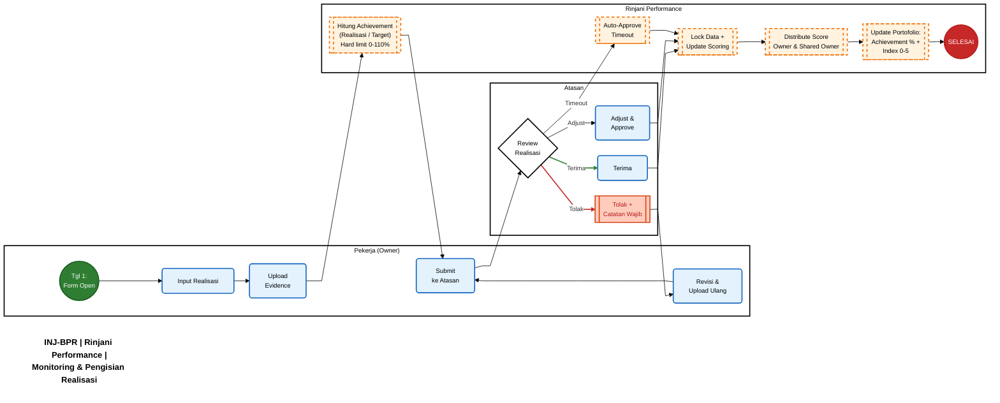
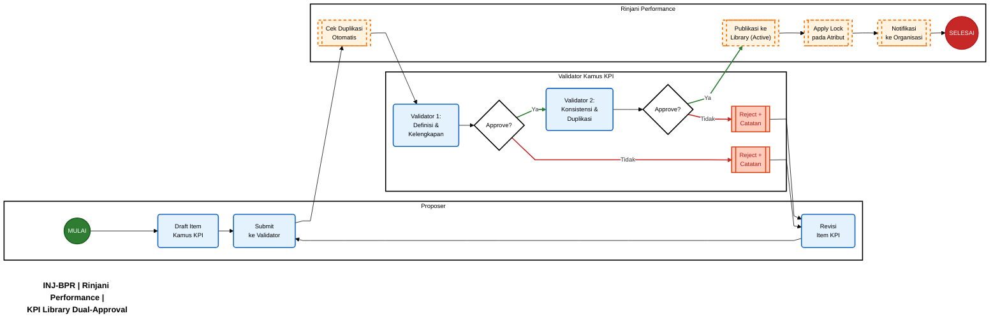

> Dokumen ini merangkum seluruh aturan bisnis (business rules) dan proses bisnis yang berlaku dalam sistem Rinjani Performance Management, disusun berdasarkan dokumentasi BRD KPI Goal Setting v2.2 dan artefak pendukung.
> 

---

## Daftar Aturan & Proses Bisnis

| Section | **Area** | **Jenis** | **Ringkasan** |
| --- | --- | --- | --- |
| 1 | **Tipe KPI & Kepemilikan** | Aturan | 2 tipe KPI (Bersama + Unit), anchor ke Position Variant ID, KPI Bersama locked |
| 2 | **Cascading** | Aturan + Proses | Top-down cascade, Direct (satuan locked) vs Indirect (modifiable), Owner/Collaborator/Shared Owner |
| 3 | **Perencanaan & Target** | Aturan + Proses | Fixed vs Progressive target, dual-layer weighting (Bobot Kategori + Bobot Item = 100%) |
| 4 | **Monitoring & Realisasi** | Aturan + Proses | 4 frekuensi (Monthly/Quarterly/Half/Yearly), evidence wajib, 6 skenario approval, auto-approve timeout |
| 5 | **Scoring & Performance Index** | Aturan | Target-based dynamic (0-110%), PA formula per tipe jabatan, PI skala 1.00-5.00 (Perdir Pasal 9) |
| 6 | **Mutasi, PGS & Prorata** | Aturan | PI prorata berbasis bulan (Perdir Pasal 11), threshold tanggal 15, PGS >= 1 bulan |
| 7 | **Ketentuan Khusus & Indisipliner** | Aturan | 10 kategori KK-01 s.d. KK-10, override scoring 4 tingkat (Ringan -10%, Sedang -30%, Berat -50%, PHK) |
| 8 | **KPI Library (Kamus KPI)** | Aturan + Proses | Dual-approval workflow, lockable attributes, versioning, rekomendasi item saat planning |
| 9 | **KPI Admin Headquarter** | Aturan + Proses | Company Tiers, Category Weight per kohort, Period Management, Schedule Monitoring, PI/Rating Config |

---

## 1. Tipe KPI & Kepemilikan

### 1.1 Dua Tipe KPI

| Aspek | **KPI Bersama** | **KPI Unit** |
| --- | --- | --- |
| **Definisi** | KPI strategis korporat yang mengukur pencapaian target perusahaan/sub-holding | KPI individual yang mengukur hasil kerja spesifik jabatan |
| **Scope** | Corporate/Business level; dapat berbeda per posisi via Company Tiers | Individual/Position level; spesifik per jabatan |
| **Anchor** | Position Variant ID | Position Variant ID |
| **Editable oleh Pekerja** | Tidak (locked); hanya Admin/Atasan | Ya; direncanakan bersama atasan |
| **Cascading** | Top-down dari Admin via KPI Admin HQ | Top-down dari atasan (Direct / Indirect) |
| **Frekuensi Monitoring** | Configurable (Monthly / Quarterly / Half / Yearly) | Configurable (Monthly / Quarterly / Half / Yearly) |

Validasi: Total bobot KPI Bersama + KPI Unit = 100%

### 1.2 Kepemilikan KPI (Position Variant ID)

<aside>
📌

**Position Variant ID sebagai Anchor Utama**

Seluruh KPI (Bersama dan Unit) di-anchor ke Position Variant ID, bukan Employee Number.

- Saat pekerja **mutasi lintas perusahaan**, KPI Bersama otomatis berubah sesuai posisi baru (Company Tiers berbeda)
- Saat posisi diisi **pekerja baru**, seluruh KPI Unit tetap dilanjutkan
- Perubahan item KPI pada suatu posisi berdampak **cascading ke posisi bawahan**
</aside>

### 1.3 KPI Bersama Locked

- Pekerja dan atasan **tidak dapat** mengubah item atau bobot KPI Bersama
- KPI Bersama hanya dikelola oleh Admin Performance via KPI Admin HQ
- KPI Bersama **dapat berbeda per posisi** dalam satu perusahaan melalui mekanisme Company Tiers

---

## 2. Cascading

### 2.1 Mekanisme Cascading Top-Down

KPI Unit di-cascade **top-down** dari atasan ke bawahan langsung (satu level di bawah).

| Aspek | **Direct Cascade** | **Indirect Cascade** |
| --- | --- | --- |
| **Item KPI** | Sama persis dengan parent | Dapat dimodifikasi (judul, target, satuan) |
| **Satuan Target** | Terkunci (sama dengan parent) | Boleh berbeda |
| **Realisasi** | Di-akumulasi otomatis ke parent | Tidak diakumulasi |
| **Target** | Tidak perlu akumulatif ke parent | Independen |

### 2.2 Proses Cascade & Approval

```mermaid
%%{init: {
  'layout': 'dagre',
  'theme': 'base',
  'look': 'classic',
  'flowchart': { 'curve': 'linear', 'nodeSpacing': 30, 'rankSpacing': 30 },
  'themeVariables': { 'primaryColor': '#fff8e8', 'edgeLabelBackground':'#ffffff', 'fontSize': '12px'}
}}%%
flowchart LR
  classDef processTitle fill:#ffffff,stroke:none,font-size:16px,font-weight:bold,color:#000000;
  classDef startNode fill:#2e7d32,stroke:#1b5e20,stroke-width:2px,color:#fff,shape:circle;
  classDef endNode fill:#c62828,stroke:#b71c1c,stroke-width:2px,color:#fff,shape:circle;
  classDef userTask fill:#e3f2fd,stroke:#1565c0,stroke-width:2px,rx:5,ry:5,color:#000;
  classDef serviceTask fill:#fff3e0,stroke:#ef6c00,stroke-width:2px,rx:5,ry:5,stroke-dasharray: 5 5,color:#000;
  classDef gateway fill:#ffffff,stroke:#000000,stroke-width:2px,shape:rhombus,color:#000;
  classDef errorEvent fill:#ffccbc,stroke:#d84315,stroke-width:2px,shape:hexagon,color:#b71c1c;

  TitleNode["INJ-BPR | Rinjani Performance |<br/>Team KPI Cascade & Approval"]
  class TitleNode processTitle

  subgraph Sup ["Atasan"]
    Start(("MULAI")):::startNode
    Select["Pilih Bawahan<br/>& Item KPI"]:::userTask
    CascadeType{"Metode<br/>Cascade?"}:::gateway
    SetRole["Tentukan Owner<br/>Collaborator<br/>Shared Owner"]:::userTask
    ReviewPlan{"Review<br/>KPI Plan?"}:::gateway
    RejectPlan[["Reject +<br/>Catatan"]]:::errorEvent
  end

  subgraph Bwh ["Bawahan"]
    Receive["Terima Draft<br/>KPI Unit"]:::userTask
    AdjustDraft["Adjust Target<br/>& Bobot Item"]:::userTask
    SubmitPlan["Submit KPI Plan<br/>ke Atasan"]:::userTask
    RevisePlan["Revisi<br/>KPI Plan"]:::userTask
  end

  subgraph System ["Rinjani Performance"]
    DirectC[["Apply Direct Cascade:<br/>Satuan Locked"]]:::serviceTask
    IndirectC[["Apply Indirect Cascade:<br/>Item Modifiable"]]:::serviceTask
    ValidW[["Validasi Bobot<br/>Item + Kategori = 100%"]]:::serviceTask
    ValidOK{"Bobot<br/>Valid?"}:::gateway
    Attach[["Attach ke Position<br/>Variant ID"]]:::serviceTask
    Final[["Finalisasi<br/>& Notifikasi"]]:::serviceTask
    End(("SELESAI")):::endNode
  end

  Start --> Select
  Select --> CascadeType
  CascadeType -->|"Direct"| DirectC
  CascadeType -->|"Indirect"| IndirectC
  DirectC --> SetRole
  IndirectC --> SetRole
  SetRole --> Receive
  Receive --> AdjustDraft
  AdjustDraft --> SubmitPlan
  SubmitPlan --> ReviewPlan
  ReviewPlan -->|"Approve"| ValidW
  ReviewPlan -->|"Reject"| RejectPlan
  RejectPlan --> RevisePlan
  RevisePlan --> SubmitPlan
  ValidW --> ValidOK
  ValidOK -->|"Tidak"| AdjustDraft
  ValidOK -->|"Ya"| Attach
  Attach --> Final
  Final --> End

  linkStyle 10 stroke:#2e7d32,stroke-width:2px
  linkStyle 11 stroke:#c62828,stroke-width:2px
  linkStyle 16 stroke:#2e7d32,stroke-width:2px
  linkStyle 15 stroke:#c62828,stroke-width:2px
  style Sup stroke:#000000,stroke-width:2px
  style Bwh stroke:#000000,stroke-width:2px
  style System stroke:#000000,stroke-width:2px
```

### 2.3 Skema Kepemilikan Item KPI

| **Role** | **Definisi** | **Isi Realisasi** | **Skor** |
| --- | --- | --- | --- |
| **Owner** | Penanggung jawab utama (tepat 1 per item KPI Unit) | Ya | Berdasarkan realisasi sendiri |
| **Collaborator** | Memiliki child KPI hasil cascading dari parent KPI | Ya (item sendiri) | Berdasarkan realisasi sendiri |
| **Shared Owner** | Berbagi tanggung jawab pada 1 item KPI yang sama | Tidak | Mengikuti Owner; bobot item dapat berbeda |
- Skema ini **hanya berlaku untuk KPI Unit**, tidak untuk KPI Bersama
- Ditetapkan saat proses cascading/perencanaan KPI; tidak dapat diubah di luar masa perencanaan

---

## 3. Perencanaan & Target

### 3.1 Tipe Target

| **Tipe** | **Deskripsi** | **Contoh** |
| --- | --- | --- |
| **Fixed Target** | Target sama sepanjang tahun per periode monitoring | CSI >= 4.5 setiap quarter |
| **Progressive Target** | Target spesifik per periode | Q1 = 80%, Q2 = 85%, Q3 = 90%, Q4 = 95% |

Tipe target ditentukan saat perencanaan KPI. Achievement dihitung berdasarkan target periode yang berlaku.

### 3.2 Dual-Layer Weighting

<aside>
⚖️

**Dua Tingkat Bobot:**

1. **Bobot Kategori (Category Weight):** KPI Bersama X% + KPI Unit Y% = 100%. Dikonfigurasi oleh Admin per kohort.
2. **Bobot Item (Item Weight):** Dalam setiap kategori, total bobot semua item = 100%.
</aside>

**Contoh untuk Officer (Bobot Kategori 40:60):**

- KPI Bersama (3 item): Achievement 95%, 100%, 88% x Bobot 40%, 35%, 25% = Capaian **95%**
- KPI Unit (4 item): weighted average = Capaian **92%**
- PA = (95% x 40%) + (92% x 60%) = 38% + 55.2% = **93.2%**

---

## 4. Monitoring & Realisasi

### 4.1 Frekuensi Monitoring

- Didukung: **Monthly**, **Quarterly**, **Half-yearly**, **Yearly**
- Admin mengkonfigurasi frekuensi aktif per item KPI via KPI Admin HQ
- Daily dan Weekly **tidak didukung** untuk mengurangi administrative burden

### 4.2 Timeline Pengisian Realisasi

| **Frekuensi** | **Formulir Tersedia** | **Deadline Input** | **Deadline Review Atasan** | **Auto-Approve** |
| --- | --- | --- | --- | --- |
| Monthly | Tanggal 1 | Tanggal 5 | Tanggal 10 | Jika lewat tanggal 10 |
| Quarterly | Tanggal 1 bulan pertama Q baru | Tanggal 10 | Tanggal 15 | Jika lewat tanggal 15 |
| Half-yearly | Tanggal 1 bulan pertama semester baru | Tanggal 10 | Tanggal 15 | Jika lewat tanggal 15 |
| Yearly | Tanggal 1 Januari tahun baru | Tanggal 15 | Tanggal 25 | Jika lewat tanggal 25 |

### 4.3 Ketentuan Pengisian

- Tiap pekerja mengisi realisasi KPI Unit miliknya sendiri (Owner)
- **Wajib** mengisi evidence: Dokumen (PDF, DOCX, XLSX), Gambar (JPG, PNG, max 5MB), Link eksternal
- Maksimal 5 file attachment per submission

### 4.4 Skenario Approval Realisasi

| **No** | **Skenario** | **Deskripsi** |
| --- | --- | --- |
| 1 | **Approve** | Atasan setuju, data terkunci, capaian masuk ke scoring |
| 2 | **Reject with Comment** | Atasan menolak dengan catatan wajib, pekerja revisi dan re-submit |
| 3 | **Request Clarification** | Atasan minta informasi tambahan tanpa mengubah angka realisasi |
| 4 | **Adjust & Approve** | Atasan koreksi minor pada nilai realisasi (audit trail lengkap) |
| 5 | **Auto-Approve (Timeout)** | Atasan tidak review hingga batas waktu, sistem otomatis approve |
| 6 | **Not Submitted (Default 0%)** | Pekerja tidak submit hingga deadline, capaian = 0% |

### 4.5 Proses Monitoring & Realisasi

---

## 5. Scoring & Performance Index

### 5.1 Formula Scoring

- **Achievement (%) = (Realisasi / Target) x 100%**
- Polarity "Minimize": Achievement = (Target / Realisasi) x 100%
- **Hard limit: 0% - 110%** (achievement di atas 110% tetap dihitung 110%)
- Opsi **category-based scoring** untuk KPI proyek/aktivitas (Selesai = 100%, Tidak Selesai = 0%)

### 5.2 Performance Achievement (PA)

<aside>
📌

**Alur Perhitungan Skor Kinerja Individu** *(Perdir Pasal 9)*

Achievement% per item --> Akumulasi per jenis KPI --> Kalikan bobot jenis KPI --> Jumlahkan --> **Performance Achievement (PA)**

</aside>

**Formula per Tipe Jabatan:**

| **Tipe Jabatan** | **Formula** | **Default Perdir** |
| --- | --- | --- |
| **Struktural** | PA = (Capaian KPI Bersama x Bobot Bersama) + (Capaian KPI Unit x Bobot Unit) | Bersama 40% + Unit 60% |
| **Fungsional** | PA = Capaian KPI Unit x 100% | KPI Unit 100% |
| **General** | PA = (Capaian Bersama x Bobot) + (Capaian Unit x Bobot) | Configurable per kohort |

### 5.3 Performance Index (PI)

PA dipetakan ke PI menggunakan konfigurasi admin. **Default Perdir Pasal 9:**

| **PI Range** | **Rating** | **Label** |
| --- | --- | --- |
| 4.50 - 5.00 | 5 | **Outstanding** |
| 3.50 - 4.49 | 4 | **Excellent** |
| 2.50 - 3.49 | 3 | **Successful** |
| 1.50 - 2.49 | 2 | **Partially Successful** |
| 1.00 - 1.49 | 1 | **Unsuccessful** |
- PA dan PI **ditampilkan di semua view** (portofolio, team view, tree view)
- Range dan label PI **dapat dikonfigurasi** oleh Admin via KPI Admin HQ
- Referensi: Perdir PD.INJ.03.04/12/2022/A.0022, Pasal 9

---

## 6. Mutasi, PGS & Prorata

### 6.1 Scoring Proporsional Mutasi/Rotasi

<aside>
📌

**Formula Mutasi (Perdir Pasal 11 Ayat 4):**

**PI Final = [PI Posisi Lama x (Bulan Lama / 12)] + [PI Posisi Baru x (Bulan Baru / 12)]**

</aside>

**Ketentuan:**

- Bulan Lama + Bulan Baru = 12 (total bulan masa kerja)
- **Threshold tanggal 15:** Tgl 1-15 = bulan dihitung Posisi Baru; Tgl 16-31 = Posisi Lama
- Sistem otomatis: close-out posisi lama, generate Performance Tree baru, switch KPI Bersama per Company Tier

### 6.2 Item Belum Aktif

- Score dihitung **hanya dari item KPI yang sudah aktif** pada periode tersebut
- Bobot item belum aktif didistribusikan proporsional ke item aktif
- Metode default: Weighted by Active Period (configurable oleh Admin)

### 6.3 PGS (Pejabat Pengganti Sementara)

| **Kondisi** | **Treatment** |
| --- | --- |
| PGS >= 1 bulan | Dinilai di posisi penugasan; PI PGS = [PI Posisi Asal x (Bulan Asal / 12)] + [PI Posisi PGS x (Bulan PGS / 12)] |
| PGS < 1 bulan | Hanya dinilai di posisi asal |
- KPI Bersama mengikuti Company Tier posisi PGS selama masa penugasan
- Status Hasil Nilai: **Pengganti**
- Referensi: Perdir Pasal 11 Ayat 5

---

## 7. Ketentuan Khusus & Indisipliner

### 7.1 Ketentuan Khusus Penilaian Kinerja

<aside>
⚠️

Berdasarkan **Perdir Pasal 4** tentang pengecualian karyawan dari penilaian. Diakomodasi dalam **10 kategori** (KK-01 s.d. KK-10).

</aside>

| **Kode** | **Ketentuan** | **Treatment** | **Status Hasil Nilai** |
| --- | --- | --- | --- |
| KK-01 | Penugasan Belajar | Tidak dinilai selama tugas belajar; prorata jika aktif >= 3 bulan | Tidak Dinilai / Parsial |
| KK-02 | Keluar Perusahaan | Dinilai hingga tanggal efektif keluar; PI prorata | Parsial |
| KK-03 | Tanpa KPI Individu | Dinilai KPI Bersama saja (Struktural); tidak dinilai (Fungsional) | Parsial / Tidak Dinilai |
| KK-04 | Sakit > 12 Bulan | Dikecualikan (Perdir Pasal 4); prorata jika <= 12 bulan dan aktif >= 3 bulan | Dibekukan / Parsial |
| KK-05 | Cuti Luar Tanggungan | Dikecualikan dari penilaian (Perdir Pasal 4) | Dibekukan |
| KK-06 | Skorsing | Ditangguhkan; tidak bersalah = prorata; bersalah = indisipliner | Dibekukan / Override |
| KK-07 | Indisipliner Ringan | PI maks = Median - 10% | Override |
| KK-08 | Indisipliner Sedang | PI maks = Median - 30% | Override |
| KK-09 | Indisipliner Berat Non PHK | PI maks = Median - 50% | Override |
| KK-10 | Indisipliner Berat PHK | Tidak dinilai; dikeluarkan dari penilaian | Tidak Dinilai |

**Status Hasil Nilai** yang didukung: **Normal** | **Parsial** | **Gabungan** (mutasi) | **Pengganti** (PGS) | **Dibatasi** | **Override** (indisipliner) | **Dibekukan** | **Tidak Dinilai**

### 7.2 Hukuman Indisipliner - Override Scoring

<aside>
🚫

Pekerja dengan hukuman indisipliner mendapat **override** pada PI. Skor dibatasi oleh **batas bawah median** dikurangi persentase sesuai tingkat hukuman.

</aside>

| **Tingkat** | **Override Rule** | **Contoh (Median = 3.00)** |
| --- | --- | --- |
| **Ringan** | Batas Bawah Median - 10% | PI maks = 3.00 - 0.30 = **2.70** |
| **Sedang** | Batas Bawah Median - 30% | PI maks = 3.00 - 0.90 = **2.10** |
| **Berat Non PHK** | Batas Bawah Median - 50% | PI maks = 3.00 - 1.50 = **1.50** |
| **Berat PHK** | Tidak dinilai | Dikeluarkan dari penilaian |
- **Batas Bawah Median** = median PI unit organisasi, atau nilai dari Komite Kinerja
- Override **otomatis** setelah admin input data indisipliner
- Jika PI aktual sudah lebih rendah dari batas override, PI aktual yang digunakan
- Audit trail: tanggal, jenis hukuman, PI sebelum/sesudah override
- Referensi: Perdir Pasal 14

---

## 8. KPI Library (Kamus KPI)

### 8.1 Struktur Item

| **Atribut** | **Wajib** | **Lockable** | **Keterangan** |
| --- | --- | --- | --- |
| Judul KPI | Ya | Ya | Nama standar item KPI |
| Definisi | Ya | Ya | Penjelasan lengkap tentang apa yang diukur |
| Satuan | Ya | Ya | Unit pengukuran (%, IDR, poin, dll.) |
| Formula | Ya | Ya | Cara menghitung realisasi |
| Polarity | Ya | Ya | Maximize (higher is better) atau Minimize (lower is better) |
| Frekuensi Rekomendasi | Tidak | Tidak | Monthly / Quarterly / Half / Yearly (saran) |
| Kategori | Ya | Tidak | Financial, Customer, Process, Learning & Growth |
| Tags | Tidak | Tidak | Label tambahan: departemen, fungsi, level jabatan |
| Evidence Requirement | Tidak | Ya | Jenis evidence yang direkomendasikan |

### 8.2 Dual-Approval Workflow

**Ketentuan:**

- **Tahap 1 (Validator 1):** Review kelengkapan atribut, kejelasan definisi, kesesuaian formula
- **Tahap 2 (Validator 2):** Review konsistensi dengan item existing, cek duplikasi, validasi kategori & tags
- Opsi per tahap: **Approve**, **Reject with Comment**, **Request Revision**
- Validator di-assign oleh Admin Performance (dapat berbeda per kategori KPI)

### 8.3 Status Item Library

- **Draft** - Sedang disusun oleh Proposer
- **Pending Review** - Menunggu approval Validator
- **Active** - Sudah dipublikasikan, tersedia untuk digunakan
- **Deprecated** - Tidak direkomendasikan lagi, tetapi masih valid untuk periode berjalan
- **Archived** - Dihapus dari katalog, tidak tersedia untuk perencanaan baru

### 8.4 Lockable Attributes

- Admin Performance dapat mengunci atribut tertentu agar tidak dapat diubah oleh pekerja saat planning
- Contoh: Satuan "IDR" di-lock = pekerja tidak bisa mengubah ke "%" saat menggunakan item "Revenue"
- Lock/unlock hanya dapat dilakukan oleh Admin Performance

---

## 9. KPI Admin Headquarter

### 9.1 Company Tiers

- **Company Tier** = pengelompokan posisi yang mendapatkan set KPI Bersama yang sama
- Contoh: "Bandara Internasional", "Bandara Domestik", "Holding Office"
- Satu posisi hanya berada di **1 Company Tier** pada satu waktu
- Perubahan Tier hanya berlaku untuk **periode berikutnya** (tidak retroaktif)

### 9.2 Category Weight per Tipe Jabatan & Kohort

<aside>
📌

Perdir Pasal 3 menetapkan default bobot jenis KPI berdasarkan tipe jabatan. Admin dapat mengkonfigurasi bobot via KPI Admin HQ.

</aside>

**Default Bobot per Tipe Jabatan (Perdir Pasal 3):**

| **Tipe Jabatan** | **KPI Bersama** | **KPI Unit** | **Keterangan** |
| --- | --- | --- | --- |
| **Struktural** | 40% | 60% | Default Perdir Pasal 3 Ayat 1 |
| **Fungsional** | 0% | 100% | Default Perdir Pasal 3 Ayat 2 |
| **General** | Configurable | Configurable | Tidak diatur Perdir; dikonfigurasi Admin per kohort |

**Contoh Konfigurasi per Kohort (Struktural):**

| **Kohort** | **KPI Bersama** | **KPI Unit** |
| --- | --- | --- |
| Executive (BOD-1/2) | 60% | 40% |
| Senior Manager (BOD-3) | 50% | 50% |
| Manager (BOD-4) | 40% | 60% |
| Supervisor/Officer (BOD-5) | 30% | 70% |

### 9.3 Period Management

Admin mengelola **4 jenis periode** penilaian kinerja:

| **Jenis Periode** | **Durasi** | **Bulan Evaluasi** | **Keterangan** |
| --- | --- | --- | --- |
| Tahunan | 12 bulan | Januari - Desember | Periode utama; **wajib ada** |
| Semesteran | 6 bulan | S1: Jan-Jun, S2: Jul-Des | Mid-year review |
| Triwulan | 3 bulan | Q1-Q4 | Quarterly monitoring |
| Bulanan | 1 bulan | Per bulan kalender | Detail tracking |

**Status Periode:** Draft --> Open --> Closed --> Locked

### 9.4 Admin Roles & Segregation

| **Role** | **Scope & Akses** |
| --- | --- |
| **Admin Performance HO** | Akses seluruh perusahaan InJourney Group. Manage Company Tiers, bobot kategori global, KPI Bersama holding. Assign Validator Kamus KPI. |
| **Admin Performance Regional** | Akses perusahaan di scope regional. Manage KPI Bersama anak perusahaan, bobot kategori per regional, frekuensi monitoring per item. |

Keduanya tidak dapat mengubah konfigurasi di luar scope masing-masing. Semua perubahan memiliki audit trail lengkap.

---

## 10. Referensi Dokumen

| **Dokumen** | **Keterangan** |
| --- | --- |
| BRD KPI Goal Setting v2.2 | Dokumen sumber utama (child BRD) |
| BRD InJourney Performance Management System (Rinjani 2.0) | Parent BRD scope Rinjani Performance |
| Sitemap & Feature Overview | Struktur aplikasi dan use cases per modul |
| Perdir PD.INJ.03.04/12/2022/A.0022 | Pedoman Penilaian Kinerja Karyawan InJourney |
| MOM-185 | Rinjani Portal & Performance Review, 7 Januari 2026 |

---

*Dokumen ini akan diperbarui seiring dengan perubahan kebijakan dan pengembangan sistem Rinjani Performance.*