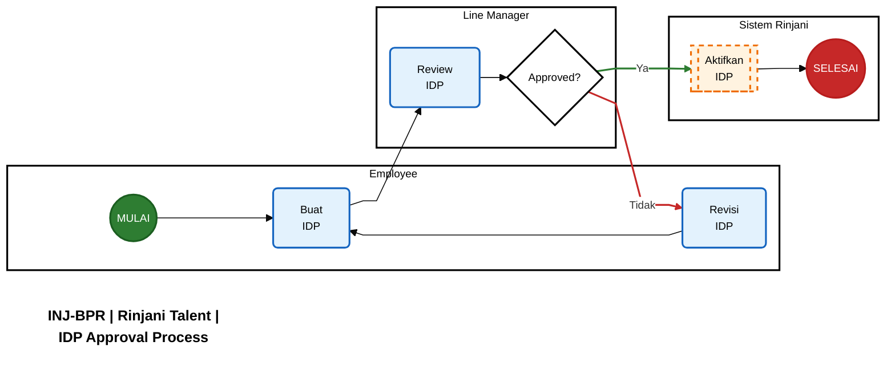
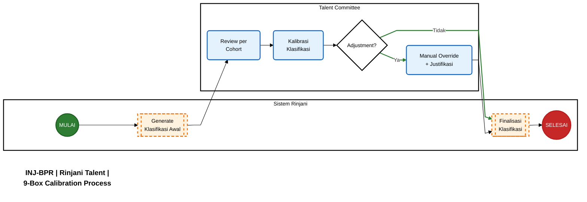

> Dokumen ini merangkum seluruh aturan bisnis (business rules) yang berlaku dalam sistem Rinjani Talent Management, disusun berdasarkan dokumentasi BRD/PRD yang ada di Project Docs.
> 

---

## Daftar Aturan & Proses Bisnis

| Section | Area | Jenis | Ringkasan |
| --- | --- | --- | --- |
| 1 | **IDP (Individual Development Plan)** | Aturan + Proses | Minimum 40 jam/tahun, single-level approval (Line Manager), Mid-Year Evaluation |
| 2 | **Job Tender — Aplikasi** | Aturan + Proses | Always-on marketplace, max 3 aplikasi aktif, eligibility: grade ±3, job family, status disiplin |
| 3 | **Job Tender — Pembuatan Lowongan** | Proses | Project Assignment vs Talent Mobility, approval workflow, scope (Internal / Cross-Entity) |
| 4 | **Klasifikasi Talenta (9-Box)** | Aturan + Proses | Performance × Potential matrix, relative threshold per cohort, 5 cluster output, Top Talent selection |
| 5 | **Employee Qualification Score (EQS)** | Aturan | 6 komponen (Kinerja, Kompetensi, Pengalaman, Aspirasi, Pelatihan, TES), disqualification rule |
| 6 | **Talent Review** | Proses | Supervisor → HC → TC workflow, 5 jenis aspirasi, agenda quarterly (Q1-Q4) |
| 7 | **Succession Planning** | Aturan + Proses | KSP & posisi struktural, min 3 suksesor/posisi, readiness level, TC validation |
| 8 | **Risk Profile Tag** | Aturan | Job Family cross-matrix (Deloitte SWP 2023), tag LOW/MEDIUM/HIGH, informatif (bukan eligibility) |
| 9 | **Talent Committee** | Aturan | Struktur 3-tier, scope per band, variasi movement (Definitif, Mobility, Joint TC) |
| 10 | **Pemetaan Band Jabatan** | Aturan | 5 band (BoD → BoD-4), grade range, aturan movement, TC scope mapping |
| 11 | **Eligibility Rule** | Aturan | 6 kriteria (Kinerja, Job Fit, EQS, Masa Kerja, Disiplin, Riwayat Jabatan), HCBP override |

---

## 1. IDP (Individual Development Plan)

### 1.1 Ketentuan Umum

| Aspek | Ketentuan |
| --- | --- |
| **Minimum Learning Hour** | 40 jam/tahun (configurable per entity) |
| **Trigger** | Otomatis setelah fase Performance Planning selesai |
| **Siklus** | Tahunan, mengikuti siklus Performance Management |
| **Cakupan** | Seluruh karyawan aktif yang memiliki Performance Plan |

### 1.2 Approval Process



**Ketentuan Approval:**

- Single-level approval (hanya Line Manager)
- Line Manager dapat menyetujui, menolak, atau meminta revisi
- Alasan penolakan wajib diisi dengan salah satu tag: `Tidak Sesuai Kebutuhan Kompetensi`, `Budget Tidak Tersedia`, `Lainnya`

### 1.3 Mid-Year Learning Evaluation

| Aspek | Ketentuan |
| --- | --- |
| **Waktu** | Pertengahan tahun (bersamaan dengan Mid-Year Review PMS) |
| **Tujuan** | Evaluasi progress learning terhadap target 40 jam |
| **Action** | Penyesuaian rencana learning jika diperlukan |

---

## 2. Job Tender

### 2.1 Ketentuan Umum Marketplace

| Aspek | Ketentuan |
| --- | --- |
| **Model** | Always-on marketplace (bukan batch/event-based) |
| **Maksimum Aplikasi Aktif** | 3 lowongan per karyawan |
| **Status Aplikasi** | Applied → Shortlisted → Selected / Rejected |

### 2.2 Kriteria Eligibility Pelamar

<aside>
📌

**Syarat Dasar untuk Apply Job Tender:**

1. Tidak sedang menjalani hukuman disiplin
2. Masa kerja di grade saat ini minimal 1 tahun
3. Memiliki nilai kinerja minimal 1 tahun terakhir
</aside>

**Kriteria Grade:**

- Pelamar dapat apply pada posisi dengan selisih **maksimal ±3 grade** dari grade saat ini
- Contoh: Karyawan grade 15 dapat apply posisi grade 12–18

**Kriteria Job Family:**

- Pelamar harus memiliki **pengalaman minimal 1 tahun** di job family yang sama dengan posisi yang dilamar, **ATAU**
- Posisi tidak mensyaratkan job family spesifik (open for all)

### 2.3 Tahapan Penetapan Aplikasi Job Tender

```mermaid
%%{init: {
  'layout': 'dagre',
  'theme': 'base',
  'flowchart': { 'curve': 'linear', 'nodeSpacing': 30, 'rankSpacing': 30 },
  'themeVariables': { 'primaryColor': '#fff8e8', 'edgeLabelBackground':'#ffffff', 'fontSize': '12px'}
}}%%
flowchart LR
  %% --- DEFINISI KELAS ---
  classDef processTitle fill:#ffffff,stroke:none,font-size:16px,font-weight:bold,color:#000000;
  classDef startNode fill:#2e7d32,stroke:#1b5e20,stroke-width:2px,color:#fff,shape:circle;
  classDef endNode fill:#c62828,stroke:#b71c1c,stroke-width:2px,color:#fff,shape:circle;
  classDef userTask fill:#e3f2fd,stroke:#1565c0,stroke-width:2px,rx:5,ry:5,color:#000;
  classDef serviceTask fill:#fff3e0,stroke:#ef6c00,stroke-width:2px,rx:5,ry:5,stroke-dasharray: 5 5,color:#000;
  classDef subProcess fill:#f3e5f5,stroke:#7b1fa2,stroke-width:2px,rx:5,ry:5,stroke-dasharray: 5,color:#000;
  classDef gateway fill:#ffffff,stroke:#000000,stroke-width:2px,shape:rhombus,color:#000;
  classDef dataObject fill:#f5f5f5,stroke:#616161,stroke-width:1px,stroke-dasharray: 2 2,shape:note,color:#000;
  classDef errorEvent fill:#ffccbc,stroke:#d84315,stroke-width:2px,shape:hexagon,color:#b71c1c;

  %% --- TITLE NODE ---
  TitleNode["INJ-BPR | Rinjani Talent |<br/>Job Tender Application"]
  class TitleNode processTitle

  %% --- STRUKTUR SUBGRAPH ---
  subgraph Karyawan ["Karyawan"]
      Start(("MULAI")):::startNode
      SubmitApp["Submit<br/>Aplikasi"]:::userTask
  end

  subgraph Sistem ["Sistem Rinjani"]
      EligCheck[["Validasi<br/>Eligibility"]]:::serviceTask
      EligGW{"Eligible?"}:::gateway
      AutoReject[["Auto<br/>Reject"]]:::errorEvent
      PoolApp[["Masuk ke<br/>Pool"]]:::serviceTask
  end

  subgraph AdminHC ["Admin HC"]
      Shortlist["Review &<br/>Shortlist"]:::userTask
      ShortGW{"Shortlisted?"}:::gateway
      Reject["Aplikasi<br/>Ditolak"]:::userTask
  end

  subgraph TC ["Talent Committee"]
      TDayGW{"Perlu<br/>Talent Day?"}:::gateway
      TDay["Talent Day<br/>Assessment"]:::userTask
      DirectSel["Direct<br/>Selection"]:::userTask
      TCDecision["TC<br/>Decision"]:::userTask
      SelGW{"Selected?"}:::gateway
      EndSuccess(("TERPILIH")):::endNode
      EndReject(("TIDAK<br/>TERPILIH")):::endNode
  end

  %% --- LOGIKA FLOW ---
  Start --> SubmitApp
  SubmitApp --> EligCheck
  EligCheck --> EligGW
  EligGW -->|Ya| PoolApp
  PoolApp --> Shortlist
  Shortlist --> ShortGW
  ShortGW -->|Ya| TDayGW
  TDayGW -->|Ya| TDay
  TDayGW -->|Tidak| DirectSel
  TDay --> TCDecision
  DirectSel --> TCDecision
  TCDecision --> SelGW
  SelGW -->|Ya| EndSuccess
  
  %% Exception Paths
  EligGW -->|Tidak| AutoReject
  ShortGW -->|Tidak| Reject
  SelGW -->|Tidak| EndReject

  %% --- KONFIGURASI VISUAL ---
  linkStyle 3 stroke:#2e7d32,stroke-width:2px
  linkStyle 6 stroke:#2e7d32,stroke-width:2px
  linkStyle 11 stroke:#2e7d32,stroke-width:2px
  linkStyle 12 stroke:#c62828,stroke-width:2px
  linkStyle 13 stroke:#c62828,stroke-width:2px
  linkStyle 14 stroke:#c62828,stroke-width:2px
  style Karyawan stroke:#000000,stroke-width:2px
  style Sistem stroke:#000000,stroke-width:2px
  style AdminHC stroke:#000000,stroke-width:2px
  style TC stroke:#000000,stroke-width:2px
```



**Keterangan Tahapan:**

| Tahap | PIC | Aktivitas |
| --- | --- | --- |
| **1. Eligibility Check** | Sistem | Validasi otomatis: grade range, job family, status disiplin |
| **2. Shortlisting** | Admin HC | Review profil kandidat, seleksi awal |
| **3. Talent Day** | Talent Committee | Assessment jika diperlukan (opsional) |
| **4. Selection** | Talent Committee | Keputusan final pemilihan kandidat |

---

## 3. Pembuatan Lowongan Job Tender

### 3.1 Jenis Lowongan

Job Tender memiliki toggle untuk menentukan jenis lowongan:

| Jenis | Deskripsi | Dasar Hukum |
| --- | --- | --- |
| **Project Assignment** | Penugasan sementara untuk proyek spesifik | Surat Penugasan (SP) |
| **Talent Mobility** | Perpindahan ke posisi lain (permanen/temporer) | SK atau SP |

### 3.2 Tahapan Pembuatan Lowongan — Project Assignment

```mermaid
%%{init: {
  'layout': 'dagre',
  'theme': 'base',
  'flowchart': { 'curve': 'linear', 'nodeSpacing': 30, 'rankSpacing': 30 },
  'themeVariables': { 'primaryColor': '#fff8e8', 'edgeLabelBackground':'#ffffff', 'fontSize': '12px'}
}}%%
flowchart LR
  %% --- DEFINISI KELAS ---
  classDef processTitle fill:#ffffff,stroke:none,font-size:16px,font-weight:bold,color:#000000;
  classDef startNode fill:#2e7d32,stroke:#1b5e20,stroke-width:2px,color:#fff,shape:circle;
  classDef endNode fill:#c62828,stroke:#b71c1c,stroke-width:2px,color:#fff,shape:circle;
  classDef userTask fill:#e3f2fd,stroke:#1565c0,stroke-width:2px,rx:5,ry:5,color:#000;
  classDef serviceTask fill:#fff3e0,stroke:#ef6c00,stroke-width:2px,rx:5,ry:5,stroke-dasharray: 5 5,color:#000;
  classDef subProcess fill:#f3e5f5,stroke:#7b1fa2,stroke-width:2px,rx:5,ry:5,stroke-dasharray: 5,color:#000;
  classDef gateway fill:#ffffff,stroke:#000000,stroke-width:2px,shape:rhombus,color:#000;
  classDef dataObject fill:#f5f5f5,stroke:#616161,stroke-width:1px,stroke-dasharray: 2 2,shape:note,color:#000;
  classDef errorEvent fill:#ffccbc,stroke:#d84315,stroke-width:2px,shape:hexagon,color:#b71c1c;

  %% --- TITLE NODE ---
  TitleNode["INJ-BPR | Rinjani Talent |<br/>Create Project Assignment Vacancy"]
  class TitleNode processTitle

  %% --- STRUKTUR SUBGRAPH ---
  subgraph Requestor ["Requestor"]
      Start(("MULAI")):::startNode
      Request["Ajukan<br/>Kebutuhan"]:::userTask
  end

  subgraph AdminHC ["Admin HC"]
      CreateVac["Create<br/>Vacancy"]:::userTask
      InputDetail["Input Detail:<br/>Nama, Durasi,<br/>Jumlah, Kualifikasi"]:::userTask
      SetElig["Set Eligibility:<br/>Grade, Job Family,<br/>Skill"]:::userTask
  end

  subgraph Approver ["Approver"]
      ReviewGW{"Review &<br/>Approval"}:::gateway
  end

  subgraph Sistem ["Sistem Rinjani"]
      Publish[["Publish<br/>Lowongan"]]:::serviceTask
      EndSuccess(("SELESAI")):::endNode
  end

  %% --- LOGIKA FLOW ---
  Start --> Request
  Request --> CreateVac
  CreateVac --> InputDetail
  InputDetail --> SetElig
  SetElig --> ReviewGW
  ReviewGW -->|Approved| Publish
  Publish --> EndSuccess
  ReviewGW -->|Revision| CreateVac

  %% --- KONFIGURASI VISUAL ---
  linkStyle 5 stroke:#2e7d32,stroke-width:2px
  linkStyle 7 stroke:#c62828,stroke-width:2px
  style Requestor stroke:#000000,stroke-width:2px
  style AdminHC stroke:#000000,stroke-width:2px
  style Approver stroke:#000000,stroke-width:2px
  style Sistem stroke:#000000,stroke-width:2px
```



**Ketentuan Project Assignment:**

- Durasi penugasan harus didefinisikan (start & end date)
- Karyawan tetap tercatat di unit asal selama penugasan
- Evaluasi dilakukan di akhir periode penugasan

### 3.3 Tahapan Pembuatan Lowongan — Talent Mobility

```mermaid
%%{init: {
  'layout': 'dagre',
  'theme': 'base',
  'flowchart': { 'curve': 'linear', 'nodeSpacing': 30, 'rankSpacing': 30 },
  'themeVariables': { 'primaryColor': '#fff8e8', 'edgeLabelBackground':'#ffffff', 'fontSize': '12px'}
}}%%
flowchart LR
  %% --- DEFINISI KELAS ---
  classDef processTitle fill:#ffffff,stroke:none,font-size:16px,font-weight:bold,color:#000000;
  classDef startNode fill:#2e7d32,stroke:#1b5e20,stroke-width:2px,color:#fff,shape:circle;
  classDef endNode fill:#c62828,stroke:#b71c1c,stroke-width:2px,color:#fff,shape:circle;
  classDef userTask fill:#e3f2fd,stroke:#1565c0,stroke-width:2px,rx:5,ry:5,color:#000;
  classDef serviceTask fill:#fff3e0,stroke:#ef6c00,stroke-width:2px,rx:5,ry:5,stroke-dasharray: 5 5,color:#000;
  classDef subProcess fill:#f3e5f5,stroke:#7b1fa2,stroke-width:2px,rx:5,ry:5,stroke-dasharray: 5,color:#000;
  classDef gateway fill:#ffffff,stroke:#000000,stroke-width:2px,shape:rhombus,color:#000;
  classDef dataObject fill:#f5f5f5,stroke:#616161,stroke-width:1px,stroke-dasharray: 2 2,shape:note,color:#000;
  classDef errorEvent fill:#ffccbc,stroke:#d84315,stroke-width:2px,shape:hexagon,color:#b71c1c;

  %% --- TITLE NODE ---
  TitleNode["INJ-BPR | Rinjani Talent |<br/>Create Talent Mobility Vacancy"]
  class TitleNode processTitle

  %% --- STRUKTUR SUBGRAPH ---
  subgraph Trigger ["Trigger"]
      Start(("MULAI")):::startNode
      Identify["Identifikasi<br/>Kebutuhan Posisi"]:::userTask
      SuksesorGW{"Ada<br/>Suksesor?"}:::gateway
  end

  subgraph SuccPath ["Succession Path"]
      ViaSucc[["Proses via<br/>Succession"]]:::subProcess
  end

  subgraph AdminHC ["Admin HC"]
      CreateVac["Create<br/>Vacancy"]:::userTask
      InputDetail["Input Detail:<br/>Posisi, Level,<br/>Grade, Job Family"]:::userTask
      SetElig["Set Eligibility:<br/>Grade ±3,<br/>Job Family, Tenure"]:::userTask
      ScopeGW{"Scope?"}:::gateway
  end

  subgraph Sistem ["Sistem Rinjani"]
      PubEntity[["Publish ke<br/>Entity"]]:::serviceTask
      PubGroup[["Publish ke<br/>Group"]]:::serviceTask
      EndSuccess(("LOWONGAN<br/>AKTIF")):::endNode
  end

  %% --- LOGIKA FLOW ---
  Start --> Identify
  Identify --> SuksesorGW
  SuksesorGW -->|Ya| ViaSucc
  SuksesorGW -->|Tidak| CreateVac
  CreateVac --> InputDetail
  InputDetail --> SetElig
  SetElig --> ScopeGW
  ScopeGW -->|Internal| PubEntity
  ScopeGW -->|Cross-Entity| PubGroup
  PubEntity --> EndSuccess
  PubGroup --> EndSuccess

  %% --- KONFIGURASI VISUAL ---
  linkStyle 2 stroke:#2e7d32,stroke-width:2px
  linkStyle 3 stroke:#c62828,stroke-width:2px
  linkStyle 7 stroke:#2e7d32,stroke-width:2px
  style Trigger stroke:#000000,stroke-width:2px
  style SuccPath stroke:#000000,stroke-width:2px
  style AdminHC stroke:#000000,stroke-width:2px
  style Sistem stroke:#000000,stroke-width:2px
```



**Perbedaan Project Assignment vs Talent Mobility:**

| Aspek | Project Assignment | Talent Mobility |
| --- | --- | --- |
| **Sifat** | Temporer | Permanen/Temporer |
| **Posisi** | Posisi proyek | Posisi struktural |
| **Home Unit** | Tetap di unit asal | Dapat pindah |
| **Durasi** | Terbatas | Tidak terbatas (jika permanen) |

---

## 4. Klasifikasi Talenta (9-Box)

### 4.1 Framework 9-Box

Klasifikasi talenta menggunakan matriks 2 dimensi:

- **Sumbu X:** Performance (Kinerja)
- **Sumbu Y:** Potential (Potensi/Job Fit)

### 4.2 Metode Threshold

<aside>
⚠️

**Relative Threshold Method**

Batas kategori High/Medium/Low ditentukan berdasarkan **median per cohort**, bukan nilai absolut. Ini memastikan distribusi yang proporsional antar level jabatan.

</aside>

**Penentuan Cohort:**

- Cohort ditentukan berdasarkan Band Jabatan
- Setiap cohort memiliki median tersendiri
- Threshold dihitung ulang setiap periode klasifikasi

### 4.3 Kriteria Performance

| Kategori | Kondisi |
| --- | --- |
| **High** | Tahun terakhir minimal *Excellent* dengan tahun sebelumnya *Successful* |
| **Medium** | Tahun terakhir *Successful* dengan tahun sebelumnya minimal *Successful* |
| **Low** | Tahun kedua berturut-turut di bawah *Successful* |

### 4.4 Kriteria Potential (Job Fit)

| Kategori | Range Job Fit |
| --- | --- |
| **High** | ≥ 85% |
| **Medium** | 70% – 84% |
| **Low** | ≤ 69% |

### 4.5 Hasil Klasifikasi — 5 Cluster

| Job Fit | Low Performance | Medium Performance | High Performance |
| --- | --- | --- | --- |
| **High (≥85%)** | Sleeping Tiger | Promotable | **High Potential** |
| **Medium (70-84%)** | Sleeping Tiger | Promotable | Promotable |
| **Low (≤69%)** | Unfit | Solid Contributor | Solid Contributor |

<aside>
⭐

**Talent Pool** = Karyawan dengan klasifikasi **Promotable** + **High Potential**

</aside>

### 4.6 Proses Kalibrasi



**Ketentuan Kalibrasi:**

- Dilakukan **1x per tahun** (setelah PMS Calibration selesai)
- Talent Committee berwenang melakukan adjustment dengan justifikasi
- Hasil kalibrasi menjadi dasar Talent Pool composition

### 4.7 Top Talent Selection

Top Talent dipilih dari Talent Pool (High Potential + Promotable) berdasarkan:

1. **EQS Score** tertinggi dalam cohort
2. **Konsistensi** kinerja 2-3 tahun terakhir
3. **Rekomendasi** Talent Committee

**Privilege Top Talent:**

- Kenaikan grade maksimal **3 grade** (vs 1 grade untuk non-Top Talent; Configurable)
- Prioritas dalam succession planning
- Program pengembangan khusus

---

## 5. Employee Qualification Score (EQS)

### 5.1 Komponen & Bobot

| No | Komponen | Bobot | Keterangan |
| --- | --- | --- | --- |
| 1 | **Kinerja** | 20% | Rata-rata nilai kinerja 2-3 tahun terakhir |
| 2 | **Kompetensi** | 20% | Job Fit / Competency Assessment |
| 3 | **Pengalaman** | 20% | Relevansi pengalaman kerja |
| 4 | **Aspirasi** | 10% | Kesesuaian aspirasi karir |
| 5 | **Pelatihan** | 20% | Completion rate IDP/learning |
| 6 | **TES** | 10% | Hasil assessment formal (jika ada) |

**Formula:**

```
EQS = (Kinerja × 0.20) + (Kompetensi × 0.20) + (Pengalaman × 0.20) 
    + (Aspirasi × 0.10) + (Pelatihan × 0.20) + (TES × 0.10)
```

### 5.2 Eligibility Gate

<aside>
🚫

**Disqualification Rule:**

Karyawan yang sedang menjalani **hukuman disiplin** tidak eligible untuk kalkulasi EQS dan tidak dapat masuk ke dalam proses succession/promotion apapun.

</aside>

### 5.3 Penggunaan EQS

| Proses | Penggunaan EQS |
| --- | --- |
| Talent Pool Ranking | Ranking kandidat dalam pool |
| Succession Planning | Prioritas penetapan suksesor |
| Promotion Decision | Salah satu pertimbangan promosi |
| Talent Day | Baseline score sebelum assessment |

---

## 6. Talent Review

### 6.1 Kriteria Eligible to Review

Karyawan dapat di-review jika memenuhi:

1. Masa kerja pada **grade saat ini minimal 1 tahun**
2. Memiliki **nilai Job Fit** (competency assessment)
3. Memiliki **nilai Kinerja** (performance rating)

### 6.2 Proses Talent Review

```mermaid
%%{init: {
  'layout': 'dagre',
  'theme': 'base',
  'flowchart': { 'curve': 'linear', 'nodeSpacing': 30, 'rankSpacing': 30 },
  'themeVariables': { 'primaryColor': '#fff8e8', 'edgeLabelBackground':'#ffffff', 'fontSize': '12px'}
}}%%
flowchart LR
  %% --- DEFINISI KELAS ---
  classDef processTitle fill:#ffffff,stroke:none,font-size:16px,font-weight:bold,color:#000000;
  classDef startNode fill:#2e7d32,stroke:#1b5e20,stroke-width:2px,color:#fff,shape:circle;
  classDef endNode fill:#c62828,stroke:#b71c1c,stroke-width:2px,color:#fff,shape:circle;
  classDef userTask fill:#e3f2fd,stroke:#1565c0,stroke-width:2px,rx:5,ry:5,color:#000;
  classDef serviceTask fill:#fff3e0,stroke:#ef6c00,stroke-width:2px,rx:5,ry:5,stroke-dasharray: 5 5,color:#000;
  classDef subProcess fill:#f3e5f5,stroke:#7b1fa2,stroke-width:2px,rx:5,ry:5,stroke-dasharray: 5,color:#000;
  classDef gateway fill:#ffffff,stroke:#000000,stroke-width:2px,shape:rhombus,color:#000;
  classDef dataObject fill:#f5f5f5,stroke:#616161,stroke-width:1px,stroke-dasharray: 2 2,shape:note,color:#000;
  classDef errorEvent fill:#ffccbc,stroke:#d84315,stroke-width:2px,shape:hexagon,color:#b71c1c;

  %% --- TITLE NODE ---
  TitleNode["INJ-BPR | Rinjani Talent |<br/>Talent Review Process"]
  class TitleNode processTitle

  %% --- STRUKTUR SUBGRAPH ---
  subgraph Supervisor ["01 Supervisor"]
      Start(("MULAI")):::startNode
      ReviewTeam["Review<br/>Anggota Tim"]:::userTask
      InputAspirasi["Input Aspirasi:<br/>Promosi, Rotasi,<br/>Demosi, Dev"]:::userTask
  end

  subgraph AdminHC ["02 Admin HC"]
      HCReview["Review<br/>Aspirasi"]:::userTask
      InputRekom["Input Rekomendasi:<br/>Jabatan, Grade,<br/>Rotasi, Gaji"]:::userTask
  end

  subgraph TC ["03 Talent Committee"]
      TCReview["Review<br/>Rekomendasi"]:::userTask
      TCDecision["Keputusan Final:<br/>Promosi, Rotasi,<br/>Salary, Dev"]:::userTask
  end

  subgraph Execution ["04 Execution"]
      Execute[["Execute<br/>Keputusan"]]:::serviceTask
      EndSuccess(("SELESAI")):::endNode
  end

  %% --- LOGIKA FLOW ---
  Start --> ReviewTeam
  ReviewTeam --> InputAspirasi
  InputAspirasi --> HCReview
  HCReview --> InputRekom
  InputRekom --> TCReview
  TCReview --> TCDecision
  TCDecision --> Execute
  Execute --> EndSuccess

  %% --- KONFIGURASI VISUAL ---
  style Supervisor stroke:#000000,stroke-width:2px
  style AdminHC stroke:#000000,stroke-width:2px
  style TC stroke:#000000,stroke-width:2px
  style Execution stroke:#000000,stroke-width:2px
```



### 6.3 Jenis Aspirasi dari Supervisor

| Aspirasi | Keterangan |
| --- | --- |
| **Kenaikan Jabatan** | Promosi ke level jabatan lebih tinggi |
| **Kenaikan Grade** | Naik grade dalam band yang sama |
| **Rotasi** | Pindah ke fungsi/posisi lain (lateral) |
| **Demosi** | Turun level/grade (karena kinerja atau permintaan) |
| **Development** | Fokus pengembangan tanpa movement |

### 6.4 Agenda Talent Review per Kuartal

| Kuartal | Agenda Utama |
| --- | --- |
| **Q1 (April)** | Talent Review, Succession List, PMS Calibration, Vacant Fulfillment, >3 Years Review, Dev Plan |
| **Q2 (Juli)** | Talent Review, Succession List, Vacant Fulfillment, >3 Years Review, Dev Plan, **Salary Increment Review** |
| **Q3 (Oktober)** | Talent Review, Succession List, Vacant Fulfillment, >3 Years Review, Dev Plan |
| **Q4 (Januari)** | Talent Review, Succession List, Vacant Fulfillment, >3 Years Review, Dev Plan, Salary Increment, **Top Talent Selection** |

---

## 7. Succession Planning

### 7.1 Target Posisi Succession

| Kategori | Keterangan |
| --- | --- |
| **Key Strategic Position (KSP)** | Posisi kritikal yang berdampak signifikan pada bisnis |
| **Posisi Struktural** | Seluruh posisi dalam struktur organisasi |

### 7.2 Proses Penetapan Kandidat Posisi

```mermaid
%%{init: {
  'layout': 'dagre',
  'theme': 'base',
  'flowchart': { 'curve': 'linear', 'nodeSpacing': 30, 'rankSpacing': 30 },
  'themeVariables': { 'primaryColor': '#fff8e8', 'edgeLabelBackground':'#ffffff', 'fontSize': '12px'}
}}%%
flowchart LR
  %% --- DEFINISI KELAS ---
  classDef processTitle fill:#ffffff,stroke:none,font-size:16px,font-weight:bold,color:#000000;
  classDef startNode fill:#2e7d32,stroke:#1b5e20,stroke-width:2px,color:#fff,shape:circle;
  classDef endNode fill:#c62828,stroke:#b71c1c,stroke-width:2px,color:#fff,shape:circle;
  classDef userTask fill:#e3f2fd,stroke:#1565c0,stroke-width:2px,rx:5,ry:5,color:#000;
  classDef serviceTask fill:#fff3e0,stroke:#ef6c00,stroke-width:2px,rx:5,ry:5,stroke-dasharray: 5 5,color:#000;
  classDef subProcess fill:#f3e5f5,stroke:#7b1fa2,stroke-width:2px,rx:5,ry:5,stroke-dasharray: 5,color:#000;
  classDef gateway fill:#ffffff,stroke:#000000,stroke-width:2px,shape:rhombus,color:#000;
  classDef dataObject fill:#f5f5f5,stroke:#616161,stroke-width:1px,stroke-dasharray: 2 2,shape:note,color:#000;
  classDef errorEvent fill:#ffccbc,stroke:#d84315,stroke-width:2px,shape:hexagon,color:#b71c1c;

  %% --- TITLE NODE ---
  TitleNode["INJ-BPR | Rinjani Talent |<br/>Position Candidate Selection"]
  class TitleNode processTitle

  %% --- STRUKTUR SUBGRAPH ---
  subgraph Trigger ["Trigger"]
      Start(("MULAI")):::startNode
      Identify["Identifikasi<br/>Posisi Target"]:::userTask
  end

  subgraph Sistem ["Sistem Rinjani"]
      GenCand[["Generate<br/>Eligible Candidates"]]:::serviceTask
      Filter[["Filter<br/>Eligibility"]]:::serviceTask
      Pool[("Pool<br/>Kandidat")]:::dataObject
      Ranking[["Ranking:<br/>EQS, Job Family,<br/>Grade"]]:::serviceTask
  end

  subgraph AdminHC ["Admin HC"]
      Shortlist["Shortlist<br/>Top Candidates"]:::userTask
      TDayGW{"Perlu<br/>Talent Day?"}:::gateway
  end

  subgraph TC ["Talent Committee"]
      TDay["Talent Day<br/>Assessment"]:::userTask
      DirectSel["Direct<br/>Selection"]:::userTask
      TCDecision["TC<br/>Decision"]:::userTask
      EndSuccess(("KANDIDAT<br/>TERPILIH")):::endNode
  end

  %% --- LOGIKA FLOW ---
  Start --> Identify
  Identify --> GenCand
  GenCand --> Filter
  Filter --> Pool
  Pool --> Ranking
  Ranking --> Shortlist
  Shortlist --> TDayGW
  TDayGW -->|Ya| TDay
  TDayGW -->|Tidak| DirectSel
  TDay --> TCDecision
  DirectSel --> TCDecision
  TCDecision --> EndSuccess

  %% --- KONFIGURASI VISUAL ---
  linkStyle 7 stroke:#2e7d32,stroke-width:2px
  linkStyle 8 stroke:#2e7d32,stroke-width:2px
  style Trigger stroke:#000000,stroke-width:2px
  style Sistem stroke:#000000,stroke-width:2px
  style AdminHC stroke:#000000,stroke-width:2px
  style TC stroke:#000000,stroke-width:2px
```



### 7.3 Kriteria Eligibility Suksesor

<aside>
✅

**Syarat Menjadi Suksesor:**

1. Masuk kategori **Promotable** atau **High Potential**
2. Berasal dari **job family yang sama** ATAU pernah memiliki pengalaman **minimal 1 tahun** di job family tersebut
3. **Tidak sedang** menjalani hukuman disiplin
4. Grade minimal **sama** atau maksimal **2 grade di bawah** Job Grade target
    - Khusus Top Talent: maksimal **3 grade di bawah**
</aside>

### 7.4 Proses Penetapan Suksesor Posisi

```mermaid
%%{init: {
  'layout': 'dagre',
  'theme': 'base',
  'flowchart': { 'curve': 'linear', 'nodeSpacing': 30, 'rankSpacing': 30 },
  'themeVariables': { 'primaryColor': '#fff8e8', 'edgeLabelBackground':'#ffffff', 'fontSize': '12px'}
}}%%
flowchart LR
  %% --- DEFINISI KELAS ---
  classDef processTitle fill:#ffffff,stroke:none,font-size:16px,font-weight:bold,color:#000000;
  classDef startNode fill:#2e7d32,stroke:#1b5e20,stroke-width:2px,color:#fff,shape:circle;
  classDef endNode fill:#c62828,stroke:#b71c1c,stroke-width:2px,color:#fff,shape:circle;
  classDef userTask fill:#e3f2fd,stroke:#1565c0,stroke-width:2px,rx:5,ry:5,color:#000;
  classDef serviceTask fill:#fff3e0,stroke:#ef6c00,stroke-width:2px,rx:5,ry:5,stroke-dasharray: 5 5,color:#000;
  classDef subProcess fill:#f3e5f5,stroke:#7b1fa2,stroke-width:2px,rx:5,ry:5,stroke-dasharray: 5,color:#000;
  classDef gateway fill:#ffffff,stroke:#000000,stroke-width:2px,shape:rhombus,color:#000;
  classDef dataObject fill:#f5f5f5,stroke:#616161,stroke-width:1px,stroke-dasharray: 2 2,shape:note,color:#000;
  classDef errorEvent fill:#ffccbc,stroke:#d84315,stroke-width:2px,shape:hexagon,color:#b71c1c;

  %% --- TITLE NODE ---
  TitleNode["INJ-BPR | Rinjani Talent |<br/>Successor Assignment Process"]
  class TitleNode processTitle

  %% --- STRUKTUR SUBGRAPH ---
  subgraph AdminHC ["Admin HC"]
      Start(("MULAI")):::startNode
      SelectPos["Select Posisi<br/>Target"]:::userTask
  end

  subgraph Sistem ["Sistem Rinjani"]
      ViewElig[["Tampilkan<br/>Eligible Successors"]]:::serviceTask
      ShowCand[("Kandidat:<br/>Job Family Match,<br/>HP/Promotable,<br/>Aspirasi")]:::dataObject
  end

  subgraph Review ["Review & Selection"]
      Compare["Compare:<br/>EQS, Job Fit,<br/>Experience"]:::userTask
      SelectMin3["Select min. 3<br/>Suksesor"]:::userTask
      SetReadiness["Set Readiness:<br/>Ready Now,<br/>1-2 Yr, 3+ Yr"]:::userTask
  end

  subgraph TC ["Talent Committee"]
      TCValidate["TC<br/>Validation"]:::userTask
      Finalize[["Finalisasi<br/>Succession List"]]:::serviceTask
      EndSuccess(("SELESAI")):::endNode
  end

  %% --- LOGIKA FLOW ---
  Start --> SelectPos
  SelectPos --> ViewElig
  ViewElig --> ShowCand
  ShowCand --> Compare
  Compare --> SelectMin3
  SelectMin3 --> SetReadiness
  SetReadiness --> TCValidate
  TCValidate --> Finalize
  Finalize --> EndSuccess

  %% --- KONFIGURASI VISUAL ---
  style AdminHC stroke:#000000,stroke-width:2px
  style Sistem stroke:#000000,stroke-width:2px
  style Review stroke:#000000,stroke-width:2px
  style TC stroke:#000000,stroke-width:2px
```



### 7.5 Ketentuan Succession

| Aspek | Ketentuan |
| --- | --- |
| **Minimum Suksesor** | 3 orang per posisi |
| **Kenaikan Grade** | Max 2 grade (atau 3 grade untuk Top Talent) |
| **Masa Plt.** | 3 bulan s.d 1 tahun untuk promosi 1 level di atas |
| **Prioritas** | Kandidat dengan aspirasi ke posisi tersebut |

---

## 8. Risk Profile Tag — Job Family Cross-Matrix


### 8.1 Konsep Risk Profile

Risk Profile adalah **tag informasi** yang ditampilkan pada setiap kandidat dalam sistem Rinjani. Tag ini menunjukkan tingkat risiko perpindahan berdasarkan kecocokan antara **riwayat Job Family kandidat** dengan **Job Family posisi tujuan**.

<aside>
ℹ️

**Catatan:** Risk Profile hanya bersifat **informatif** sebagai bahan pertimbangan Talent Committee. Bukan sebagai syarat eligibility — kandidat dengan Risk Profile High tetap dapat dimutasikan jika disetujui TC.

</aside>

### 8.2 Matriks Risiko Antar Job Family

Penentuan Risk Profile menggunakan **matriks silang** yang memetakan setiap kombinasi Job Family asal (riwayat jabatan kandidat) dengan Job Family tujuan (posisi target). Nilai risiko **ditentukan secara eksplisit** per pasangan Job Family berdasarkan Kajian SWP Deloitte 2023.

| Risk Level | Tag | Warna di Matriks |
| --- | --- | --- |
| 🟢 **Risiko Rendah** | `LOW` | Hijau |
| 🟡 **Risiko Sedang** | `MEDIUM` | Kuning |
| 🔴 **Risiko Tinggi** | `HIGH` | Merah |

**Contoh Penerapan:**

Kandidat dengan riwayat di Job Family *Business Development* dan *QSHE*:

| Posisi Tujuan | Lookup Matriks | Risk Level |
| --- | --- | --- |
| **People Management** | BD → People Mgmt = 🟡 Kuning
QSHE → People Mgmt = 🟡 Kuning | `MEDIUM` 🟡 |
| **Procurement & GA** | BD → Procurement & GA = 🟢 Hijau
QSHE → Procurement & GA = 🟢 Hijau | `LOW` 🟢 |
| **Technology Information** | BD → TI = 🔴 Merah
QSHE → TI = 🔴 Merah | `HIGH` 🔴 |

<aside>
ℹ️

**Logika Penentuan Risk Level:**

Jika kandidat memiliki **lebih dari satu Job Family** dalam riwayatnya, sistem mengambil nilai **terendah** (paling aman) dari hasil lookup matriks untuk setiap Job Family.

</aside>

### 8.3 Sumber Data Matriks

Matriks risiko antar Job Family disusun berdasarkan **Kajian SWP Deloitte 2023** yang memetakan tingkat keterkaitan antar fungsi:

- **Steering Functions:** Corporate Strategy & Planning, Audit/Legal/Compliance, Business Development, QSHE
- **Core Functions:** Sales & Marketing, Customer Service, Asset Management, Airport Operations, Airport Engineering, Operation & Maintenance, Designing & Planning, Travel & Hospitality, Supply Chain, Store Management
- **Enabler Functions:** People Management, Procurement & GA, Finance & Accounting, Technology Information, Corporate Relation & Communication

### 8.4 Penggunaan Tag dalam UI

Tag Risk Profile akan ditampilkan pada:

- Daftar kandidat di layar **Talent Pool**
- Daftar kandidat di layar **Succession Planning**
- Daftar applicant di layar **Job Tender**
- Detail profil kandidat saat di-review TC

---

## 9. Talent Committee


### 9.1 Definisi & Fungsi

Talent Committee adalah komite yang bertugas:

- Menjalankan praktik manajemen talenta
- Memastikan pola karir berjalan sesuai prinsip GCG
- Melaksanakan Talent Committee Meeting secara **quarterly**

### 9.2 Struktur 3-Tier

| Role | Tier 1 | Tier 2 | Tier 3 |
| --- | --- | --- | --- |
| **Ketua** | Direktur Utama INJ | Direktur HC | Direktur Terkait / HCBP GH |
| **Anggota** | BoD Terkait | BoD Terkait | GH HCBP & GH Terkait |
| **Secretary** | GH HCBP INJ | GH HCBP | DH HCBP |
| **Scope** | Group Head, Direksi Anak Perusahaan | Division Head, Department Head | Unit Head ke bawah |

### 9.3 Variasi Struktur berdasarkan Jenis Movement

**A. Mutasi Definitif (Permanen)**

- Dasar: Surat Keputusan (SK)
- Karyawan pindah secara permanen ke unit baru

**B. Talent Mobility (Sementara)**

- Dasar: Surat Penugasan (SP)
- Karyawan tetap tercatat di unit asal

**C. Joint Talent Committee (Lintas Entitas)**

- Untuk talent mobility antar perusahaan dalam grup
- Melibatkan Host Company dan Home Company
- Output: Joint Berita Acara Talent Mobility

### 9.4 Agenda Standar TC Meeting

1. Employee Performance Validation
2. Salary Increment Review
3. Define Strategic Capabilities
4. Career Management
5. Talent Development Plan

---

## 10. Pemetaan Band Jabatan

.jpg)

### 10.1 Struktur Band

| Band | Level Jabatan | Grade Range |
| --- | --- | --- |
| **BoD** | Board of Directors | 27 – 28 |
| **BoD-1** | Group Head / VP | 24 – 26 |
| **BoD-2** | Division Head | 21 – 23 |
| **BoD-3** | Department Head | 18 – 20 |
| **BoD-4** | Unit Head & Below | 07 – 17 |

### 10.2 Aturan Movement antar Band

<aside>
📊

**Ketentuan Promosi Band:**

- Kenaikan jabatan maksimal **1 band** per periode
- Kenaikan grade dalam band yang sama:
    - **Non-Top Talent:** Maksimal 1 grade
    - **Top Talent:** Maksimal 3 grade
</aside>

### 10.3 Talent Committee Scope berdasarkan Band

| Band Target | Talent Committee Tier |
| --- | --- |
| BoD, BoD-1 (GH, Direksi AP) | **Tier 1** |
| BoD-2, BoD-3 (DH, Dept Head) | **Tier 2** |
| BoD-4 (UH ke bawah) | **Tier 3** |

---

## 11. Eligibility Rule — Kandidat Talent Pool

### 11.1 Konsep Eligibility Rule

<aside>
🎯

**Eligibility Rule** menentukan apakah seorang pekerja akan muncul sebagai **kandidat yang direkomendasikan sistem** dalam Talent Pool, Succession Planning, dan Job Tender.

Pekerja yang **tidak memenuhi** seluruh kriteria Eligibility Rule **tidak akan muncul** dalam daftar rekomendasi sistem.

</aside>

### 11.2 Override oleh HCBP

<aside>
⚠️

**Manual Override:**

Meskipun pekerja tidak memenuhi keseluruhan kriteria Eligibility Rule, **HCBP dapat memilih secara manual** pekerja tersebut sebagai kandidat. 

Kandidat yang dipilih manual (override) **tetap dapat diproses** untuk mutasi/promosi oleh Talent Committee dengan justifikasi yang sesuai.

</aside>

### 11.3 Kriteria Eligibility Rule

Sesuai **PD.INJ.03.01/06/2022/A.0003** dengan penyesuaian sistem:

| No | Kriteria | Ketentuan Default | Configurable |
| --- | --- | --- | --- |
| 1 | **Kinerja** | Rata-rata nilai kinerja **3 tahun terakhir** minimal *On Target* (atau *Successful*) | ✅ Ya |
| 2 | **Job Fit** | Nilai Job Fit / Competency Assessment minimal **70%** | ✅ Ya |
| 3 | **EQS Target Position** | Skor EQS terhadap posisi tujuan minimal **60** | ✅ Ya |
| 4 | **Masa Kerja Grade** | Telah menduduki **grade saat ini** minimal **1 tahun** | ✅ Ya |
| 5 | **Status Disiplin** | **Tidak sedang** menjalani hukuman disiplin tingkat **Sedang** atau **Berat** | ✅ Ya |
| 6 | **Riwayat Jabatan** | Memiliki riwayat jabatan di **minimal satu Job Family** yang sama dengan Job Family posisi tujuan | ❌ Tidak |

<aside>
⚙️

**Keterangan Configurable:**

- **✅ Ya** = Threshold/parameter dapat diubah oleh Admin per Entity (misal: minimum kinerja, minimum Job Fit, dll)
- **❌ Tidak** = Kriteria bersifat fixed dan tidak dapat diubah melalui konfigurasi
</aside>

### 11.4 Kriteria Riwayat Jabatan (Job Family Match)

<aside>
📋

**Definisi:**

Kandidat dianggap eligible jika **pernah menduduki posisi** yang memiliki **salah satu atau lebih Job Family** yang sama dengan Job Family posisi tujuan.

</aside>

**Contoh Penerapan:**

- **Posisi X** memiliki Job Family: `QSHE` dan `Business Development`
- **Kandidat A** memiliki riwayat jabatan di posisi dengan Job Family: `Sales & Marketing`, `Business Development`
- **Hasil:** Kandidat A **eligible** ✅ (karena pernah di `Business Development`)
- **Kandidat B** memiliki riwayat jabatan di posisi dengan Job Family: `Technology Information`, `Finance & Accounting`
- **Hasil:** Kandidat B **tidak eligible** ❌ (tidak ada kecocokan Job Family)

### 11.5 Mekanisme Sistem

```mermaid
%%{init: {
  'layout': 'dagre',
  'theme': 'base',
  'flowchart': { 'curve': 'linear', 'nodeSpacing': 30, 'rankSpacing': 30 },
  'themeVariables': { 'primaryColor': '#fff8e8', 'edgeLabelBackground':'#ffffff', 'fontSize': '12px'}
}}%%
flowchart LR
  %% --- DEFINISI KELAS ---
  classDef processTitle fill:#ffffff,stroke:none,font-size:16px,font-weight:bold,color:#000000;
  classDef startNode fill:#2e7d32,stroke:#1b5e20,stroke-width:2px,color:#fff,shape:circle;
  classDef endNode fill:#c62828,stroke:#b71c1c,stroke-width:2px,color:#fff,shape:circle;
  classDef userTask fill:#e3f2fd,stroke:#1565c0,stroke-width:2px,rx:5,ry:5,color:#000;
  classDef serviceTask fill:#fff3e0,stroke:#ef6c00,stroke-width:2px,rx:5,ry:5,stroke-dasharray: 5 5,color:#000;
  classDef subProcess fill:#f3e5f5,stroke:#7b1fa2,stroke-width:2px,rx:5,ry:5,stroke-dasharray: 5,color:#000;
  classDef gateway fill:#ffffff,stroke:#000000,stroke-width:2px,shape:rhombus,color:#000;
  classDef dataObject fill:#f5f5f5,stroke:#616161,stroke-width:1px,stroke-dasharray: 2 2,shape:note,color:#000;
  classDef errorEvent fill:#ffccbc,stroke:#d84315,stroke-width:2px,shape:hexagon,color:#b71c1c;

  %% --- TITLE NODE ---
  TitleNode["INJ-BPR | Rinjani Talent |<br/>Eligibility Filtering"]
  class TitleNode processTitle

  %% --- STRUKTUR SUBGRAPH ---
  subgraph Input ["Input"]
      Start(("MULAI")):::startNode
      AllEmp[("Seluruh<br/>Pekerja")]:::dataObject
  end

  subgraph Sistem ["Sistem Rinjani"]
      CheckElig[["Cek Eligibility<br/>Rule (6 Kriteria)"]]:::serviceTask
      EligGW{"Eligible?"}:::gateway
  end

  subgraph Output ["Output"]
      ShowPool[("Tampil di<br/>Talent Pool")]:::dataObject
      NotShow[("Tidak Tampil<br/>di Sistem")]:::dataObject
  end

  subgraph Override ["HCBP Override"]
      ManualPick["HCBP Pilih<br/>Manual"]:::userTask
      AddJustif["Tambah<br/>Justifikasi"]:::userTask
      TCReview["TC Review<br/>Override"]:::userTask
      EndSuccess(("PROSES<br/>LANJUT")):::endNode
  end

  %% --- LOGIKA FLOW ---
  Start --> AllEmp
  AllEmp --> CheckElig
  CheckElig --> EligGW
  EligGW -->|Ya| ShowPool
  EligGW -->|Tidak| NotShow
  NotShow --> ManualPick
  ManualPick --> AddJustif
  AddJustif --> TCReview
  TCReview --> EndSuccess

  %% --- KONFIGURASI VISUAL ---
  linkStyle 3 stroke:#2e7d32,stroke-width:2px
  linkStyle 4 stroke:#c62828,stroke-width:2px
  style Input stroke:#000000,stroke-width:2px
  style Sistem stroke:#000000,stroke-width:2px
  style Output stroke:#000000,stroke-width:2px
  style Override stroke:#000000,stroke-width:2px
```



---

## 12. Referensi Dokumen

| Dokumen | Keterangan |
| --- | --- |
| BRD InJourney TMS Rinjani 2.0 | Parent BRD sistem Rinjani |
| INJ-BPR-BRD IDP | Aturan Individual Development Plan |
| INJ-BPR-BRD Internal Job Tender | Aturan Job Tender marketplace |
| INJ-BPR-BRD Talent Classification | Aturan 9-Box & klasifikasi |
| INJ-BPR-BRD Talent Review | Aturan proses Talent Review |
| PRD Konsolidasi | EQS formula & TC structure |
| As-is Talent Review Framework | Framework TC & Talent Review eksisting |
| PD.INJ.03.01/06/2022/A.0003 | Pedoman Manajemen Talenta dan Pola Karir |

---

*Dokumen ini akan diperbarui seiring dengan perubahan kebijakan dan pengembangan sistem Rinjani.*