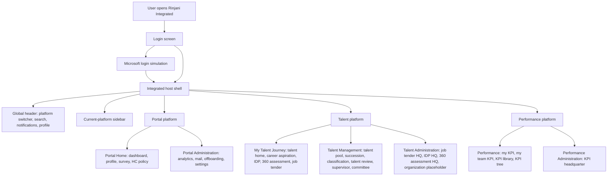

# Rinjani 2.0 Design System Overhaul

This ExecPlan is a living document. Keep `Progress`, `Surprises & Discoveries`, `Decision Log`, and `Outcomes & Retrospective` up to date as work proceeds.

## Purpose / Big Picture

Rinjani 2.0 already has a Talent-derived visual baseline, but the repository still carries component, token, and styling drift from the three original prototype streams: Portal, Talent, and Performance. The goal of this work is to enhance and formalize the existing design system, not redesign it from scratch.

After this phase, the team should have a clearer foundation for future component-library work:

- `.stitch/DESIGN.md` remains the Google Stitch / Google Stage-style source of truth for AI screen generation.
- Human-readable documentation explains the broader Rinjani design-system foundation, component taxonomy, and adoption path.
- Common UI components are categorized by utility and interaction role, not by source package.
- Domain-specific components are identified as future candidates, but not refactored or standardized in this documentation-first phase.
- The future dry-run preview page can be planned from a stable taxonomy rather than from ad hoc component discovery.

## Current Stage

Current stage:

- **Component library implementation: Phase 1-7 partial foundation.**
- `.stitch/DESIGN.md` is intentionally skipped for now because Stitch is being iterated by other agents.
- Documentation foundation is in place.
- Shared-ui foundation components, feedback/status components, and tab primitives are implemented and build-validated.
- Preview route is implemented at `/#/design-system`, so product-designer visual review can start in local dev.
- The preview route currently focuses on the component library. Additional horizontal tabs for typography, layout, naming conventions, semantics, primitives, and color theory are planned after the component-library pass is complete.

Completed in code:

- [x] `packages/shared-ui/src/utils.ts`: `cn`
- [x] `packages/shared-ui/src/action-chip.tsx`: `ActionChip`
- [x] `packages/shared-ui/src/button.tsx`: `Button`, `IconButton`, `ActionGroup`
- [x] `packages/shared-ui/src/dropdown-menu.tsx`: `DropdownMenu`, `DropdownMenuTrigger`, `DropdownMenuContent`, `DropdownMenuItem`
- [x] `packages/shared-ui/src/command-menu.tsx`: `CommandMenu`, `CommandMenuDialog`, `CommandMenuInput`, `CommandMenuItem`
- [x] `packages/shared-ui/src/badge.tsx`: `Badge`
- [x] `packages/shared-ui/src/card.tsx`: `Card`, `CardHeader`, `CardTitle`, `CardDescription`, `CardAction`, `CardContent`, `CardFooter`
- [x] `packages/shared-ui/src/field.tsx`: `Field`, `FieldGroup`, `FieldLabel`, `FieldDescription`, `FieldError`
- [x] `packages/shared-ui/src/label.tsx`: `Label`
- [x] `packages/shared-ui/src/input.tsx`: `Input`
- [x] `packages/shared-ui/src/textarea.tsx`: `Textarea`
- [x] `packages/shared-ui/src/select.tsx`: `Select`, `SelectTrigger`, `SelectContent`, `SelectItem`, `SelectValue`
- [x] `packages/shared-ui/src/checkbox.tsx`: `Checkbox`
- [x] `packages/shared-ui/src/radio-group.tsx`: `RadioGroup`, `RadioGroupItem`
- [x] `packages/shared-ui/src/switch.tsx`: `Switch`
- [x] `packages/shared-ui/src/progress.tsx`: `Progress`
- [x] `packages/shared-ui/src/alert.tsx`: `Alert`, `AlertTitle`, `AlertDescription`
- [x] `packages/shared-ui/src/banner.tsx`: `Banner`, `BannerTitle`, `BannerDescription`
- [x] `packages/shared-ui/src/dialog.tsx`: `Dialog`, `DialogTrigger`, `DialogContent`
- [x] `packages/shared-ui/src/alert-dialog.tsx`: `AlertDialog`, `AlertDialogTrigger`, `AlertDialogContent`
- [x] `packages/shared-ui/src/sheet.tsx`: `Sheet`, `SheetTrigger`, `SheetContent`
- [x] `packages/shared-ui/src/popover.tsx`: `Popover`, `PopoverTrigger`, `PopoverContent`
- [x] `packages/shared-ui/src/tooltip.tsx`: `Tooltip`, `TooltipTrigger`, `TooltipContent`
- [x] `packages/shared-ui/src/state.tsx`: `EmptyState`, `ErrorState`
- [x] `packages/shared-ui/src/separator.tsx`: `Separator`
- [x] `packages/shared-ui/src/skeleton.tsx`: `Skeleton`
- [x] `packages/shared-ui/src/spinner.tsx`: `Spinner`
- [x] `packages/shared-ui/src/tabs.tsx`: `Tabs`, `TabsList`, `TabsTrigger`, `TabsContent`
- [x] `packages/shared-ui/src/breadcrumb.tsx`: `Breadcrumb`, `BreadcrumbList`, `BreadcrumbItem`, `BreadcrumbPage`
- [x] `packages/shared-ui/src/pagination.tsx`: `Pagination`, `PaginationContent`, `PaginationLink`
- [x] `packages/shared-ui/src/table.tsx`: `Table`, `TableHeader`, `TableBody`, `TableRow`, `TableCell`
- [x] `packages/shared-ui/src/data-table.tsx`: `DataTable`
- [x] `packages/shared-ui/src/description-list.tsx`: `DescriptionList`, `DescriptionListItem`
- [x] `packages/shared-ui/src/detail-panel.tsx`: `DetailPanel`, `DetailPanelHeader`, `DetailPanelContent`
- [x] `packages/shared-ui/src/loading-state.tsx`: `LoadingState`
- [x] `packages/shared-ui/src/index.ts`: shared exports
- [x] `apps/rinjani/src/index.css`: Tailwind source scanning for `packages/shared-ui/src`
- [x] `apps/rinjani/src/design-system-page.tsx`: admin-only component preview page
- [x] `apps/rinjani/src/routes.tsx`: `/#/design-system` admin-only route
- [x] `apps/rinjani/src/manifests.ts`: admin sidebar item and route metadata

Next implementation candidates:

- [x] `Combobox`
- [x] `DateInput`
- [x] `SearchInput`, `List`, `StatusLabel`
- [x] `ProfileSummary`
- [ ] Shell visual redesign for navbar/sidebar/header using the approved manual Figma direction as reference
- [x] `MetricCard`, `ChartContainer`, `BarChart`, `ProgressCluster`, `RankingList`
- [x] Admin-only `/#/design-system` preview route

Product-designer review gate:

- [ ] Review `/#/design-system` in local dev as Admin.
- [ ] Confirm visual direction, density, hierarchy, and token usage.
- [ ] Confirm state coverage for implemented components.
- [ ] Mark components as approved, needs iteration, or blocked.

## Context and Orientation

Primary project facts:

- The integrated app lives in `apps/rinjani`.
- Shared implementation surfaces currently live in `packages/shared-ui`, `packages/shared-types`, and `packages/shell`.
- Copied prototype source snapshots live in `packages/portal`, `packages/talent`, and `packages/performance`.
- The current shared visual token source is `packages/shared-ui/src/theme.css`.
- The current Stitch-facing design-system source is `.stitch/DESIGN.md`.
- The current Stitch project metadata is stored in `.stitch/metadata.json`.
- Existing design-system audit notes are in `docs/design-system-overhaul-2026-04-07/DESIGN_CONSISTENCY_AUDIT.md`.

Reference inputs:

- Design Systems Surf guides: https://designsystems.surf/guides
- Typography system article: https://designsystems.surf/articles/do-you-have-a-typography-system-or-just-text-styles
- Component-category article: https://designsystems.surf/articles/the-building-blocks-of-great-design-systems-5-essential-categories
- AI kickoff article: https://designsystems.surf/articles/how-to-kick-start-of-your-design-system-with-ai
- InJourney brand book: `INJ_BRAND_BOOK_UPDATEJULY (1).pdf` from Google Drive, used as a brand rationale and guardrail, not as an automatic token override.
- Local Stitch skills: `stitch-design`, `taste-design`, and `design-md`

Baseline decision:

- Talent remains the canonical visual baseline.
- This is an enhancement and standardization project.
- The first implementation phase is planning and documentation, not component refactoring.

## Integrated Product Sitemap Overview

This is the grand-picture navigation model for the integrated Rinjani system. It is intentionally high level; detailed route lists remain in `docs/integrated-product-architecture/INTEGRATED_SITEMAP.md`.

Design-system implication:

- The shell is a product frame, not a page-level component.
- Stitch/Stage-generated in-app pages should usually be content-only regions inside the shell.
- The design-system preview route should eventually live inside the integrated shell so components can be judged in their real product context.

## Scope and Approach

This phase will:

- Create this living ExecPlan as `docs/design-system-overhaul-2026-04-07/DESIGN_SYSTEM_OVERHAUL_EXECPLAN.md`.
- Use repo-backed audit findings to prepare a product-designer interview.
- Define a functional component taxonomy inspired by the five essential categories from Design Systems Surf.
- Document UI pattern options so AI prototyping can choose appropriate presentation forms.
- Identify canonicalization strategy for future shared component work.
- Keep domain components documented as future candidates only.

This phase will not:

- Refactor runtime components.
- Move `components/ui` into `packages/shared-ui`.
- Update `.stitch/DESIGN.md` before interview decisions are locked.
- Build the dry-run preview route yet.
- Standardize KPI, 9-box, employee profile, IDP, job tender, or talent review domain components yet.

The approach is intentionally staged. First document the system and decision agenda, then run the product-designer interview, then update Stitch and supplementary docs, then plan the preview page and future shared-library migration.

Important sequence guardrail:

- After the product-designer interview, summarize and confirm conclusions first.
- Create and review `docs/design-system-overhaul-2026-04-07/DESIGN_SYSTEM.md` and `docs/design-system-overhaul-2026-04-07/COMPONENT_LIBRARY.md` before updating `.stitch/DESIGN.md`.
- Only update `.stitch/DESIGN.md` after the human-readable docs are accepted.

## Current Repo Findings

The repository already has a useful foundation:

- `packages/shared-ui/src/theme.css` carries the Talent-derived theme and legacy compatibility aliases.
- `packages/shell/src/app-shell.tsx` owns the integrated shell pattern.
- `.stitch/DESIGN.md` already describes the Rinjani Integrated visual atmosphere, palette, typography, component style, layout rules, and Stitch generation rules.
- `docs/design-system-overhaul-2026-04-07/DESIGN_CONSISTENCY_AUDIT.md` confirms the integrated shell and token unification pass already happened.

The main standardization gaps are:

- `packages/shared-ui` is still small and currently exports only the theme and `PageHeading`.
- Portal, Talent, and Performance each carry a local `components/ui` folder.
- Most base UI files are identical, but these are not identical across packages: `badge`, `button`, `dialog`, `input`, `progress`, `sheet`, and `textarea`.
- A static scan found many local style escape hatches: hardcoded hex values, inline `style={{ ... }}`, arbitrary radius classes, and arbitrary shadow classes.
- Portal and Performance still include large Figma/generated import surfaces under `src/imports`.
- Performance snapshot styles still include older teal values and `Inter` references that differ from the Talent-derived shared theme.

Quantitative audit snapshot from planning:

- `components/ui` references: 366 matches across 89 files, primarily in Talent imports.
- Hardcoded hex mentions: 3,454 matches across 127 files.
- Inline `style={{ ... }}`: 4,745 matches across 185 files.
- Arbitrary radius classes: 1,531 matches across 73 files.
- Arbitrary shadow classes: 121 matches across 39 files.
- UI symbol mentions across copied packages: `Button`, `Card`, `Badge`, `Input`, `Select`, `Progress`, `Table`, and `Dialog` are the most frequent.

These numbers are planning evidence, not immediate cleanup targets. The next implementation phases should avoid large blind refactors and instead use the taxonomy and preview page to guide incremental standardization.

## Component Taxonomy

The taxonomy should group UI by functional utility, not package ownership.

### Actions

Purpose: trigger movement, decisions, commands, or workflow transitions.

Examples:

- Buttons: primary, secondary, destructive, ghost, outline, link, icon-only.
- Chips and pills that act as commands or filters.
- Menu items and dropdown actions.
- Step navigation actions: next, back, submit, approve, reject, save draft.
- Link actions that move users to another page or detail view.
- Command palette actions and quick-action items.

Usage options to document:

- Inline button row for local page actions.
- Sticky footer action bar for long forms or approval flows.
- Compact icon button for table rows and dense cards.
- Dropdown menu for secondary or bulk actions.
- Command/search result action when the user is navigating by intent.

### Feedback

Purpose: tell users what happened, what is happening, or what requires attention.

Examples:

- Alerts, banners, inline validation messages, empty-state guidance, confirmation dialogs, toast notifications, success/error states.
- Warning callouts for deadline, approval, or incomplete data.
- Destructive confirmation modals.

Usage options to document:

- Inline message when the feedback belongs to a specific field or section.
- Banner when the message affects the page or workflow.
- Toast when the result is transient and does not block continuation.
- Modal confirmation when the action is destructive, irreversible, or high impact.

### Inputs

Purpose: collect or modify user-provided values.

Examples:

- Text input, textarea, select, combobox-like select, checkbox, radio group, switch, OTP input, date input, search input.
- Form labels, helper text, error text, required/optional indicators.

Usage options to document:

- Single-column forms for clarity and mobile safety.
- Two-column forms for short administrative metadata on desktop.
- Inline edit pattern for low-risk fields.
- Modal form for short scoped tasks.
- Right-side panel form for contextual edit-with-reference workflows.

### Navigation

Purpose: orient users, move between modules, or reveal information hierarchy.

Examples:

- Integrated shell sidebar, header, platform switcher, breadcrumbs, tabs, pagination, command/search, back links, section anchors.

Usage options to document:

- Sidebar for platform module navigation.
- Header platform switcher for cross-platform movement.
- Tabs for sibling views inside the same module.
- Breadcrumbs for nested admin/detail pages.
- Pagination for large tables.
- Search/command for global or platform-scoped discovery.

### Status Indicators

Purpose: communicate state, progress, availability, or readiness.

Examples:

- Badge, status label, progress bar, skeleton, loading indicator, empty state, error state, completion marker.

Usage options to document:

- Badge for compact categorical state.
- Progress bar for completion against a target.
- Skeleton for loading content with known layout.
- Empty state for data absence with a recovery action.
- Error state for failed loading or invalid workflow state.

### Data Display

Purpose: present structured data for scanning and comparison.

Examples:

- Cards, tables, lists, description lists, detail panels, profile summaries, metadata rows, accordions.

Usage options to document:

- Table for dense comparable records.
- Card grid for dashboard or review summaries.
- Description list for profile or object detail.
- Accordion for secondary detail that should not dominate the page.
- Right-side detail panel when a user needs to inspect one record while keeping list context.

### Analytics

Purpose: present measurable progress, trend, distribution, or scoring.

Examples:

- Metric card, chart, score card, KPI summary, progress cluster, ranking list.

Usage options to document:

- Metric card for one important number and short context.
- Chart when comparison or trend matters.
- Ranked list when sequence matters more than exact visual plotting.
- Progress cluster when several related completion states are needed.

### Shell

Purpose: preserve the integrated product frame.

Examples:

- App shell, sidebar, header, platform switcher, global search placeholder, notification trigger, profile trigger, role switcher.

Usage options to document:

- Full shell only for integrated app screens.
- Content-only screen guidance for Stitch-generated in-app pages.
- No duplicate sidebars or duplicate top-level headers inside module screens.

### Prototype Patterns

Purpose: document presentational options for AI prototyping without forcing immediate component implementation.

Examples:

- Employee brief profile can appear as inline card, modal, right-side panel, popover, or full detail page.
- KPI detail can appear as table row expansion, side panel, modal, or full page.
- Approval task can appear as compact card, timeline, modal confirmation, or sticky action workflow.

Usage guidance:

- Inline card when the information is part of the page scan.
- Modal when the task is short and interruptive.
- Right-side panel when the user needs detail without losing list context.
- Popover when the information is small and non-critical.
- Full detail page when the content is complex, shareable, or requires navigation history.

## Domain Component Parking Lot

Domain components are important, but this phase only catalogs them for future work. They should not be standardized or migrated yet.

Future candidates:

- KPI cards, KPI list items, KPI detail panels, KPI progress bars, KPI tree nodes.
- 9-box grid cells, classification badges, talent pool candidate cards, EQS score displays.
- Employee profile summaries, profile popovers, profile side panels, profile detail views.
- IDP status badges, IDP activity cards, IDP timeline/progress patterns.
- Job tender position cards, application cards, application status timeline, job admin cards.
- Talent review cards, committee decision cards, recommendation cards, proposal history cards.
- Offboarding and onboarding workflow cards, countdown/status panels, checklist items.
- Survey cards, survey analytics blocks, announcement cards, mail-management cards.

The interview should decide which of these become first-class shared components in a later implementation phase.

## Documentation Inventory And Organization

The `docs` folder currently contains a mix of active product architecture docs, completed historical ExecPlans, and current design-system planning docs. This phase should organize relevance before adding more files.

Active docs for the design-system work:

- `docs/design-system-overhaul-2026-04-07/DESIGN_SYSTEM_OVERHAUL_EXECPLAN.md`: current living plan for this work.
- `docs/design-system-overhaul-2026-04-07/DESIGN_SYSTEM_BLUEPRINT.md`: comprehensive blueprint for interview decisions, token strategy, taxonomy, and documentation direction.
- `docs/design-system-overhaul-2026-04-07/DESIGN_CONSISTENCY_AUDIT.md`: current audit checklist for design-system unification.

Active architecture docs outside the design-system focus:

- `docs/integrated-product-architecture/`: living architecture reference folder for navigation and shell ownership.
- `docs/integrated-product-architecture/INTEGRATED_SITEMAP.md`: detailed route and navigation ownership reference.
- `docs/integrated-product-architecture/SHELL_OWNERSHIP.md`: shell ownership rules that directly affect design-system guidance.
- `docs/integrated-product-architecture/TALENT_ROUTE_NORMALIZATION.md`: route-normalization reference; keep while legacy redirects still exist.

Archived completed plans:

- `docs/archive/completed-execplans/REPOSITORY_README_EXECPLAN.md`: completed README documentation plan.
- `docs/archive/completed-execplans/STITCH-DESIGN-EXECPLAN.md`: completed `.stitch/DESIGN.md` creation plan.
- `docs/archive/completed-execplans/INTEGRATED_SHELL_DESIGN_SYSTEM_EXECPLAN.md`: completed integrated shell and design-system unification plan.

Archive policy:

- Do not delete historical docs.
- Keep living artifacts in purpose-specific folders that describe the workstream and, when relevant, include the start date.
- Move completed historical plans into `docs/archive/` when they are no longer active working documents.
- Preserve links from the root README or docs index so contributors know which docs are current.

Future documentation outputs should be organized as:

- Current plan: `docs/design-system-overhaul-2026-04-07/DESIGN_SYSTEM_OVERHAUL_EXECPLAN.md`
- Current blueprint: `docs/design-system-overhaul-2026-04-07/DESIGN_SYSTEM_BLUEPRINT.md`
- Canonical AI generation source: `.stitch/DESIGN.md`
- Human design-system foundation: `docs/design-system-overhaul-2026-04-07/DESIGN_SYSTEM.md`
- Component taxonomy and usage options: `docs/design-system-overhaul-2026-04-07/COMPONENT_LIBRARY.md`
- Detailed navigation reference: `docs/integrated-product-architecture/INTEGRATED_SITEMAP.md`

## Milestones

### Milestone 1 - Documentation Plan

Create this ExecPlan with current repo findings, source references, taxonomy, and decision gates.

Validation:

- `docs/design-system-overhaul-2026-04-07/DESIGN_SYSTEM_OVERHAUL_EXECPLAN.md` exists and is readable.
- The plan clearly states that Talent remains the baseline.
- The plan clearly states that this phase is documentation-first.

### Milestone 2 - Product-Designer Interview

Run a repo-backed interview to lock decisions that cannot be inferred from code.

Interview agenda:

- Confirm component category names and definitions.
- Confirm whether any category needs additional Rinjani-specific naming.
- Confirm which base UI variants are canonical when package copies differ.
- Confirm whether the future component preview route should be internal-only or navigable from the app shell.
- Confirm priority order for future component standardization.
- Confirm typography policy, especially whether Georgia remains as a serif accent or is removed from enterprise screens.
- Confirm how strict the ban should be on new hardcoded colors, arbitrary radius, arbitrary shadows, and inline styles.

Validation:

- Interview decisions are recorded in `Decision Log`.
- Interview conclusions are summarized as a separate checkpoint before editing `.stitch/DESIGN.md` or supplementary docs.
- Open questions are reduced to implementation-ready decisions before documentation updates.

### Milestone 3 - Interview Conclusion Checkpoint

Summarize the product-designer interview into a clear conclusion note before changing the design-system documentation.

Conclusion should cover:

- Confirmed component taxonomy names and meanings.
- Confirmed visual baseline and typography policy.
- Confirmed canonicalization defaults for non-identical base UI files.
- Confirmed documentation organization and archive decisions.
- Confirmed future dry-run preview route scope.

Validation:

- No `.stitch/DESIGN.md`, `docs/design-system-overhaul-2026-04-07/DESIGN_SYSTEM.md`, or `docs/design-system-overhaul-2026-04-07/COMPONENT_LIBRARY.md` edits happen until this conclusion is captured.
- The conclusion can be used as implementation input without re-running the interview.

### Milestone 4 - Human Documentation

Create human-facing design-system documentation after interview decisions are locked.

Planned docs:

- `docs/design-system-overhaul-2026-04-07/DESIGN_SYSTEM.md`: system foundation and usage principles.
- `docs/design-system-overhaul-2026-04-07/COMPONENT_LIBRARY.md`: functional component taxonomy and UI pattern options.

Validation:

- Human docs are more comprehensive and explain usage options.
- Domain components remain parked unless explicitly promoted by interview decision.

### Milestone 5 - Stitch Documentation

Update `.stitch/DESIGN.md` after `DESIGN_SYSTEM.md` and `COMPONENT_LIBRARY.md` are reviewed.

Validation:

- Stitch guidance stays concise and generation-oriented.
- Stitch guidance preserves the accepted human-readable design-system decisions.
- Brand-book guidance remains a guardrail and does not blindly replace Rinjani tokens.

### Milestone 6 - Future Preview Page Planning

Plan the future dry-run preview route after documentation is approved.

Candidate route:

- `/#/design-system`

Preview page should eventually show:

- Tokens: color, typography, spacing, radius, elevation.
- Base UI: actions, inputs, feedback, navigation, status indicators, data display.
- Pattern options: inline card, modal, right-side panel, popover, full detail page.
- Future domain component placeholders, clearly marked as future work.

Validation:

- No preview route is implemented before the taxonomy and docs are approved.
- When implemented later, the page should be visually inspected and `npm run build` should pass.

## Validation

Documentation-first validation:

- Read back this file after creation.
- Confirm it includes `Purpose / Big Picture`, `Context and Orientation`, `Scope and Approach`, `Current Repo Findings`, `Component Taxonomy`, `Domain Component Parking Lot`, `Milestones`, `Validation`, `Progress`, `Surprises & Discoveries`, `Decision Log`, and `Outcomes & Retrospective`.
- Confirm it states Talent remains the canonical baseline.
- Confirm the taxonomy is functional rather than package-based.
- Confirm domain components are parked for future work.
- Confirm no production UI behavior changes are made.

Later implementation validation:

- `npm run build`
- Manual visual check of any future dry-run design-system page.
- Manual check that the integrated shell is still single-owner and no module page generates duplicate app chrome.

## Action Plan Before Component Coding

The next work should not jump straight into component files. Complete these gates first:

1. Review and approve `DESIGN_SYSTEM.md`.
2. Review and approve `COMPONENT_LIBRARY.md`.
3. Derive `.stitch/DESIGN.md` from the approved human-readable docs.
4. Run a shadcn/Radix/TanStack inventory and decide which open-source primitives become the base for each Rinjani component.
5. Create a component implementation ExecPlan for code work.
6. Build the shared foundation in `packages/shared-ui`.
7. Build the admin-only preview route at `/#/design-system`.
8. Validate component examples visually before migrating existing screens.
9. Product-designer review: evaluate the preview route, component states, token usage, and whether the component taxonomy is understandable visually.
10. Migrate new work first, then high-touch existing screens.
11. Treat domain components as a separate phase after base primitives and preview are stable.

Recommended open-source baseline:

- Use shadcn/ui as the open-code starting point because it is designed for building a custom component library, not importing an opaque black-box package.
- Use Radix-based primitives where shadcn already composes them for accessibility and interaction semantics.
- Use TanStack Table for complex data-table behavior such as sorting, filtering, pagination, selection, and column visibility.
- Keep Recharts or the existing shadcn Chart pattern for chart containers if analytics components need chart rendering.

Do not install or overwrite shadcn components blindly. First compare the current local `components/ui` copies, the shadcn registry output, and Rinjani token requirements.

## Component Build Task List

### Phase 0 - Inventory And Setup

- [ ] Run shadcn project inventory and confirm component configuration, aliases, Tailwind version, primitive base, and icon library.
- [ ] Compare Portal, Talent, and Performance `components/ui` folders for divergent components.
- [ ] Confirm the exact `packages/shared-ui` export structure.
- [ ] Decide the component source strategy: import/adapt from shadcn registry, rebuild from local Talent reference, or create a Rinjani-specific pattern.
- [ ] Define acceptance states for each component: default, hover, focus, disabled, loading, error, empty, selected, active, and read-only where applicable.

### Phase 1 - Foundation Tokens And Utilities

- [ ] Normalize token names and CSS variable documentation in `packages/shared-ui/src/theme.css`.
- [x] Add or confirm shared utility exports such as `cn`.
- [ ] Define shared focus-ring behavior.
- [ ] Define typography utility guidance for tabular numeric data.
- [ ] Define status color semantics for success, warning, attention, destructive, pending, approved, rejected, and draft.

### Phase 2 - Core Actions

- [x] `Button`: primary, secondary, destructive, outline, ghost, link, icon-only, loading.
- [x] `IconButton`: compact action button with accessible label requirements.
- [x] `ButtonGroup` or `ActionGroup`: grouped actions and toolbar actions.
- [x] `ActionChip`: selected, removable, disabled, and filter-action states.
- [x] `DropdownMenu`: contextual actions, destructive item, disabled item, group behavior.

### Phase 3 - Inputs And Forms

- [x] `Field`: label, helper, error, required, optional, disabled, read-only.
- [x] `Input`: default, focus, error, disabled, read-only.
- [x] `Textarea`: default, focus, error, disabled.
- [x] `Select`: single selection, grouped items, disabled, error.
- [x] `Combobox`: searchable selection pattern if needed for employee/module lookup.
- [x] `Checkbox`: checked, unchecked, indeterminate, disabled.
- [x] `RadioGroup`: grouped single-choice pattern.
- [x] `Switch`: immediate binary control.
- [x] `DateInput` or date-picker wrapper: document first if implementation scope is uncertain.
- [x] `SearchInput`: local table search and global-search-compatible visual pattern.
- [ ] `InputOTP`: keep as low priority unless authentication or verification flows need it.

### Phase 4 - Feedback And Overlays

- [x] `Alert`: info, success, warning, error.
- [x] `Banner`: page-level information and warning states.
- [x] `Toast`: use Sonner-compatible API and system status semantics.
- [x] `EmptyState`: first-use, no data, filtered empty.
- [x] `ErrorState`: inline, panel, page.
- [x] `Dialog`: accessible title, description, footer actions.
- [x] `AlertDialog`: destructive and high-impact confirmations.
- [x] `Sheet`: right-side detail/edit panel.
- [x] `Popover`: small contextual information.
- [x] `Tooltip`: short non-critical helper text.

### Phase 5 - Navigation

- [x] `Tabs`: sibling views and admin sub-sections.
- [x] `Breadcrumbs`: nested admin and detail pages.
- [x] `Pagination`: table/list pagination.
- [ ] `NavigationMenu` or scoped nav helper only when not duplicating shell navigation.
- [ ] `Command` pattern: optional global or module-scoped search result/action pattern.

### Phase 6 - Data Display

- [x] `Card`: default, elevated, interactive, selected.
- [x] `Table`: base table styling and states.
- [x] `DataTable`: shared pattern for search, sorting, pagination, empty state, and column visibility.
- [x] `List`: compact and interactive record lists.
- [x] `DescriptionList`: employee/object detail metadata.
- [x] `DetailPanel`: inline and right-side inspection pattern.
- [x] `ProfileSummary`: compact person identity display; keep generic, not domain-heavy.
- [x] `Accordion`: secondary detail disclosure.

### Phase 7 - Status And Loading

- [x] `Badge`: neutral, info, success, warning, error, attention.
- [x] `StatusLabel`: text-first status display.
- [x] `Progress`: default, success, warning, error.
- [x] `Skeleton`: text, card, table row.
- [x] `Spinner`: button and inline loading.
- [x] `LoadingState`: page or panel loading pattern.

### Phase 8 - Analytics Patterns

- [x] `MetricCard`: value, label, supporting text, trend, comparison.
- [x] `ChartContainer`: chart title, description, legend, empty state.
- [x] `BarChart`: x-axis, y-axis, hover tooltip, animated hover bars.
- [x] `ProgressCluster`: grouped completion states.
- [x] `RankingList`: ordered comparison display.
- [ ] `KpiSummary`: future composite pattern only; do not expose as a global component yet.

### Phase 9 - Preview And QA

- [x] Create the admin-only `/#/design-system` route.
- [ ] Add foundation preview: colors, typography, spacing, radius, elevation, naming conventions, semantics, primitives, and color theory.
- [ ] Add component previews for all base components and key states.
- [ ] Add prototype pattern previews: inline card, modal, right-side panel, popover, full page.
- [ ] Add a clearly marked domain parking-lot section.
- [ ] Run `npm run build`.
- [ ] Visually inspect desktop and mobile layouts.
- [ ] Product-designer review: confirm visual direction, density, hierarchy, state coverage, and which components need adjustment before migration.

### Phase 10 - Shell Visual Redesign

- [x] Review the approved Talent shell direction for navbar, sidebar, header, platform switcher, notifications, help, and profile menu.
- [x] Create the focused AppShell redesign plan at `docs/design-system-overhaul-2026-04-07/APP_SHELL_REDESIGN_PLAN.md`.
- [x] Create AppShell specifications and usage guidelines at `docs/design-system-overhaul-2026-04-07/APP_SHELL_GUIDELINES.md`.
- [x] Import approved Rinjani logo and supergraphic assets into `apps/rinjani/public/brand/`.
- [x] Removed incorrect kawung crop set, kept the master supergraphic, cleaned Factor 09 into the current approved extraction, and added a repeated tile preview in `/#/design-system`.
- [x] Review Intent UI Sidebar reference and record applicable shell capabilities without adopting the library blindly.
- [x] Translate the shell direction into shared shell tokens and component-level rules without changing product navigation behavior.
- [x] Update `packages/shell/src/app-shell.tsx` with Talent-derived sidebar/topbar, compliant logo plate, warm kawung tile texture, rounded workspace corner, and data-driven integrated navigation.
- [x] Preserve the existing integrated navigation ownership: shell owns global chrome; modules own page content only.
- [ ] Validate the shell across Portal, Talent, Performance, and the admin-only design-system route.

### Phase 11 - Migration Planning

- [ ] Identify new screens that should use shared components first.
- [ ] Identify high-touch HQ/admin screens for first migration.
- [ ] Keep generated/Figma import surfaces out of the first migration unless explicitly selected.
- [ ] Track remaining local component usage in Portal, Talent, and Performance.
- [ ] Create a follow-up migration ExecPlan before refactoring existing screens.

## Progress

- [x] Confirmed user intent: enhance the Talent-derived Rinjani design system, not redesign from scratch.
- [x] Reviewed existing Stitch-oriented documentation and local design-system skills.
- [x] Reviewed the current design-system baseline in `.stitch/DESIGN.md`.
- [x] Reviewed current shared theme and shell structure.
- [x] Completed static codebase review for common components, duplicated UI, token drift, inline style usage, and generated surfaces.
- [x] Created this design-system overhaul ExecPlan.
- [x] Added a high-level Mermaid sitemap overview for the integrated product navigation model.
- [x] Added documentation inventory and archive-candidate guidance for the `docs` folder.
- [x] Ran the first product-designer interview pass and captured decisions in a comprehensive blueprint.
- [x] Created `docs/design-system-overhaul-2026-04-07/DESIGN_SYSTEM_BLUEPRINT.md` as the reviewable conclusion artifact before final documentation updates.
- [x] Created `docs/README.md` as the active documentation index.
- [x] Moved completed historical ExecPlans into `docs/archive/completed-execplans/`.
- [x] Grouped the current design-system overhaul files into the dated session folder `docs/design-system-overhaul-2026-04-07/`.
- [x] Moved living product architecture references into `docs/integrated-product-architecture/`.
- [x] Moved the design consistency audit into the active design-system session folder.
- [x] Updated blueprint decisions: final docs are English-only, preview route is permanently admin-only, and base components should be clean shared implementations informed by Talent.
- [x] Read the InJourney brand book through Google Drive connector and used it as a brand rationale/guardrail.
- [x] Confirmed serif typography is deferred; no serif family is approved for this phase.
- [x] Created supplementary `docs/design-system-overhaul-2026-04-07/DESIGN_SYSTEM.md`.
- [x] Created supplementary `docs/design-system-overhaul-2026-04-07/COMPONENT_LIBRARY.md`.
- [x] Added pre-code action plan and component build task list.
- [x] Implemented first shared-ui component batch: `cn`, `Button`, `IconButton`, `ActionGroup`, `Badge`, `Card`, `Field`, `Label`, `Input`, `Textarea`, and `Progress`.
- [x] Added shared-ui source scanning to the app Tailwind entry file.
- [x] Ran `npm run build` successfully after esbuild sandbox execution was escalated.
- [x] Implemented second shared-ui component batch: `Alert`, `EmptyState`, `ErrorState`, `Separator`, `Skeleton`, `Spinner`, and `Tabs`.
- [x] Added the admin-only `/#/design-system` preview route with a horizontal tab foundation.
- [x] Ran `npm run build` successfully after the second component batch.
- [x] Implemented third shared-ui input batch: `Select`, `Checkbox`, `RadioGroup`, and `Switch`.
- [x] Replaced arbitrary success/warning badge text colors with semantic `success` and `warning` theme tokens.
- [x] Implemented `ActionChip` as a larger interactive chip, keeping `Badge` compact for status labels.
- [x] Implemented overlay/feedback batch: `DropdownMenu`, `Banner`, `Dialog`, `AlertDialog`, `Sheet`, `Popover`, and `Tooltip`.
- [x] Ran `npm install` after adding direct shared-ui Radix dependencies; npm still reports 3 existing vulnerabilities.
- [x] Ran `npm run build` successfully after the third component batch; existing large chunk warning remains.
- [x] Ran `npm run build` successfully after adding `ActionChip`; existing large chunk warning remains.
- [x] Ran `npm run build` successfully after adding the overlay/feedback batch; existing large chunk warning remains.
- [x] Added explicit preview titles and descriptions for each visible component example on `/#/design-system`.
- [x] Implemented navigation/data-display batch: `Breadcrumb`, `Pagination`, `Table`, `DescriptionList`, `DetailPanel`, and `LoadingState`.
- [x] Ran `npm run build` successfully after the navigation/data-display batch; existing large chunk warning remains.
- [x] Renamed the preview page title to `Rinjani 2.0 Design System`.
- [x] Removed non-functional hero actions (`Review checklist`, `Approve batch`) from the preview page.
- [x] Activated design-system foundation tabs for `Tokens`, `Typography`, and `Layout`.
- [x] Adjusted component preview labels to use the design-system sans treatment instead of uppercase/tracking-heavy labels.
- [x] Ran `npm run build` successfully after activating the foundation tabs; existing large chunk warning remains.
- [x] Added JetBrains Mono usage preview for structured technical metadata in the Typography tab.
- [x] Added component-category sidebar navigation inside the Components tab, including an `Implementation Status` entry.
- [x] Updated the `Implementation Status` table to include implemented and backlog components with `Last updated` tracking.
- [x] Added `Available states / variants` metadata to the `Implementation Status` table.
- [x] Removed duplicated typography/data preview from the `Implementation Status` section because it is now covered by the Typography tab.
- [x] Expanded the Layout tab with a coverage model for page shell, hierarchy, responsive grid, density, inspection patterns, and state coverage.
- [x] Increased the global radius token from `0.5rem` to `0.75rem` for softer surfaces.
- [x] Ran `npm run build` successfully after sidebar/category, monospace, layout, and radius updates; existing large chunk warning remains.
- [x] Implemented `CommandMenu` for navbar-search-style command palette interactions.
- [x] Implemented `DataTable` with search, sorting, column visibility, pagination, and empty state.
- [x] Enhanced `Sheet` with slide animation, softer radius, floating presentation, blur overlay, and no-overlay option.
- [x] Ran `npm install` and `npm run build` successfully after `CommandMenu`, `DataTable`, and enhanced `Sheet`; existing vulnerabilities and large chunk warning remain.
- [x] Fixed `CommandMenuDialog` trigger placement and overlay preview spacing, then reran `npm run build` successfully; existing large chunk warning remains.
- [x] Implemented analytics foundation components: `MetricCard`, `ChartContainer`, `ProgressCluster`, and `RankingList`.
- [x] Ran `npm run build` successfully after the analytics foundation batch; existing large chunk warning remains.
- [x] Removed `KpiSummary` from the global component library, compacted analytics preview spacing, and added `BarChart` with axis labels, hover tooltip, and hover animation.
- [x] Ran `npm run build` successfully after the analytics refinement batch; existing large chunk warning remains.
- [x] Standardized analytics preview spacing with `ComponentPreviewBlock` and changed preview stacks from auto-row grid to flex/content-start to prevent grid stretching gaps.
- [x] Documented grid-versus-flex layout guidance in `DESIGN_SYSTEM.md` and `COMPONENT_LIBRARY.md`.
- [x] Implemented `SearchInput`, `StatusLabel`, and `List`, then added them to the admin-only design-system preview.
- [x] Ran `npm run build` successfully after `SearchInput`, `StatusLabel`, and `List`; existing large chunk warning remains.
- [x] Implemented `Combobox`, `Toast`, and `Accordion`, then added them to the admin-only design-system preview.
- [x] Ran `npm install` and `npm run build` successfully after `Combobox`, `Toast`, and `Accordion`; existing vulnerabilities and large chunk warning remain.
- [x] Implemented `DateInput` and `ProfileSummary`, then added them to the admin-only design-system preview.
- [x] Ran `npm run build` successfully after `DateInput` and `ProfileSummary`; existing large chunk warning remains.
- [x] Adjusted `Badge` vertical alignment, moved `Toast` placement to bottom-right, and expanded table preview coverage with empty/loading states plus next-state recommendations.
- [x] Captured the future review-loop idea: select a cluttered Talent module, redesign it using the new shared design-system components, and use the result to validate whether the system is ready before broad migration.
- [x] Adjusted `ProfileSummary` preview to show an avatar icon sample, use an 8-digit numeric employee ID with monospace metadata styling, and avoid genericizing the Talent-only `Ready now` readiness badge.
- [x] Added a reusable component documentation standard to `COMPONENT_LIBRARY.md` so migration readiness can be evaluated consistently.
- [x] Reviewed the original Talent shell files and created a focused AppShell redesign plan before touching runtime shell code.
- [x] Replaced the rough fourteen-factor crop preview with a cleaner Factor 09 extraction and repeated-pattern/sidebar silhouette trials.
- [x] Added warm/red Factor 09 tile variants, updated the kawung preview to avoid teal-on-teal invisibility, and implemented the first runtime AppShell visual pass in `packages/shell/src/app-shell.tsx`.
- [x] Identified a major AppShell visual failure: `packages/shell/src` was not included in Tailwind source scanning, kawung opacity/blending made the motif invisible, search was too low-contrast, and sidebar profile menu was rendered from the wrong anchor.
- [x] Added `packages/shell/src` to Tailwind source scanning and corrected the AppShell pass with stronger search treatment, sidebar-anchored profile menu, warmer kawung visibility, and better topbar popover surfaces.
- [x] Created `DESIGN_SYSTEM_CLEANUP_PLAN.md` to classify current source of truth, active legacy residue, unsafe deletions, and the migration sequence for package-local UI/token cleanup.
- [x] Review and confirm the human-readable docs before `.stitch/DESIGN.md` updates.
- [x] Update `.stitch/DESIGN.md` using the `design-md` skill structure after the shared theme and component library were stabilized.
- [ ] Expand `/#/design-system` beyond components into typography, layout, naming conventions, semantics, primitives, and color theory tabs.

## Surprises & Discoveries

- `packages/shared-ui` is not yet a full shared component library. It currently provides the shared theme and `PageHeading`, while most reusable UI primitives remain copied inside Portal, Talent, and Performance.
- Many `components/ui` files are byte-for-byte identical across the copied packages, which suggests future canonicalization is feasible.
- Several base UI files differ across packages, so migration must compare behavior before choosing a canonical version.
- Talent is already closer to the intended design-system baseline than Portal and Performance, but even Talent contains local hardcoded style choices and domain-specific variants.
- Portal and Performance include large Figma/generated import files that should be treated as legacy/generated surfaces rather than the first refactor targets.
- Performance snapshot styling still includes older visual assumptions, including `Inter` references and teal values that differ from the shared Talent-derived theme.

## Decision Log

- Decision: Keep Talent as the canonical visual baseline.
  Rationale: The product direction explicitly treats this as enhancement of the Rinjani Talent-derived system, not a redesign.
  Date/Author: 2026-04-07 / Product + Codex

- Decision: Use `.stitch/DESIGN.md` as the primary AI-generation source of truth.
  Rationale: The repo already uses Stitch metadata and skills, and the user wants Google Stitch / Stage-style design-system documentation compatibility.
  Date/Author: 2026-04-07 / Product + Codex

- Decision: Categorize components by function and utility, not package ownership.
  Rationale: The user wants AI and product design to see implementation options such as card, modal, side panel, popover, and full page when prototyping flows.
  Date/Author: 2026-04-07 / Product + Codex

- Decision: Park domain components for future phases.
  Rationale: KPI, 9-box, employee profile, IDP, job tender, talent review, and performance-specific components need documentation context first, but should not be refactored in this plan.
  Date/Author: 2026-04-07 / Product + Codex

- Decision: Treat hardcoded style cleanup as a later migration, not a first-step refactor.
  Rationale: The static scan shows significant drift, but the safest path is to define taxonomy and docs before touching runtime UI across copied snapshots.
  Date/Author: 2026-04-07 / Codex

- Decision: Add a high-level sitemap to this ExecPlan instead of creating a second route inventory.
  Rationale: `docs/integrated-product-architecture/INTEGRATED_SITEMAP.md` already owns detailed route lists; this plan only needs the grand-picture navigation model for design-system context.
  Date/Author: 2026-04-07 / Product + Codex

- Decision: Create a comprehensive blueprint instead of a separate interview notes file.
  Rationale: The user wants one consumable document that combines interview decisions, existing design context, and best-practice synthesis before deriving final design-system docs.
  Date/Author: 2026-04-07 / Product + Codex

- Decision: Archive completed historical ExecPlans into `docs/archive/completed-execplans/`.
  Rationale: The docs folder needs a clearer active-vs-historical structure, and these two plans are completed decision-history artifacts rather than current working docs.
  Date/Author: 2026-04-07 / Product + Codex

- Decision: Organize living docs by purpose-specific folders and archive completed historical work.
  Rationale: The user needs to know which documents are active, which workstream they belong to, and which artifacts are only historical decision context.
  Date/Author: 2026-04-07 / Product + Codex

- Decision: Final design-system docs should be English-only.
  Rationale: The user confirmed the final documentation language after reviewing the blueprint.
  Date/Author: 2026-04-07 / Product

- Decision: The design-system preview route should be permanently admin-only.
  Rationale: The component/design-system library is useful for designers, engineers, and authorized reviewers, but should not be available to normal users.
  Date/Author: 2026-04-07 / Product

- Decision: Build base shared components from a clean state while using Talent as the primary reference.
  Rationale: The future library should become the source of truth, not a direct copy of inconsistent package-local variants; Talent remains the strongest visual and interaction reference.
  Date/Author: 2026-04-07 / Product

- Decision: Keep Georgia replacement as a recommendation checkpoint, not a finalized implementation decision.
  Rationale: The user wants a recommendation and alternatives before approving typography changes.
  Date/Author: 2026-04-07 / Product + Codex

- Decision: Defer serif usage for this phase.
  Rationale: Data-heavy enterprise UI should rely on Plus Jakarta Sans with tabular numeric behavior and JetBrains Mono only for structured technical metadata; no serif family is needed for the current operational product scope.
  Date/Author: 2026-04-07 / Product + Codex

- Decision: Use the InJourney brand book as a guardrail, not as an automatic redesign source.
  Rationale: The brand book explains the corporate rationale behind the current warm/cool palette and trust/care/excellence tone, but product UI tokens should not change blindly without product-designer confirmation.
  Date/Author: 2026-04-07 / Product + Codex

- Decision: Create human-readable design-system docs before updating `.stitch/DESIGN.md`.
  Rationale: The human docs hold the detailed technicalities and governance; `.stitch/DESIGN.md` should be the concise AI-generation derivative after those docs are reviewed.
  Date/Author: 2026-04-07 / Product + Codex

## Outcomes & Retrospective

Current outcome:

- This ExecPlan now captures the design-system overhaul direction, repo findings, functional component taxonomy, and next decision gates.
- This ExecPlan now includes the integrated system's high-level navigation sitemap and a documentation organization policy.
- The design-system blueprint and docs index now exist, and completed historical ExecPlans have been archived.
- The docs folder now separates active design-system session docs, living integrated-product architecture docs, and archived completed ExecPlans.
- The human-readable design-system foundation and component-library taxonomy now exist for review before `.stitch/DESIGN.md` is updated.
- No runtime UI files have been intentionally changed as part of this documentation-first step.

Remaining work:

- Review and confirm the human-readable design-system docs.
- Convert accepted human-readable docs into concise updates for `.stitch/DESIGN.md`.
- Plan and later implement a design-system dry-run preview page after documentation and taxonomy are approved.
