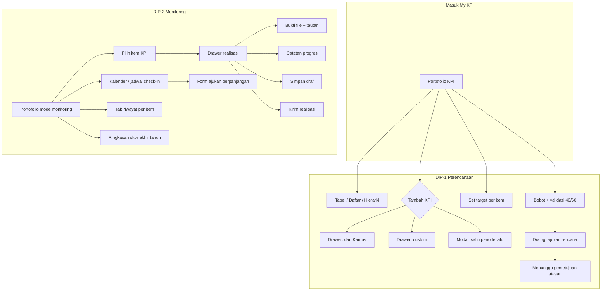
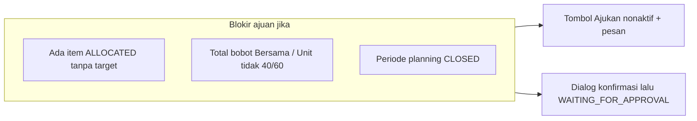
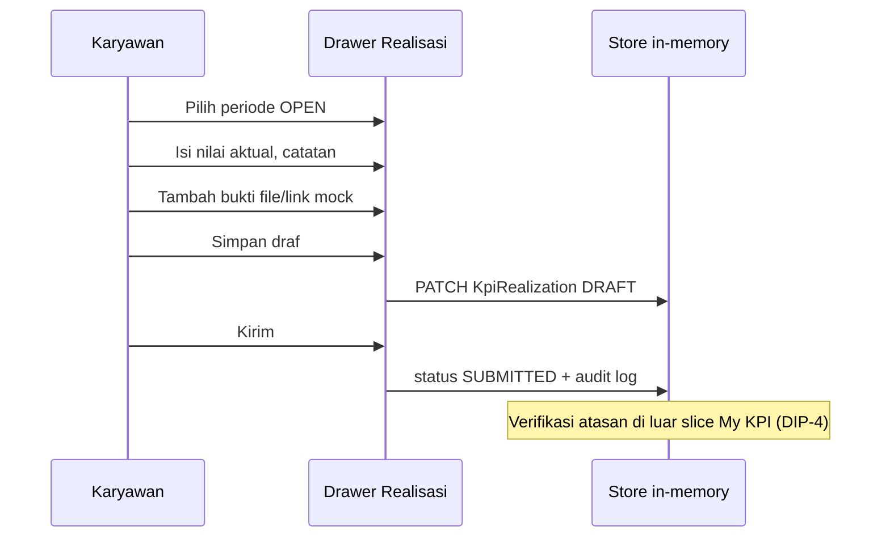

# My KPI — comprehensive DIP-driven plan (Performance 2.0)

This document supersedes the short “shell toggle + portfolio” sketch with a **full coverage map** of [DIP-1 My KPI Planning & Goal Setting](docs/design-input-packs/performance/exports/dip-1-my-kpi-planning-goal-setting-v0.1.md) and [DIP-2 My KPI Monitoring & Check-In](docs/design-input-packs/performance/exports/dip-2-my-kpi-monitoring-check-in-v0.1.md), including **prototype flows**, **visualization of those flows**, and **interactive behaviors** (mock store / in-memory actions).

Visual and density cues: [.stitch/DESIGN.md](.stitch/DESIGN.md) (tokens, cards, tables, overlays). Local Stitch HTML/PNG (if present under `.stitch/designs/`) are **reference only** for rhythm and copy—not a component source.

---

## 1. Product framing

| Fase (DIP)      | Employee intent                                                                           | Primary DIP               |
| --------------- | ----------------------------------------------------------------------------------------- | ------------------------- |
| **Perencanaan** | Susun portofolio, target, bobot; ajukan ke atasan                                         | DIP-1 §5–6, §7 screen map |
| **Monitoring**  | Isi realisasi per periode, bukti, catatan; lihat jadwal; akhir tahun lihat breakdown skor | DIP-2 §5–6, §7 screen map |

The **shell-level toggle** (Perencanaan | Monitoring) switches **which sub-tree of My KPI** is active (`/performance-v2/my-kpi…`), stays **outside** the white workspace (teal header per prior decision), and must **not** duplicate a second sidebar inside pages ([DESIGN.md — AppShell](.stitch/DESIGN.md)).

---

## 2. End-to-end flow (visualization)

### 2.1 High level

### 2.2 Perencanaan — decision flow (validasi submit)

### 2.3 Monitoring — realisasi (prototype interaksi)

---

## 3. DIP screen / flow coverage matrix

### 3.1 DIP-1 — Planning ([§7 coverage map](docs/design-input-packs/performance/exports/dip-1-my-kpi-planning-goal-setting-v0.1.md))

| DIP ref | User story | Screen / surface                   | Prototype must demonstrate                                                                                                                                                                                        |
| ------- | ---------- | ---------------------------------- | ----------------------------------------------------------------------------------------------------------------------------------------------------------------------------------------------------------------- |
| §7      | US-MK-001  | KPI Portfolio Dashboard            | Group Bersama/Unit; 3 view modes; dual bobot + kontribusi PI; footer total; empty/partial/submitted states                                                                                                        |
| §7      | US-MK-002  | Draft KPI Drawer (Library)         | Autocomplete ≥2 chars, max 10; link buka kamus; locked fields; simpan DRAFT + `dictionaryItemId`                                                                                                                  |
| §7      | US-MK-003  | Draft KPI Drawer (Custom)          | Form lengkap Unit-only; prompt cari kamus dulu; DRAFT `source=CUSTOM`                                                                                                                                             |
| §7      | US-MK-004  | Copy from Previous Modal           | List periode lalu; copy → ALLOCATED; sumber asli dipertahankan                                                                                                                                                    |
| §7      | US-MK-005  | Cascaded detail / row affordance   | Badge DIRECT/INDIRECT; induk + nama atasan; ALLOCATED→DRAFT saat edit target                                                                                                                                      |
| §7      | US-MK-006  | Target in drawer / inline          | FIXED vs PROGRESSIVE (Q1–Q4 / S1–S2); polaritas jelas                                                                                                                                                             |
| §7      | US-MK-007  | Weight assignment (footer / panel) | Running total; valid/invalid; dual display formula teks DIP                                                                                                                                                       |
| §7      | US-MK-008  | Submit confirmation                | Dialog BI; blokir jika ALLOCATED/invalid; toast sukses; read-only pasca submit                                                                                                                                    |
| §5      | Path B     | `WAITING_REVIEW` responses         | Kartu di `[MyKpiPlanningScreen](packages/performance-v2/src/modules/my-kpi/MyKpiPlanningScreen.tsx)` — Kembali ke draf / Ajukan ke persetujuan; reducer `RESPOND_WAITING_REVIEW`; bobot/target terkunci sementara |
| §5      | Change req | Permohonan di luar planning        | `[MyKpiChangeRequestsPanel](packages/performance-v2/src/modules/my-kpi/my-kpi-change-requests-panel.tsx)` + fixture `kpiChangeRequests` + aksi demo setujui/tolak                                                 |
| §7      | Read-only  | Pasca-submit / disetujui           | `isKpiItemPlanningLockedForEdits` + `isPlanningPortfolioAddKpiBlocked` di reducer; slider bobot di `[kpi-portfolio-panel.tsx](packages/performance-v2/src/modules/my-kpi/kpi-portfolio-panel.tsx)`                |

### 3.2 DIP-2 — Monitoring ([§7 coverage map](docs/design-input-packs/performance/exports/dip-2-my-kpi-monitoring-check-in-v0.1.md))

| DIP ref | User story | Screen / surface                            | Prototype must demonstrate                                                                             | Prototipe v2 (My KPI)                                                                                                                                                                                      |
| ------- | ---------- | ------------------------------------------- | ------------------------------------------------------------------------------------------------------ | ---------------------------------------------------------------------------------------------------------------------------------------------------------------------------------------------------------- |
| §7      | US-MK-009  | Portfolio (monitoring) + Realization Drawer | Form periode; target vs aktual; % capaian live; DRAFT vs SUBMITTED; progressive → target kuartal aktif | **Done** — `[MyKpiCheckInScreen](packages/performance-v2/src/modules/my-kpi/MyKpiCheckInScreen.tsx)` + mini-chart batang target vs realisasi (kuartalan) untuk KPI progresif.                              |
| §7      | US-MK-010  | Evidence block in drawer                    | Multi bukti; ikon tipe; hapus; blok submit jika `evidenceRequired` tanpa bukti                         | **Done** — daftar bukti dengan hapus (draf); tautan + file mock; kirim dinonaktifkan jika `evidenceRequired` dan bukti kosong (`KPI-U-001`).                                                               |
| §7      | US-MK-011  | Notes                                       | Textarea + counter 2000; debounce autosave mock; timeline catatan per periode (minimal)                | **Done** — counter 2000 + autosave draf ke store ±2 detik (`upsertRealization` dengan `skipAudit`); salinan catatan per periode pada baris realisasi.                                                      |
| §7      | US-MK-012  | Check-in schedule / calendar                | UPCOMING/OPEN/CLOSED/OVERDUE; highlight periode aktif; countdown OPEN; banner periode                  | **Done** — termasuk teks countdown ke `deadlineDate` periode OPEN di `[my-kpi-phase-matrix.tsx](packages/performance-v2/src/modules/my-kpi/my-kpi-phase-matrix.tsx)` (refresh 30 detik).                   |
| §7      | US-MK-013  | Year-end score breakdown                    | Tabel per item; subtotal jenis; final PI + rating badge; tooltip cap; teks rumus (read-only)           | **Done** — `[MyKpiYearEndScreen](packages/performance-v2/src/modules/my-kpi/MyKpiYearEndScreen.tsx)`: `portfolioScores` per NIK, rumus teks DIP, tooltip cap persis, blok umpan balik atasan dari fixture. |
| §7      | US-MK-014  | Extension request                           | Form alasan + hari; PENDING; tampil di area kalender (mock)                                            | **Done** — form + kartu permohonan; belum di-inline di kartu jadwal.                                                                                                                                       |

**DIP-2 business note:** KPI Bersama realisasi oleh admin (Tree/HQ), bukan karyawan—UI monitoring untuk Bersama harus **read-only** atau disembunyikan dari input realisasi.

**Implemented:** kartu “KPI Bersama” hanya baca; entri contoh `REA-B-001` di fixture; KPI Unit tetap dapat dikelola di drawer.

### 3.3 DIP-4 — My Team monitoring (verifikasi atasan)

Ringkas pelacakan untuk antrian atasan ([DIP-4](docs/design-input-packs/performance/exports/dip-4-my-team-kpi-monitoring-dashboard-verification-v0.1.md)) pada `[MyTeamMonitoringScreen](packages/performance-v2/src/modules/my-team-kpi/MyTeamMonitoringScreen.tsx)`:

| Area                                                      | Status                                                               |
| --------------------------------------------------------- | -------------------------------------------------------------------- |
| Dashboard ringkas (kartu tim, jumlah menunggu verifikasi) | **Done**                                                             |
| Antrian `SUBMITTED` per bawahan langsung                  | **Done** (data dari `realizations` + `kpiItems.ownerEmployeeNumber`) |
| Detail panel (nilai, target, bukti, catatan)              | **Done** (Sheet)                                                     |
| Verifikasi / tolak / sesuaikan (ADJUSTED)                 | **Done** (`upsertRealization` + audit)                               |
| Verifikasi massal + konfirmasi dialog                     | **Done**                                                             |
| Chart progres bulanan / auto-approve timeout              | **Belum** (placeholder teks mock)                                    |

---

## 4. Component inventory (to build in `packages/performance-v2`)

Grouped by concern. Prefer `@rinjani/shared-ui` primitives; add **performance-v2-only** composites here unless reuse is proven across modules.

### 4.1 Shell / chrome (app + shell package)

| Component                         | Responsibility                                                        |
| --------------------------------- | --------------------------------------------------------------------- |
| `MyKpiPhaseToggle` (v2)           | Segmented Perencanaan                                                 |
| `AppShell` `headerAccessory` prop | Slot in [packages/shell](packages/shell/src/app-shell.tsx) for toggle |

### 4.2 Identity & context

| Component                 | DIP / notes                                                                                                                                                                                                                                            |
| ------------------------- | ------------------------------------------------------------------------------------------------------------------------------------------------------------------------------------------------------------------------------------------------------ |
| `EmployeeBriefCard`       | Kartu ringkas: nama, NIK mono, jabatan, unit, periode KPI; dari Talent fixtures + store                                                                                                                                                                |
| `PerformancePeriodBanner` | Phase OPEN/CLOSED; planning ditutup ([DIP-1](docs/design-input-packs/performance/exports/dip-1-my-kpi-planning-goal-setting-v0.1.md)); check-in dibuka ([DIP-2](docs/design-input-packs/performance/exports/dip-2-my-kpi-monitoring-check-in-v0.1.md)) |

### 4.3 Portfolio (shared between phases, props for `mode: planning | monitoring`)

| Component                    | US-MK                                                                             |
| ---------------------------- | --------------------------------------------------------------------------------- |
| `KpiPortfolioShell`          | Layout grid: heading + brief + main + optional right rail                         |
| `KpiPortfolioSectionBersama` | Visual read-only; distinct styling                                                |
| `KpiPortfolioSectionUnit`    | Editable in planning where applicable                                             |
| `KpiPortfolioViewTable`      | US-MK-001                                                                         |
| `KpiPortfolioViewList`       | US-MK-001                                                                         |
| `KpiPortfolioViewHierarchy`  | US-MK-001; tree dari `parentKpiId` / cascade                                      |
| `KpiPortfolioRow`            | Title, badges tipe/sumber/status, polaritas, bobot dual, target ringkas, aksi row |
| `CascadeBadge`               | DIRECT / INDIRECT + tooltip induk                                                 |
| `WeightTotalsFooter`         | US-MK-007; validasi band formula                                                  |
| `PiContributionHint`         | Tooltip atau kolom “kontribusi PI”                                                |

### 4.4 Planning drawers & dialogs ([DIP-1 §7](docs/design-input-packs/performance/exports/dip-1-my-kpi-planning-goal-setting-v0.1.md))

| Component                 | US-MK                          |
| ------------------------- | ------------------------------ |
| `DraftKpiDrawer`          | Container Sheet; mode `library |
| `LibraryKpiAutocomplete`  | US-MK-002                      |
| `CustomKpiForm`           | US-MK-003                      |
| `CopyFromPreviousModal`   | US-MK-004                      |
| `TargetEditorFixed`       | US-MK-006                      |
| `TargetEditorProgressive` | US-MK-006                      |
| `SubmitPlanningDialog`    | US-MK-008                      |

### 4.5 Monitoring ([DIP-2 §7](docs/design-input-packs/performance/exports/dip-2-my-kpi-monitoring-check-in-v0.1.md))

| Component                  | US-MK                                                |
| -------------------------- | ---------------------------------------------------- |
| `CheckInSchedulePanel`     | US-MK-012; timeline atau list vertikal               |
| `CheckInPeriodCard`        | Satu periode: status, tanggal, countdown             |
| `RealizationDrawer`        | US-MK-009–011                                        |
| `RealizationActualField`   | Numeric + unit + live achievement %                  |
| `EvidenceListEditor`       | US-MK-010; mock file + URL rows                      |
| `ProgressNotesField`       | US-MK-011 + debounced dispatch                       |
| `ExtensionRequestDialog`   | US-MK-014                                            |
| `RealizationHistoryTable`  | Per item; US-MK-009 view history                     |
| `ScoreBreakdownView`       | US-MK-013; reuse/extend current year-end screen      |
| `TargetVsActualMiniChart`  | US-MK-009 — batang SVG di `MyKpiCheckInScreen`       |
| `MyKpiChangeRequestsPanel` | Permohonan perubahan KPI di luar planning (DIP-1 §5) |

---

## 5. Store & prototype interactivity (in-memory)

Extend [performance-v2-store](packages/performance-v2/src/lib/store/performance-v2-store.tsx) (or dedicated `my-kpi-actions.ts`) so **demo users can actually**:

| Action                                      | Effect                                             |
| ------------------------------------------- | -------------------------------------------------- |
| `addDraftFromLibrary` / `addCustomDraft`    | Append `KpiItem` + `KpiOwnership`                  |
| `updateTarget` / `updateProgressiveTargets` | Mutate item + `KpiTarget[]`                        |
| `updateWeight`                              | Mutate ownership; recompute validation             |
| `submitPlanning`                            | Validate; set statuses WAITING_FOR_APPROVAL; audit |
| `saveRealizationDraft`                      | Upsert `KpiRealization` DRAFT                      |
| `addEvidence` / `removeEvidence`            | Mock FILE (name only) + LINK                       |
| `submitRealization`                         | SUBMITTED if rules pass; audit                     |
| `createExtensionRequest`                    | Append mock `ExtensionRequest`                     |

Persist optional: `localStorage` for “session demo” continuity—not required for first slice.

---

## 6. Routes (suggested shape)

Keep **one** My KPI module prefix `/performance-v2/my-kpi` for sidebar matching; use **children** for deep links:

- `/performance-v2/my-kpi` — portfolio hub (phase-aware default content or redirect)
- `/performance-v2/my-kpi/planning` — optional focused planning hub (drawer can open from portfolio without route change)
- `/performance-v2/my-kpi/check-in` — monitoring hub + schedule
- `/performance-v2/my-kpi/year-end` — score breakdown

**Drawer-heavy flows** can stay as state-driven overlays on the portfolio route to reduce route explosion; linkable sub-routes where DIP explicitly separates “screens” (e.g. year-end).

---

## 7. Terminology & QA (from DIP)

- **Wajib BI** di label; hindari istilah terlarang di [DIP-1 §8](docs/design-input-packs/performance/exports/dip-1-my-kpi-planning-goal-setting-v0.1.md) / [DIP-2 §8](docs/design-input-packs/performance/exports/dip-2-my-kpi-monitoring-check-in-v0.1.md).
- Optional: skrip `grep` ringan pada `packages/performance-v2/src/modules/my-kpi/`** untuk istilah Inggris terlarang produk.

---

## 8. Implementation phases (recommended)

1. **Foundation:** Shell toggle + `EmployeeBriefCard` + period banner + portfolio layout shell (no new flows).
2. **DIP-1 portfolio completeness:** US-MK-001 views + footer + cascaded row + read-only Bersama.
3. **DIP-1 authoring:** Drawers library/custom + target + weight + submit dialog + store mutations.
4. **DIP-2 schedule + realization:** US-MK-012 panel + realization drawer + evidence + notes + store.
5. **DIP-2 year-end + extension:** Score breakdown polish + extension mock + history table.
6. **Polish:** Optional chart, empty states, Stitch density pass vs [DESIGN.md](.stitch/DESIGN.md).

### 8.1 Stitch / Glue reference — landing hub (`/performance-v2/my-kpi`)

**Source:** High-fidelity references (Stitch / Glue) — workspace assets under  
`C:\Users\PC\.cursor\projects\c-Users-PC-Code-Repository-injourney-rinjani2-0\assets\`  
(`image-2103e869-5b8c-475e-9d95-a6cfb6a1fa8f.png`, `image-fbd89d94-d1be-43af-9d6e-473f2acaf41c.png`).  
Semantic tokens and rhythm: [.stitch/DESIGN.md](../../.stitch/DESIGN.md) (reference only).

**Execution (done / next):**

| Area                       | Intent                                                                                                                                                                                                                                       |
| -------------------------- | -------------------------------------------------------------------------------------------------------------------------------------------------------------------------------------------------------------------------------------------- |
| **Header**                 | `PageHeading` (card DS): eyebrow Performa · fase · status, judul portofolio/rencana, deskripsi nama/jabatan/periode, aksi badge + CTA perencanaan; tautan sekunder check-in & akhir tahun di hub.                                            |
| **Matriks fase**           | Satu kartu/grid kompak: total bobot + VALID agregat, Bersama/Unit vs target, ringkasan **Perencanaan** (`validatePlanningSubmit`), **Monitoring** (jadwal OPEN/OVERDUE + link check-in). Dipakai di hub, perencanaan, check-in, akhir tahun. |
| **Kartu ringkas karyawan** | Foto/initial, nama, jabatan, **Atasan** dari master + NIK/periode.                                                                                                                                                                           |
| **Grid status**            | Jumlah item, hitung per status (Draft / Allocated / Disetujui / Menunggu).                                                                                                                                                                   |
| **Portofolio detail**      | Hub: toolbar pencarian + chip + toggle tampilan. Perencanaan: toolbar landing dimatikan (`showLandingToolbar={false}`); tambah KPI terpusat lewat menu **Tambah KPI** → Sheet Kamus / Sheet kustom / dialog salin.                           |
| **Bersama**                | Panel read-only (copy: ditetapkan admin); tanpa aksi ubah bobot di landing.                                                                                                                                                                  |
| **Akses fase / persona**   | Tanpa kartu “Akses cepat fase”; tanpa `PersonaContextBar` di atas — **Detail sesi demo** di footer (hub/planning) atau dekat aksi (check-in/year-end) membuka dialog isi persona.                                                            |
| **Footer aksi (hub)**      | Pesan validasi, peringatan ALLOCATED tanpa target, **Simpan draft** / **Lanjutkan submit** → perencanaan.                                                                                                                                    |
| **Halaman perencanaan**    | Header `PageHeading`, matriks sama seperti hub, **Tambah KPI** satu entry point, footer sticky + ajukan.                                                                                                                                     |

**Catatan produk:** Landing = **baca + navigasi**; edit bobot/target/submit tetap di **Perencanaan**.

---

## 9. Traceability

Update [performance-v2-dip-traceability.md](docs/plans/performance-v2-dip-traceability.md) after each phase: **US-MK-xxx → route → component file → store action**.

---

## 10. Out of scope (explicit)

- Verifikasi atasan (DIP-4) — hanya status SUBMITTED setelah kirim realisasi.
- Input realisasi KPI Bersama oleh karyawan ([DIP-2 §9](docs/design-input-packs/performance/exports/dip-2-my-kpi-monitoring-check-in-v0.1.md)).
- Backend / Supabase.

