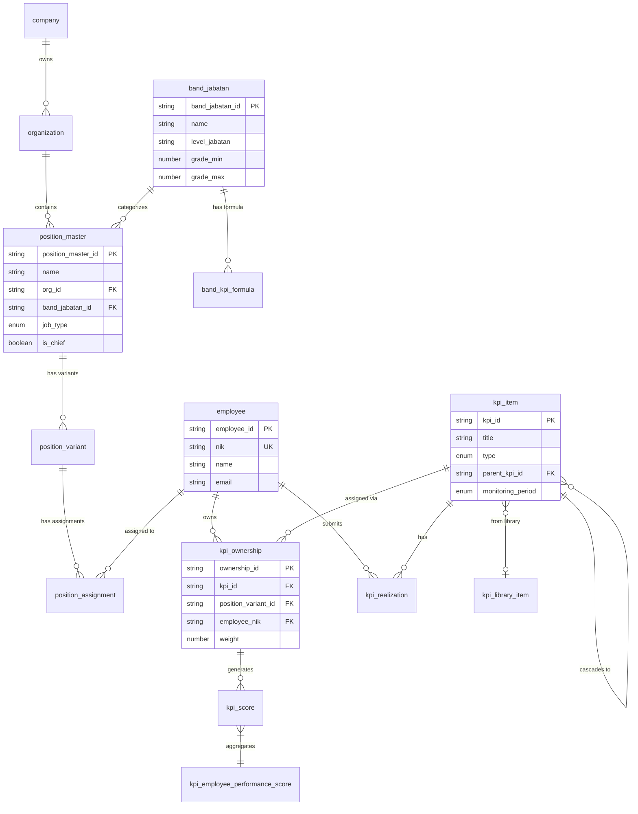

## Data Model

Core entities for **INJ-BPR** Rinjani Performance Management System.

Adapted from [PEL-004-PMS - Data Model](https://www.notion.so/PEL-004-PMS-Data-Model-a8d79578e6874ddf8a5a164d02383a19?pvs=21) with InJourney-specific adjustments.

---

## Entity Summary

Total **18 entities** organized into 5 domains:

### Organization & Position Domain

| **Entity** | **Description** |
| --- | --- |
| `company` | Master perusahaan dalam Grup InJourney (API, AP I, AP II, TWC, HIN, Sarinah, dll) |
| `organization` | Unit organisasi yang terikat ke company |
| `position_master` | Master definisi jabatan dengan cohort dan job_type |
| `position_variant` | Variant dari position_master (lokasi/spesialisasi) |
| `position_assignment` | Assignment karyawan ke position (Definitif/PLH/PGS) |
| `band_jabatan` | Pengelompokan jabatan berdasarkan level (BOD, Group Head, Division Head, Department Head) |
| `band_kpi_formula` | Bobot formula KPI per band jabatan per tahun |

### Employee Domain

| **Entity** | **Description** |
| --- | --- |
| `employee` | Data karyawan dengan NIK sebagai lookup key |

### KPI Domain

| **Entity** | **Description** |
| --- | --- |
| `kpi_item` | Definisi KPI (KPI Bersama / KPI Unit) |
| `kpi_ownership` | Assignment KPI ke position/employee dengan weight |
| `kpi_realization` | Record capaian KPI per periode |
| `kpi_library_item` | Item KPI standar di Kamus KPI |

### Score Domain

| **Entity** | **Description** |
| --- | --- |
| `kpi_score` | Skor individual KPI per periode monitoring |
| `kpi_employee_performance_score` | Agregasi skor karyawan per periode |
| `kpi_employee_performance_score_final` | Skor final karyawan (triwulan/tahunan) dengan kalibrasi |

### Schedule & Log Domain

| **Entity** | **Description** |
| --- | --- |
| `kpi_schedule` | Jadwal Goal Setting, Check-In, Year-End Review |
| `kpi_check_in_log` | Catatan diskusi Check-In antara Atasan dan Karyawan |
| `kpi_year_end_review_log` | Catatan Year-End Review dengan Self Assessment & Manager Assessment |

---

## Entity Relationship Diagram



---

## Key Entities

### 1. position_master

Master position yang merepresentasikan definisi jabatan.

**Schema Definition:**

| **Field** | **Type** | **Required** | **Description** |
| --- | --- | --- | --- |
| position_master_id | string | Yes | Unique identifier (PK) |
| name | string | Yes | Nama jabatan |
| org_id | string | Yes | Reference to Organization (FK) |
| band_jabatan_id | string | Yes | Reference to Band Jabatan (FK) |
| job_type | enum | Yes | **STRUKTURAL** / **NON_STRUKTURAL** |
| is_chief | boolean | Yes | Apakah jabatan pimpinan unit |
| is_active | boolean | Yes | Status aktif |

**TypeScript Interface:**

```tsx
export interface PositionMaster {
  position_master_id: string;
  name: string;
  org_id: string;
  cohort_id: string;
  job_type: 'STRUKTURAL' | 'NON_STRUKTURAL';
  is_chief: boolean;
  parent_position_master_id?: string;
  is_active: boolean;
}
```

---

### 2. kpi_item

Definisi KPI (KPI Bersama atau KPI Unit).

<aside>
⚠️

**Perbedaan dari Portaverse:**

- Hanya 2 tipe: `BERSAMA` dan `UNIT` (tidak ada KAI, SUB_IMPACT)
- Monitoring period: hanya `QUARTERLY`, `SEMESTER`, `ANNUAL`
</aside>

**Schema Definition:**

| **Field** | **Type** | **Required** | **Description** |
| --- | --- | --- | --- |
| kpi_id | string | Yes | Unique identifier (PK) |
| title | string | Yes | Nama KPI |
| description | text | No | Deskripsi KPI |
| type | enum | Yes | **BERSAMA** / **UNIT** |
| target | number | Yes | Target capaian |
| target_unit | string | Yes | Satuan target (%, Rp, unit, dll) |
| polarity | enum | Yes | HIGHER_IS_BETTER / LOWER_IS_BETTER |
| monitoring_period | enum | Yes | **QUARTERLY** / **SEMESTER** / **ANNUAL** |
| parent_kpi_id | string | No | Parent KPI untuk cascading (FK) |
| year | number | Yes | Tahun penilaian |
| status | enum | Yes | DRAFT / APPROVED / REJECTED |

**TypeScript Interface:**

```tsx
export interface KPIItem {
  kpi_id: string;
  title: string;
  description?: string;
  type: 'BERSAMA' | 'UNIT';
  target: number;
  target_unit: string;
  polarity: 'HIGHER_IS_BETTER' | 'LOWER_IS_BETTER';
  monitoring_period: 'QUARTERLY' | 'SEMESTER' | 'ANNUAL';
  parent_kpi_id?: string;
  library_item_id?: string;
  year: number;
  status: 'DRAFT' | 'APPROVED' | 'REJECTED';
  is_active: boolean;
}
```

---

### 3. band_kpi_formula

Bobot formula KPI per band jabatan per tahun.

<aside>
📊

**Perbedaan dari Portaverse:**

- Hanya 2 komponen: `bersama_weight` dan `unit_weight`
- Tidak ada `kai_weight` atau `sub_impact_weight`
</aside>

**Schema Definition:**

| **Field** | **Type** | **Required** | **Description** |
| --- | --- | --- | --- |
| formula_id | string | Yes | Unique identifier (PK) |
| band_jabatan_id | string | Yes | Reference to Band Jabatan (FK) |
| year | number | Yes | Tahun penilaian |
| bersama_weight | number | Yes | Bobot KPI Bersama % (0-100) |
| unit_weight | number | Yes | Bobot KPI Unit % (0-100) |
| is_active | boolean | Yes | Status aktif |

**TypeScript Interface:**

```tsx
export interface BandKPIFormula {
  formula_id: string;
  band_jabatan_id: string;
  year: number;
  bersama_weight: number; // e.g., 40 for Struktural
  unit_weight: number;    // e.g., 60 for Struktural
  is_active: boolean;
}
```

**Constraint:** `bersama_weight + unit_weight = 100`

---

### 4. kpi_check_in_log

Catatan diskusi Check-In (Pasal 7).

**Schema Definition:**

| **Field** | **Type** | **Required** | **Description** |
| --- | --- | --- | --- |
| check_in_id | string | Yes | Unique identifier (PK) |
| employee_nik | string | Yes | Karyawan yang dinilai (FK) |
| supervisor_nik | string | Yes | Atasan Langsung (FK) |
| year | number | Yes | Tahun penilaian |
| check_in_number | number | Yes | Check-in ke-1, 2, atau 3 |
| discussion_date | date | Yes | Tanggal diskusi |
| achievement_notes | text | No | Catatan capaian target |
| challenges_notes | text | No | Catatan kendala |
| feedback_notes | text | No | Feedback untuk perbaikan |

---

### 5. kpi_year_end_review_log

Catatan Year-End Review (Pasal 8).

**Schema Definition:**

| **Field** | **Type** | **Required** | **Description** |
| --- | --- | --- | --- |
| review_id | string | Yes | Unique identifier (PK) |
| employee_nik | string | Yes | Karyawan yang dinilai (FK) |
| supervisor_nik | string | Yes | Atasan Langsung (FK) |
| year | number | Yes | Tahun penilaian |
| self_assessment_rating | number | No | Rating dari Self Assessment (1-5) |
| self_assessment_notes | text | No | Catatan Self Assessment |
| manager_assessment_rating | number | Yes | Rating dari Manager Assessment (1-5) |
| manager_assessment_notes | text | No | Catatan Manager Assessment |
| strengths | text | No | Kekuatan karyawan |
| improvements | text | No | Area yang perlu ditingkatkan |
| acknowledgement_date | datetime | No | Tanggal acknowledgement karyawan |

---

## Enums & Constants

### KPI Type

| **Value** | **Label** | **Description** |
| --- | --- | --- |
| BERSAMA | KPI Bersama | KPI kolegial dari Direksi (Corporate) |
| UNIT | KPI Unit | KPI individu berdasarkan tugas/fungsi |

### Monitoring Period

| **Value** | **Label** | **Description** |
| --- | --- | --- |
| QUARTERLY | Triwulan | Monitoring setiap 3 bulan |
| SEMESTER | Semester | Monitoring setiap 6 bulan |
| ANNUAL | Tahun | Monitoring akhir tahun |

### Job Type

| **Value** | **Label** | **KPI Bersama** | **KPI Unit** |
| --- | --- | --- | --- |
| STRUKTURAL | Jabatan Struktural | 40% | 60% |
| NON_STRUKTURAL | Jabatan Non-Struktural (termasuk Fungsional) | 0% | 100% |

### Performance Rating (Pasal 9)

| **Rating** | **Label** | **PI Range** |
| --- | --- | --- |
| 1 | Unsuccessful | 1.00 - 1.49 |
| 2 | Partially Successful | 1.50 - 2.49 |
| 3 | Successful | 2.50 - 3.49 |
| 4 | Excellent | 3.50 - 4.49 |
| 5 | Outstanding | 4.50 - 5.00 |

---

## Source Reference

- [PEL-004-PMS - Data Model](https://www.notion.so/PEL-004-PMS-Data-Model-a8d79578e6874ddf8a5a164d02383a19?pvs=21)
- [[INJ-DH] Data Catalogue & Data Model](https://www.notion.so/INJ-DH-Data-Catalogue-Data-Model-d646faf37a9344efaea8bf732eb285f6?pvs=21)
- Perdir API PD.INJ.03.04/12/2022/A.0022