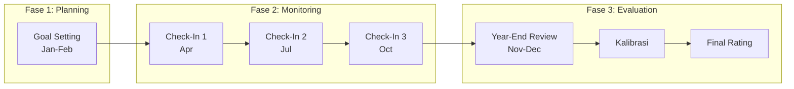

## Section Spec: KPI Headquarter (SEC-HQ)

**Module Code:** SEC-HQ  

**Parent Product:** Rinjani Performance (INJ-BPR)

---

## 1. Overview

Modul KPI Headquarter adalah modul administrasi untuk konfigurasi sistem performance management, termasuk pengaturan bobot per Band Jabatan, jadwal periode penilaian, dan reporting/analytics tingkat organisasi.

### 1.1 Objectives

- Konfigurasi bobot KPI Bersama dan KPI Unit per Band Jabatan
- Pengaturan jadwal siklus penilaian kinerja (Goal Setting, Check-In, Year-End Review)
- Monitoring completion rate dan compliance di seluruh organisasi
- Pelaporan dan analytics performance management

### 1.2 Target Users

| Role | Access Level | Primary Use Case |
| --- | --- | --- |
| HC Admin | Company scope | Konfigurasi dan monitoring per company |
| HC Admin HO | All companies | Konfigurasi global dan cross-company reporting |

---

## 2. Assessment Cycle Management

### 2.1 Siklus Penilaian Kinerja (Perdir API)

### 2.2 Schedule Configuration

| Phase | Default Period | Configurable | Description |
| --- | --- | --- | --- |
| Goal Setting | 1 Jan - 28 Feb | ✓ | Penetapan KPI Individu |
| Check-In 1 | 1 Apr - 30 Apr | ✓ | Review Q1 |
| Check-In 2 | 1 Jul - 31 Jul | ✓ | Review Semester 1 |
| Check-In 3 | 1 Oct - 31 Oct | ✓ | Review Q3 |
| Year-End Review | 15 Nov - 31 Dec | ✓ | Penilaian akhir tahun |
| Kalibrasi | After Year-End | ✓ | Calibration session |

---

## 3. User Stories

### 3.1 Weight Configuration (Priority: High)

| ID | User Story | Acceptance Criteria | Priority |
| --- | --- | --- | --- |
| HQ-001 | Sebagai HC Admin HO, saya ingin configure bobot KPI per Band Jabatan | - Weight editor per band
- Bersama + Unit = 100%
- Validation per row | P0 |
| HQ-002 | Sebagai HC Admin HO, saya ingin set bobot berbeda per tahun | - Year selector
- Copy from previous year
- Version history | P0 |
| HQ-003 | Sebagai HC Admin, saya ingin view bobot yang berlaku di company saya | - Read-only view
- Current year display | P1 |

### 3.2 Schedule Management (Priority: High)

| ID | User Story | Acceptance Criteria | Priority |
| --- | --- | --- | --- |
| HQ-004 | Sebagai HC Admin HO, saya ingin set jadwal Goal Setting | - Date range picker
- Reminder configuration
- Auto-lock setelah deadline | P0 |
| HQ-005 | Sebagai HC Admin HO, saya ingin set jadwal Check-In | - 3 Check-In periods
- Overlapping prevention
- Notification triggers | P0 |
| HQ-006 | Sebagai HC Admin HO, saya ingin set jadwal Year-End Review | - Assessment period
- Grace period option
- Lock mechanism | P0 |
| HQ-007 | Sebagai HC Admin HO, saya ingin extend deadline | - Extension form
- Audit trail
- Notification to affected users | P1 |

### 3.3 Monitoring & Reporting (Priority: High)

| ID | User Story | Acceptance Criteria | Priority |
| --- | --- | --- | --- |
| HQ-008 | Sebagai HC Admin, saya ingin melihat completion rate per phase | - Dashboard dengan metrics
- Drill-down per unit
- Trend visualization | P0 |
| HQ-009 | Sebagai HC Admin, saya ingin melihat distribusi rating | - Rating distribution chart
- Comparison vs target
- By band/unit filter | P0 |
| HQ-010 | Sebagai HC Admin, saya ingin export laporan | - Excel export
- PDF summary
- Customizable columns | P1 |
| HQ-011 | Sebagai HC Admin HO, saya ingin compare metrics antar company | - Cross-company dashboard
- Benchmark metrics
- Ranking view | P1 |

### 3.4 KPI Library Governance (Priority: Medium)

| ID | User Story | Acceptance Criteria | Priority |
| --- | --- | --- | --- |
| HQ-012 | Sebagai HC Admin HO, saya ingin review KPI Library submissions | - Approval queue
- Detail review page
- Batch approval | P1 |
| HQ-013 | Sebagai HC Admin HO, saya ingin manage KPI Library items | - Edit/deprecate capability
- Version control
- Usage analytics | P2 |

---

## 4. Screen Inventory

| Screen ID | Screen Name | Entry Point | Role Access |
| --- | --- | --- | --- |
| HQ-SCR-01 | HQ Dashboard | Sidebar menu | HC Admin, HC Admin HO |
| HQ-SCR-02 | Weight Configuration | Dashboard quick action | HC Admin HO |
| HQ-SCR-03 | Schedule Configuration | Dashboard quick action | HC Admin HO |
| HQ-SCR-04 | Completion Monitor | Dashboard tab | HC Admin, HC Admin HO |
| HQ-SCR-05 | Reports & Analytics | Dashboard tab | HC Admin, HC Admin HO |
| HQ-SCR-06 | Library Approval | Admin menu | HC Admin HO |
| HQ-SCR-07 | Company Comparison | Admin menu | HC Admin HO |

---

## 5. Business Rules

### 5.1 Weight Configuration Rules

**Per Perdir API PD.INJ.03.04/12/2022/A.0022:**

| Band Jabatan | Job Type | KPI Bersama | KPI Unit | Total |
| --- | --- | --- | --- | --- |
| Utama | Struktural | 50% | 50% | 100% |
| Madya | Struktural | 45% | 55% | 100% |
| Muda | Struktural | 40% | 60% | 100% |
| Pratama A | Struktural | 35% | 65% | 100% |
| Pratama B | Struktural | 30% | 70% | 100% |
| General | Non-Struktural | 0% | 100% | 100% |

**Validation Rules:**

- KPI Bersama + KPI Unit must equal 100%
- Changes require approval workflow for next year
- Current year weights are locked after Goal Setting ends

### 5.2 Schedule Rules

- Phases cannot overlap
- Minimum duration: 14 days per phase
- Maximum extension: 14 days
- Auto-lock after deadline + grace period (if configured)

### 5.3 Admin Scope Rules

| Role | Configuration | Monitoring | Reports |
| --- | --- | --- | --- |
| HC Admin | Read-only | Own company | Own company |
| HC Admin HO | Full access | All companies | All companies |

### 5.4 Performance Rating Distribution (Reference Curve)

Per Perdir API, target distribution:

| Rating | Label | Target % |
| --- | --- | --- |
| 5 | Outstanding | 5% |
| 4 | Excellent | 20% |
| 3 | Successful | 50% |
| 2 | Partially Successful | 20% |
| 1 | Unsuccessful | 5% |

---

## 6. Data Dependencies

| Entity | Purpose | Source |
| --- | --- | --- |
| `band_kpi_formula` | Weight configuration | This module |
| `kpi_schedule` | Schedule periods | This module |
| `kpi_employee_portfolio` | Completion tracking | My KPI Module |
| `kpi_employee_performance_score_final` | Final scores | Year-End Review |
| `company_master` | Company list | Org Master |
| `organization_unit` | Unit hierarchy | Org Master |

---

## 7. Integration Points

### 7.1 Upstream

- **My KPI Module**: Portfolio and score data
- **My Team KPI Module**: Team completion data
- **Organization Master**: Company and unit structure

### 7.2 Downstream

- **All Modules**: Schedule and weight configuration
- **Executive Dashboard**: Summary metrics
- **Compensation Module**: Final rating data (future)