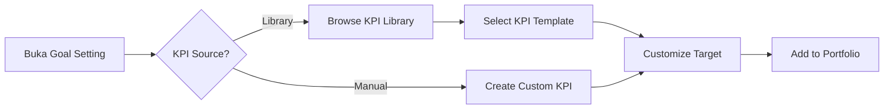

## Section Spec: KPI Library (SEC-KL)

**Module Code:** SEC-KL  

**Parent Product:** Rinjani Performance (INJ-BPR)

---

## 1. Overview

Modul KPI Library adalah kamus KPI standar yang menyediakan template KPI untuk rekomendasi dan standardisasi definisi KPI di seluruh InJourney Group. Library ini memungkinkan pengguna untuk memilih KPI yang sudah terstandarisasi atau mengajukan KPI baru untuk ditambahkan ke library.

### 1.1 Objectives

- Menyediakan katalog KPI terstandarisasi untuk seluruh InJourney Group
- Memastikan konsistensi definisi, formula, dan pengukuran KPI
- Mempercepat proses Goal Setting dengan template KPI siap pakai
- Mendokumentasikan best practices KPI berdasarkan fungsi dan level

### 1.2 Target Users

| Role | Access Level | Primary Use Case |
| --- | --- | --- |
| Karyawan | Browse, Use | Mencari KPI untuk Goal Setting |
| Atasan | Browse, Use, Submit | Merekomendasi KPI untuk tim |
| HC Admin | Browse, Use, Submit, Approve | Mengelola library KPI |
| HC Admin HO | Full Access | Konfigurasi dan governance |

---

## 2. Assessment Cycle Integration

### 2.1 Planning Phase (Goal Setting)

### 2.2 Library Usage Flow

1. **Browse Library**: User membuka KPI Library dari Goal Setting
2. **Filter & Search**: User mencari KPI berdasarkan type, fungsi, atau keyword
3. **View Detail**: User melihat detail KPI termasuk definisi dan formula
4. **Use KPI**: User menambahkan KPI ke portfolio dengan target yang di-customize
5. **Submit New**: Jika KPI tidak tersedia, user dapat submit KPI baru

---

## 3. User Stories

### 3.1 Browse & Search (Priority: High)

| ID | User Story | Acceptance Criteria | Priority |
| --- | --- | --- | --- |
| KL-001 | Sebagai Karyawan, saya ingin browse KPI Library agar dapat memilih KPI standar untuk Goal Setting | - List KPI dengan pagination
- Filter by type (Bersama/Unit)
- Search by keyword | P0 |
| KL-002 | Sebagai Karyawan, saya ingin filter KPI berdasarkan fungsi jabatan | - Filter by fungsi (Finance, HR, Operations, IT, dll)
- Multi-select filter | P0 |
| KL-003 | Sebagai Karyawan, saya ingin filter KPI berdasarkan Band Jabatan | - Filter by applicable band
- Show KPI yang relevan untuk band saya | P1 |
| KL-004 | Sebagai Karyawan, saya ingin melihat detail lengkap KPI sebelum menggunakan | - Detail page dengan semua atribut
- Usage statistics
- "Use This KPI" button | P0 |
| KL-005 | Sebagai Karyawan, saya ingin melihat KPI yang sering digunakan | - Popular/trending KPI section
- Usage count display | P2 |

### 3.2 KPI Submission (Priority: Medium)

| ID | User Story | Acceptance Criteria | Priority |
| --- | --- | --- | --- |
| KL-006 | Sebagai Atasan, saya ingin submit KPI baru ke Library | - Submit form dengan validasi
- Draft saving
- Submit for approval | P1 |
| KL-007 | Sebagai Submitter, saya ingin melihat status submission saya | - My Submissions list
- Status tracking (Draft, Submitted, In Review, Published, Rejected) | P1 |
| KL-008 | Sebagai Submitter, saya ingin revise KPI yang direject | - Revision form
- View rejection reason
- Resubmit capability | P2 |

### 3.3 Approval (Priority: Medium)

| ID | User Story | Acceptance Criteria | Priority |
| --- | --- | --- | --- |
| KL-009 | Sebagai HC Admin, saya ingin review KPI submission | - Approval queue dengan filter
- Detail review page | P1 |
| KL-010 | Sebagai HC Admin, saya ingin approve/reject KPI submission | - Approve dengan notes
- Reject dengan reason (mandatory) | P1 |
| KL-011 | Sebagai HC Admin, saya ingin edit KPI yang sudah di-publish | - Edit form
- Version history
- Deprecate old KPI | P2 |

---

## 4. Screen Inventory

| Screen ID | Screen Name | Phase | Entry Point | Role Access |
| --- | --- | --- | --- | --- |
| KL-SCR-01 | Library Browse | All | Sidebar menu, Goal Setting | All |
| KL-SCR-02 | KPI Detail | All | Click KPI item | All |
| KL-SCR-03 | Submit KPI | Planning | Button "Submit New KPI" | Atasan, HC Admin |
| KL-SCR-04 | My Submissions | All | Sidebar sub-menu | Submitters |
| KL-SCR-05 | Review Queue | All | Admin menu | HC Admin |
| KL-SCR-06 | Edit KPI | All | Admin action | HC Admin |

---

## 5. Business Rules

### 5.1 KPI Attributes (Mandatory)

- **Title**: Nama KPI (unique per type)
- **Description**: Definisi lengkap KPI
- **Type**: KPI Bersama / KPI Unit
- **Formula**: Formula pengukuran
- **Target Unit**: Satuan pengukuran (%, IDR, Scale, etc)
- **Polarity**: Higher is Better / Lower is Better
- **Monitoring Period**: Triwulan / Semester / Tahun

### 5.2 KPI Attributes (Optional)

- **Recommended Target**: Nilai target yang disarankan
- **Applicable Functions**: Fungsi jabatan yang relevan
- **Applicable Band Jabatan**: Band yang dapat menggunakan KPI ini
- **Evidence Requirement**: Dokumen bukti yang diperlukan
- **Tags**: Keywords untuk pencarian

### 5.3 Approval Rules

- KPI submission memerlukan approval dari HC Admin
- HC Admin HO dapat approve langsung tanpa review
- Rejected KPI dapat di-revise dan di-submit ulang
- Published KPI tidak dapat dihapus, hanya di-deprecate

### 5.4 Usage Rules

- KPI dari Library dapat di-customize target-nya
- Formula dan definisi tidak dapat diubah
- Usage count di-track untuk analytics

---

## 6. Data Dependencies

| Entity | Purpose | Source |
| --- | --- | --- |
| `kpi_library_item` | Master KPI Library | This module |
| `kpi_library_submission` | KPI submission queue | This module |
| `employee` | Submitter dan approver | HR Master |
| `position_fungsi` | Fungsi jabatan | Org Master |
| `band_jabatan` | Band/level jabatan | Org Master |

---

## 7. Integration Points

### 7.1 Upstream

- **Goal Setting Module**: Menyediakan KPI templates
- **KPI Tree Module**: Menyediakan hierarki KPI

### 7.2 Downstream

- **My KPI Module**: KPI Library digunakan saat Goal Setting
- **Reporting Module**: Usage analytics