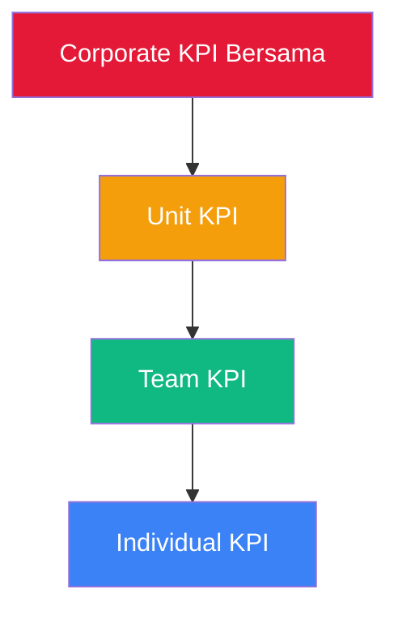

## Section Spec: KPI Tree (SEC-KT)

**Module Code:** SEC-KT  

**Parent Product:** Rinjani Performance (INJ-BPR)

---

## 1. Overview

Modul KPI Tree menyediakan visualisasi hierarki KPI dari level korporat hingga individu, menunjukkan cascading dan alignment. Fitur ini membantu memastikan setiap KPI individu terhubung dengan tujuan strategis perusahaan.

### 1.1 Objectives

- Visualisasi hierarki KPI dari Corporate → Unit → Team → Individual
- Menunjukkan cascading relationship antar KPI
- Tracking achievement status secara agregat
- Identifikasi bottleneck dan misalignment

### 1.2 Target Users

| Role | Access Scope | Primary Use Case |
| --- | --- | --- |
| Karyawan | Own KPI branch | Melihat kontribusi KPI ke target unit |
| Atasan | Team KPI branch | Melihat alignment KPI tim |
| HC Admin | Company-wide tree | Monitoring cascading completion |
| HC Admin HO | All companies | Cross-company alignment analysis |

---

## 2. Assessment Cycle Integration

### 2.1 Planning Phase



### 2.2 Monitoring Phase

- Real-time aggregation of achievement scores
- Color-coded status indicators
- Drill-down capability per branch

---

## 3. User Stories

### 3.1 View & Navigation (Priority: High)

| ID | User Story | Acceptance Criteria | Priority |
| --- | --- | --- | --- |
| KT-001 | Sebagai Karyawan, saya ingin melihat tree KPI saya agar memahami kontribusi ke corporate | - Tree view dengan parent-child relationship
- My position highlighted
- Collapse/expand nodes | P0 |
| KT-002 | Sebagai Atasan, saya ingin melihat tree KPI tim agar memantau alignment | - Tree expanded ke seluruh bawahan
- Summary score per branch
- Filter by team member | P0 |
| KT-003 | Sebagai HC Admin, saya ingin melihat tree seluruh company | - Full organizational tree
- Company-wide statistics
- Export capability | P0 |
| KT-004 | Sebagai User, saya ingin focus pada satu KPI branch | - Focus mode dengan children only
- Contribution percentage
- Achievement breakdown | P1 |
| KT-005 | Sebagai User, saya ingin melihat achievement status di tree | - Color-coded by PI score
- Legend dengan threshold
- Tooltip with details | P0 |

### 3.2 Analysis (Priority: Medium)

| ID | User Story | Acceptance Criteria | Priority |
| --- | --- | --- | --- |
| KT-006 | Sebagai Atasan, saya ingin melihat contribution analysis | - Contribution % per child
- Impact simulation
- What-if scenarios | P2 |
| KT-007 | Sebagai HC Admin, saya ingin identify cascading gaps | - Uncascaded KPI highlight
- Missing link indicators
- Gap report | P1 |
| KT-008 | Sebagai HC Admin HO, saya ingin compare tree antar company | - Side-by-side view
- Cross-company metrics
- Best practice identification | P2 |

---

## 4. Screen Inventory

| Screen ID | Screen Name | Phase | Entry Point | Role Access |
| --- | --- | --- | --- | --- |
| KT-SCR-01 | KPI Tree View | All | Sidebar menu | All (scoped) |
| KT-SCR-02 | KPI Focus View | All | Click node in tree | All |
| KT-SCR-03 | Tree Analysis | Monitoring | Analysis tab | Atasan, HC Admin |
| KT-SCR-04 | Cascading Gaps | Planning | Admin menu | HC Admin |

---

## 5. Business Rules

### 5.1 Tree Structure Rules

- KPI Bersama menjadi root nodes (level 0)
- KPI Unit di-cascade dari KPI Bersama (level 1+)
- Maximum depth: 5 levels
- One KPI can have multiple children
- One child can only have one parent

### 5.2 Access Scope Rules

| Role | Can View | Can Expand To |
| --- | --- | --- |
| Karyawan | Own branch to root | Own direct ancestors and siblings |
| Atasan | Team branch to root | All descendants of own KPI |
| HC Admin | Company tree | All nodes in company |
| HC Admin HO | All company trees | All nodes across companies |

### 5.3 Achievement Aggregation

**Aggregation Formula:**

```
Parent Score = Σ (Child Score × Child Weight) / Σ Child Weight
```

**Status Color Thresholds:**

- 🟢 Green (On Track): Score ≥ 3.50
- 🟡 Yellow (At Risk): Score 2.50 - 3.49
- 🔴 Red (Behind): Score < 2.50
- ⚪ Gray (Pending): No achievement data

### 5.4 Cascading Validation

- Total cascaded weight cannot exceed parent weight
- At least one child required for cascading
- Circular references not allowed

---

## 6. Data Dependencies

| Entity | Purpose | Source |
| --- | --- | --- |
| `kpi_item` | KPI with parent_kpi_id | Performance Module |
| `kpi_ownership` | Assignment to position/employee | Performance Module |
| `kpi_score` | Achievement data | Check-In Module |
| `organization_unit` | Organizational hierarchy | Org Master |
| `position_master` | Position hierarchy | Org Master |

---

## 7. Integration Points

### 7.1 Upstream

- **My KPI Module**: Source of individual KPI data
- **My Team KPI Module**: Team-level aggregation

### 7.2 Downstream

- **KPI Headquarter**: Tree statistics and reports
- **Dashboard**: Executive summary visualization