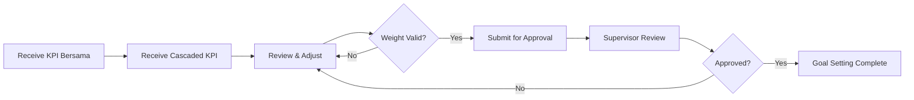

## Section Spec: My KPI (SEC-MK)

**Module Code:** SEC-MK

**Parent Product:** Rinjani Performance (INJ-BPR)

---

## 1. Overview

Modul My KPI memungkinkan karyawan untuk melihat dan mengelola KPI individu mereka sepanjang siklus penilaian kinerja (Goal Setting → Check-In → Year-End Review).

**Prototype Persona:** Binavia Wardhani (Group Head HC Planning & Analytics)

---

## 2. Assessment Cycle Phases

### Phase 1: Planning (Goal Setting)

**Period:** Januari (Awal tahun)

**Duration:** 2-3 minggu

### Phase 2: Monitoring (Check-In)

**Period:** Q1, Q2, Q3

**Frequency:** Minimal 3x per tahun

### Phase 3: Evaluation (Year-End Review)

**Period:** Desember - Januari (Akhir tahun)

**Duration:** 3-4 minggu

---

## 3. User Stories by Phase

### 3.1 Planning Phase - Goal Setting

| ID | User Story | Acceptance Criteria | Priority |
| --- | --- | --- | --- |
| MK-P-001 | Sebagai Karyawan, saya ingin melihat KPI Bersama yang sudah ditetapkan untuk periode ini | - KPI Bersama tampil dengan status read-only
- Bobot per KPI Bersama jelas
- Total bobot KPI Bersama sesuai band jabatan (40% untuk Struktural) | P0 |
| MK-P-002 | Sebagai Karyawan, saya ingin melihat KPI Unit yang di-cascade dari atasan | - KPI Unit dari cascading tampil dengan bobot yang dialokasikan
- Source KPI (parent) terlihat jelas
- Cascading method (direct/indirect) ditampilkan | P0 |
| MK-P-003 | Sebagai Karyawan, saya ingin mengusulkan KPI Unit tambahan | - Form untuk propose new KPI
- Template dari KPI Library tersedia
- Workflow approval ke atasan | P1 |
| MK-P-004 | Sebagai Karyawan, saya ingin memastikan total bobot KPI = 100% | - Real-time weight validation
- Warning jika total ≠ 100%
- Cannot submit if invalid | P0 |
| MK-P-005 | Sebagai Karyawan, saya ingin submit Goal Setting untuk approval atasan | - Submit button enabled when valid
- Confirmation dialog sebelum submit
- Status berubah ke "Pending Approval" | P0 |
| MK-P-006 | Sebagai Karyawan, saya ingin melihat status approval dan revision notes | - Status tracking (Draft → Submitted → In Review → Approved/Revision)
- Revision notes from supervisor visible
- History of submissions | P0 |

### 3.2 Monitoring Phase - Check-In

| ID | User Story | Acceptance Criteria | Priority |
| --- | --- | --- | --- |
| MK-M-001 | Sebagai Karyawan, saya ingin melihat jadwal Check-In periode ini | - Check-In schedule visible (Q1, Q2, Q3)
- Status per Check-In (Upcoming/In Progress/Completed)
- Reminder notification sebelum deadline | P0 |
| MK-M-002 | Sebagai Karyawan, saya ingin input progress dan achievement notes | - Text area untuk highlights dan achievements
- Auto-save draft
- Character limit guidance | P0 |
| MK-M-003 | Sebagai Karyawan, saya ingin mencatat challenges dan blockers | - Separate field untuk challenges
- Option to request support
- Link to action items | P0 |
| MK-M-004 | Sebagai Karyawan, saya ingin attach evidence/bukti pendukung | - File upload (PDF, Excel, Image)
- Max 10MB per file
- Evidence linked to specific KPI | P1 |
| MK-M-005 | Sebagai Karyawan, saya ingin menerima feedback dari atasan | - Supervisor feedback visible setelah discussion
- Action items dari atasan ditampilkan
- Due date untuk follow-up actions | P0 |
| MK-M-006 | Sebagai Karyawan, saya ingin acknowledge Check-In result | - Acknowledge button setelah feedback
- Timestamp recorded
- Cannot be undone | P0 |
| MK-M-007 | Sebagai Karyawan, saya ingin melihat history semua Check-In | - Timeline view Check-In 1, 2, 3
- Expandable to see details
- Export option | P1 |

### 3.3 Evaluation Phase - Year-End Review

| ID | User Story | Acceptance Criteria | Priority |
| --- | --- | --- | --- |
| MK-E-001 | Sebagai Karyawan, saya ingin melakukan Self Assessment | - Form rating 1-5 per KPI
- Notes field per KPI
- Overall reflection section | P1 |
| MK-E-002 | Sebagai Karyawan, saya ingin melihat hasil Manager Assessment | - Rating from manager visible
- Feedback notes from manager
- Comparison with self assessment | P0 |
| MK-E-003 | Sebagai Karyawan, saya ingin melihat final Performance Rating | - Final PI Score displayed
- Performance Rating (1-5 scale)
- Rating description | P0 |
| MK-E-004 | Sebagai Karyawan, saya ingin melakukan Acknowledgement | - Acknowledge button
- Optional comments field
- Timestamp recorded | P0 |

---

## 4. Screen Inventory

### 4.1 Planning Phase Screens

| Screen ID | Screen Name | Purpose | Entry Point |
| --- | --- | --- | --- |
| MK-SCR-01 | My KPI Dashboard | Overview skor, phase indicator, KPI list | Main menu → My KPI |
| MK-SCR-02 | Goal Setting | Penyusunan dan review KPI portfolio | Dashboard → Goal Setting tab |
| MK-SCR-03 | KPI Detail | Detail definition, target, history | Click on KPI item |
| MK-SCR-04 | Propose KPI | Form untuk propose new KPI Unit | Goal Setting → + Propose KPI |

### 4.2 Monitoring Phase Screens

| Screen ID | Screen Name | Purpose | Entry Point |
| --- | --- | --- | --- |
| MK-SCR-05 | Check-In List | Daftar periode Check-In dengan status | Dashboard → Check-In tab |
| MK-SCR-06 | Check-In Form | Form input progress dan notes | Check-In List → Open Check-In |
| MK-SCR-07 | Check-In Summary | Summary setelah discussion dengan atasan | Check-In Form → After submission |
| MK-SCR-08 | Evidence Upload | Upload dan manage evidence files | Check-In Form → Attach Evidence |

### 4.3 Evaluation Phase Screens

| Screen ID | Screen Name | Purpose | Entry Point |
| --- | --- | --- | --- |
| MK-SCR-09 | Self Assessment | Form self rating dan notes | Dashboard → Year-End tab (when open) |
| MK-SCR-10 | Year-End Review Result | Final result dengan manager rating | Dashboard → Year-End tab (after assessment) |
| MK-SCR-11 | Acknowledgement | Konfirmasi hasil penilaian final | Year-End Result → Acknowledge |

---

## 5. Business Rules

### 5.1 Weight Validation Rules

- **Rule W-001:** Total bobot KPI Bersama + KPI Unit = 100%
- **Rule W-002:** Bobot KPI Bersama fixed sesuai band jabatan:
    - Struktural (Utama, Madya, Muda): 40% Bersama, 60% Unit
    - Non-Struktural: 0% Bersama, 100% Unit
- **Rule W-003:** Minimum 1 KPI Unit required untuk submission
- **Rule W-004:** Maximum 10 KPI items per employee

### 5.2 Goal Setting Rules

- **Rule GS-001:** Goal Setting window dibuka oleh HC Admin HO
- **Rule GS-002:** Employee dapat edit selama status = DRAFT
- **Rule GS-003:** Revision dari supervisor memunculkan revision notes
- **Rule GS-004:** Final approval locks KPI for the year

### 5.3 Check-In Rules

- **Rule CI-001:** Minimal 3x Check-In per assessment cycle
- **Rule CI-002:** Check-In adalah diskusi kualitatif (no scoring)
- **Rule CI-003:** Check-In submission requires supervisor acknowledgement
- **Rule CI-004:** Evidence upload optional but recommended
- **Rule CI-005:** Late Check-In flagged in system

### 5.4 Year-End Review Rules

- **Rule YE-001:** Self Assessment opsional tapi highly recommended
- **Rule YE-002:** Manager Assessment mandatory untuk finalisasi
- **Rule YE-003:** Employee acknowledgement required untuk close cycle
- **Rule YE-004:** Post-calibration adjustment tidak bisa di-dispute

---

## 6. Data Dependencies

### 6.1 Master Data

- `employee` - Data karyawan login
- `position_variant` - Jabatan dan Band karyawan
- `position_assignment` - Assignment ke position
- `org_unit` - Unit organisasi

### 6.2 Transactional Data

- `kpi_item` - Definisi KPI
- `kpi_ownership` - Assignment KPI ke employee
- `kpi_check_in_log` - Catatan Check-In
- `kpi_year_end_review_log` - Catatan Year-End Review
- `kpi_evidence` - Evidence attachments
- `kpi_realization` - Periodic achievement data

### 6.3 Configuration Data

- `band_kpi_formula` - Weight formula per band
- `assessment_schedule` - Jadwal assessment cycle
- `kpi_library_item` - KPI templates

---

## 7. Integration Points

- **HR Core (SAP):** Employee master, position assignment
- **Document Management:** Evidence storage
- **Notification Service:** Reminder dan alerts
- **Reporting:** Dashboard metrics dan analytics