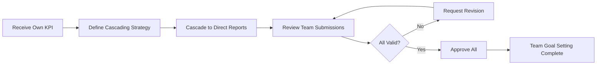
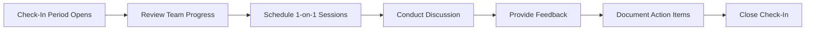
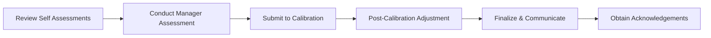

## Section Spec: My Team KPI (SEC-MT)

**Module Code:** SEC-MT

**Parent Product:** Rinjani Performance (INJ-BPR)

---

## 1. Overview

Modul My Team KPI memungkinkan Atasan Langsung untuk mengelola KPI tim, melakukan cascading, approval, dan monitoring bawahan langsung.

**Prototype Persona:** Dimas Sayyid (VP Human Capital Strategy) managing 3 Group Heads

---

## 2. Manager Workflow by Phase

### Phase 1: Planning - Team Goal Setting

**Period:** Januari (Awal tahun)

**Manager Role:** Cascading & Approval

### Phase 2: Monitoring - Team Check-In

**Period:** Q1, Q2, Q3

**Manager Role:** Discussion & Feedback

### Phase 3: Evaluation - Team Year-End Review

**Period:** Desember - Januari

**Manager Role:** Assessment & Calibration

---

## 3. User Stories by Phase

### 3.1 Planning Phase - Team Goal Setting

| ID | User Story | Acceptance Criteria | Priority |
| --- | --- | --- | --- |
| MT-P-001 | Sebagai Atasan, saya ingin melihat daftar bawahan langsung saya | - List semua direct reports
- Current goal setting status per person
- Quick action buttons | P0 |
| MT-P-002 | Sebagai Atasan, saya ingin cascade KPI Unit saya ke bawahan | - Select source KPI
- Select target employees
- Allocate weight per employee
- Choose cascading method (direct/indirect) | P0 |
| MT-P-003 | Sebagai Atasan, saya ingin menetapkan bobot KPI untuk masing-masing bawahan | - Weight editor per KPI
- Real-time validation (sum = 100%)
- Bulk edit option | P0 |
| MT-P-004 | Sebagai Atasan, saya ingin review dan approve KPI submission bawahan | - Review queue with pending items
- Side-by-side comparison view
- Approve/Reject/Request Revision actions
- Revision notes field | P0 |
| MT-P-005 | Sebagai Atasan, saya ingin melihat KPI Tree untuk memastikan alignment | - Hierarchical visualization
- My KPI → Team KPIs
- Weight distribution visible | P1 |
| MT-P-006 | Sebagai Atasan, saya ingin bulk approve submissions yang sudah valid | - Multi-select submissions
- Bulk approve action
- Confirmation dialog | P2 |

### 3.2 Monitoring Phase - Team Check-In

| ID | User Story | Acceptance Criteria | Priority |
| --- | --- | --- | --- |
| MT-M-001 | Sebagai Atasan, saya ingin melihat progress seluruh tim dalam satu dashboard | - Team summary metrics
- Score distribution chart
- Status per employee (On Track/Needs Attention/At Risk) | P0 |
| MT-M-002 | Sebagai Atasan, saya ingin melihat detail progress KPI per bawahan | - Drill-down ke individual view
- KPI-by-KPI progress
- Evidence attached | P0 |
| MT-M-003 | Sebagai Atasan, saya ingin schedule dan conduct Check-In discussion | - Calendar integration
- Meeting room booking (optional)
- Discussion template | P1 |
| MT-M-004 | Sebagai Atasan, saya ingin memberikan feedback dan action items | - Feedback notes field
- Action items with due dates
- Mark overall assessment (On Track/Needs Support) | P0 |
| MT-M-005 | Sebagai Atasan, saya ingin acknowledge Check-In submission dari bawahan | - Acknowledge button
- Optional additional notes
- Timestamp recorded | P0 |
| MT-M-006 | Sebagai Atasan, saya ingin identify team members yang perlu attention | - Alert indicators
- Filter by status
- Quick action to initiate discussion | P1 |

### 3.3 Evaluation Phase - Team Year-End Review

| ID | User Story | Acceptance Criteria | Priority |
| --- | --- | --- | --- |
| MT-E-001 | Sebagai Atasan, saya ingin review Self Assessment dari bawahan | - View self assessment per employee
- Compare with actual achievement
- Notes from employee visible | P1 |
| MT-E-002 | Sebagai Atasan, saya ingin memberikan Manager Assessment | - Rating 1-5 per KPI
- Overall rating
- Strengths & improvement areas fields
- Feedback notes | P0 |
| MT-E-003 | Sebagai Atasan, saya ingin submit assessments untuk calibration | - Submit all assessments
- Validation before submit
- Cannot edit after submit | P0 |
| MT-E-004 | Sebagai Atasan, saya ingin melihat hasil calibration dan adjustments | - Post-calibration ratings visible
- Adjustment notes from calibration committee
- Final ratings locked | P0 |
| MT-E-005 | Sebagai Atasan, saya ingin communicate final results ke bawahan | - Notify employees
- Schedule feedback sessions
- Track acknowledgement status | P1 |

---

## 4. Screen Inventory

### 4.1 Planning Phase Screens

| Screen ID | Screen Name | Purpose | Entry Point |
| --- | --- | --- | --- |
| MT-SCR-01 | Team Dashboard | Overview tim dengan metrics dan status | Main menu → My Team KPI |
| MT-SCR-02 | Team Member List | Daftar bawahan dengan quick actions | Dashboard → View All Members |
| MT-SCR-03 | Cascading | Form untuk cascade KPI ke bawahan | Dashboard → Cascade KPI |
| MT-SCR-04 | Approval Queue | Pending submissions for approval | Dashboard → Approval Queue badge |
| MT-SCR-05 | Submission Review | Detail review satu submission | Approval Queue → Select item |

### 4.2 Monitoring Phase Screens

| Screen ID | Screen Name | Purpose | Entry Point |
| --- | --- | --- | --- |
| MT-SCR-06 | Team Progress | Monitoring progress seluruh tim | Dashboard → Check-In tab |
| MT-SCR-07 | Member KPI Detail | Detail KPI dan progress per bawahan | Team Progress → Click member |
| MT-SCR-08 | Check-In Discussion | Form untuk conduct Check-In session | Member Detail → Open Check-In |
| MT-SCR-09 | Feedback Form | Form untuk input feedback dan action items | Check-In Discussion → Add Feedback |

### 4.3 Evaluation Phase Screens

| Screen ID | Screen Name | Purpose | Entry Point |
| --- | --- | --- | --- |
| MT-SCR-10 | Team Assessment Overview | Status assessment seluruh tim | Dashboard → Year-End tab |
| MT-SCR-11 | Manager Assessment Form | Form untuk input manager rating | Team Assessment → Assess Member |
| MT-SCR-12 | Calibration Results | Post-calibration ratings view | Team Assessment → After calibration |
| MT-SCR-13 | Acknowledgement Tracker | Track employee acknowledgements | Calibration Results → Track Acknowledgements |

---

## 5. Business Rules

### 5.1 Team Scope Rules

- **Rule TS-001:** Hanya bawahan langsung (direct reports) yang tampil
- **Rule TS-002:** Berdasarkan `position_assignment.supervisor_position_id`
- **Rule TS-003:** Maximum 15 direct reports per supervisor
- **Rule TS-004:** Dual reporting handled via primary supervisor

### 5.2 Cascading Rules

- **Rule CA-001:** KPI Unit dapat di-cascade ke bawahan
- **Rule CA-002:** KPI Bersama tidak dapat di-cascade (ditetapkan by system)
- **Rule CA-003:** Cascading methods:
    - **Direct:** Child KPI berkontribusi langsung ke parent (accumulative)
    - **Indirect:** Child KPI related tapi tidak berkontribusi langsung
- **Rule CA-004:** Satu source KPI bisa di-cascade ke multiple employees
- **Rule CA-005:** Weight distribution harus documented

### 5.3 Approval Workflow Rules

- **Rule AP-001:** Atasan wajib review semua submissions dalam 5 working days
- **Rule AP-002:** Revision dapat di-request max 2 kali
- **Rule AP-003:** Escalation ke HC Admin HO jika pending > 5 days
- **Rule AP-004:** Bulk approval available jika semua items valid

### 5.4 Assessment Rules

- **Rule AS-001:** Atasan wajib melakukan minimal 3x Check-In per cycle
- **Rule AS-002:** Manager Assessment wajib untuk Year-End Review
- **Rule AS-003:** Assessment harus submit sebelum calibration deadline
- **Rule AS-004:** Post-calibration adjustment hanya oleh HC Admin HO

---

## 6. Data Dependencies

### 6.1 Master Data

- `employee` - Data atasan dan bawahan
- `position_variant` - Position master dengan supervisor relationship
- `position_assignment` - Employee assignment ke position
- `org_unit` - Organizational hierarchy

### 6.2 Transactional Data

- `kpi_item` - Definisi KPI
- `kpi_ownership` - Assignment dan cascading records
- `kpi_cascade_log` - Cascading history
- `kpi_approval_log` - Approval workflow records
- `kpi_check_in_log` - Check-In records (team view)
- `kpi_year_end_review_log` - Assessment records

### 6.3 Derived Data

- `team_performance_summary` - Aggregated team metrics
- `approval_queue` - Pending approval items
- `check_in_schedule` - Team Check-In calendar

---

## 7. Integration Points

- **HR Core (SAP):** Organizational hierarchy, supervisor relationships
- **Calendar Integration:** Check-In scheduling
- **Notification Service:** Approval alerts, deadline reminders
- **Calibration Module:** Year-End calibration workflow
- **Reporting:** Team analytics dan dashboards