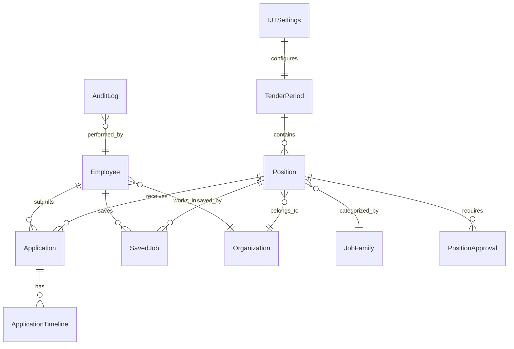
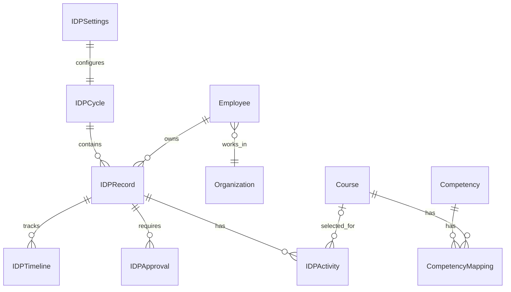
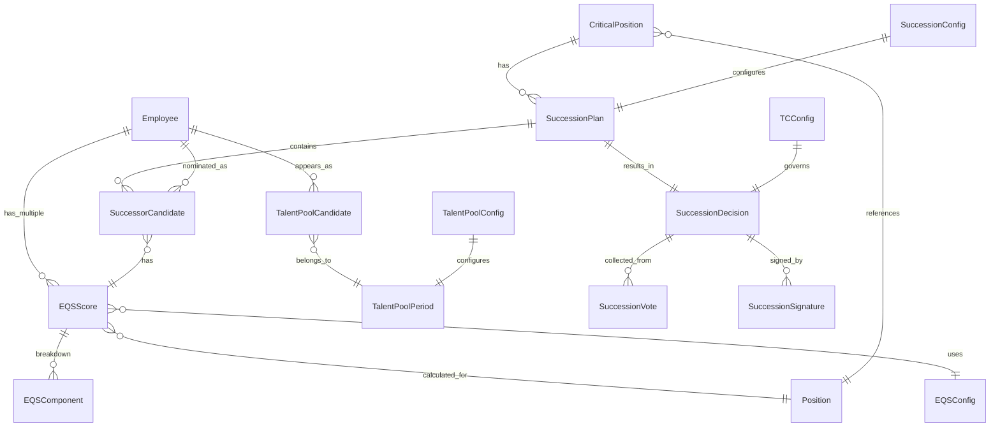
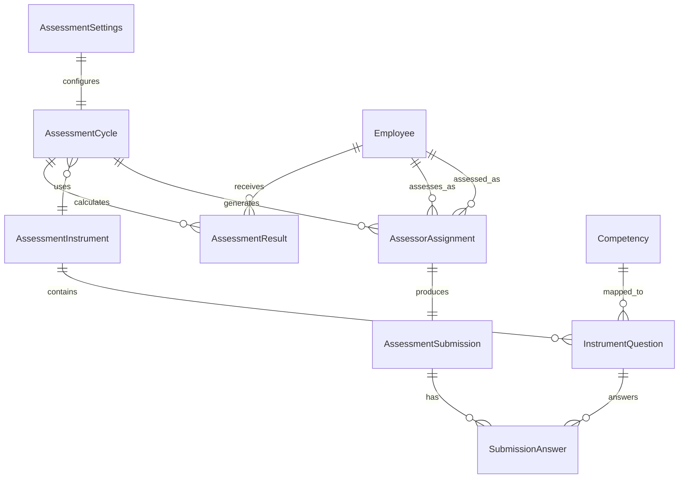

## Internal Job Tender Module

---

## Entity Relationship Diagram



---

## Eligibility Rules

> **Referensi:** [PRD: Career Path - InJourney ITMS](https://www.notion.so/PRD-Career-Path-InJourney-ITMS-830177ca4a64421b8b2a27cb557f2b5b?pvs=21)
> 

Aturan eligibility untuk Internal Job Tender mengikuti standar Career Path module:

### Kandidat Eligibility (untuk Apply)

| Rule | Kriteria | Validasi |
| --- | --- | --- |
| **Status Karyawan** | Karyawan Tetap (bukan kontrak/outsource) | `employee_type = 'PERMANENT'` |
| **Status Disiplin** | Tidak sedang menjalani hukuman disiplin | `disciplinary_status != 'ACTIVE'` |
| **Grade Jabatan - Promosi** | Grade Posisi > Grade Pekerja, maksimal +3 level | `target_grade \\\> current_grade AND target_grade \\\<= current_grade + 3` |
| **Grade Jabatan - Rotasi** | Grade Posisi ≤ Grade Pekerja, minimal -3 level | `target_grade \\\<= current_grade AND target_grade \\\>= current_grade - 3` |
| **Job Family - Same** | Job Family sama → otomatis eligible | `target_job_family = current_job_family` |
| **Job Family - Different** | Job Family berbeda → pengalaman ≥ 1 tahun di JF tujuan | `experience_in_target_jf \\\>= 1 year` |
| **Posisi Saat Ini** | Tidak boleh memilih posisi yang sedang dijabat | `target_position_id != current_position_id` |
| **Min Grade Kandidat** | Grade kandidat harus ≥ minimum yang ditetapkan posisi | `current_grade \\\>= position.min_grade_kandidat` |

### Eligibility Check Function

```tsx
interface EligibilityCheckResult {
  is_eligible: boolean
  checks: {
    employee_type: { passed: boolean; message: string }
    disciplinary_status: { passed: boolean; message: string }
    grade_range: { passed: boolean; message: string; movement_type: 'PROMOSI' | 'ROTASI' }
    job_family: { passed: boolean; message: string }
    not_current_position: { passed: boolean; message: string }
    min_grade: { passed: boolean; message: string }
  }
  eqs_score?: number
}

function checkEligibility(employee: Employee, position: Position): EligibilityCheckResult {
  const checks = {
    employee_type: {
      passed: employee.employee_type === 'PERMANENT',
      message: employee.employee_type === 'PERMANENT' 
        ? 'Karyawan tetap' 
        : 'Hanya karyawan tetap yang dapat melamar'
    },
    disciplinary_status: {
      passed: employee.disciplinary_status !== 'ACTIVE',
      message: employee.disciplinary_status !== 'ACTIVE'
        ? 'Tidak ada hukuman disiplin aktif'
        : 'Sedang menjalani hukuman disiplin'
    },
    grade_range: {
      passed: position.grade_jabatan >= (employee.grade_jabatan - 3) 
           && position.grade_jabatan <= (employee.grade_jabatan + 3),
      message: `Grade ${employee.grade_jabatan} dapat melamar grade ${employee.grade_jabatan - 3} s/d ${employee.grade_jabatan + 3}`,
      movement_type: position.grade_jabatan > employee.grade_jabatan ? 'PROMOSI' : 'ROTASI'
    },
    job_family: {
      passed: employee.job_family_id === position.job_family_id 
           || employee.experience_in_job_family[position.job_family_id] >= 1,
      message: employee.job_family_id === position.job_family_id
        ? 'Job Family sama'
        : `Pengalaman di Job Family tujuan: ${employee.experience_in_job_family[position.job_family_id] || 0} tahun`
    },
    not_current_position: {
      passed: employee.current_position_id !== 
```

---

## Entities

### Position

Representasi posisi yang dibuka dalam periode Internal Job Tender.

**Schema Definition:**

| Field | Type | Required | Description |
| --- | --- | --- | --- |
| id | string | Yes | Unique identifier (UUID) |
| title | string | Yes | Nama posisi |
| description | text | Yes | Deskripsi pekerjaan |
| organization_id | string | Yes | Unit/organisasi pemilik posisi |
| job_family_id | string | Yes | Kategori job family |
| grade_jabatan | number | Yes | Grade jabatan posisi (7-28) |
| band_jabatan | string | Yes | Band jabatan posisi (info only) |
| location | string | Yes | Lokasi kerja |
| incumbent_id | string | No | Current incumbent (null jika vacant) |
| quota | number | Yes | Jumlah posisi yang dibutuhkan |
| status | enum | Yes | draft | pending_approval | open | closed | cancelled |
| deadline | datetime | Yes | Batas akhir pendaftaran |
| period_id | string | Yes | Periode tender terkait |
| **min_grade_kandidat** | number | No | Minimum grade jabatan kandidat (default: grade_jabatan - 3) |
| **min_experience_years** | number | No | Minimum pengalaman kerja (tahun) |
| **required_skills** | string[] | No | Array skill yang dibutuhkan |
| **required_documents** | string[] | No | Array dokumen wajib (CV, Motivation Letter, dll) |
| **additional_requirements** | text | No | Persyaratan tambahan dalam format teks |
| created_by | string | Yes | User ID pembuat |
| created_at | datetime | Yes | Timestamp pembuatan |
| updated_at | datetime | Yes | Timestamp update terakhir |

**TypeScript Interface:**

```tsx
export interface Position {
  id: string
  title: string
  description: string
  organization_id: string
  job_family_id: string
  grade_jabatan: number
  band_jabatan: string
  location: string
  incumbent_id?: string
  quota: number
  status: 'draft' | 'pending_approval' | 'open' | 'closed' | 'cancelled'
  deadline: string
  period_id: string
  // Eligibility Requirements
  min_grade_kandidat?: number
  min_experience_years?: number
  required_skills?: string[]
  required_documents?: string[]
  additional_requirements?: string
  // Metadata
  created_by: string
  created_at: string
  updated_at: string
}
```

---

### Application

Representasi aplikasi/lamaran kandidat untuk posisi tertentu.

**Schema Definition:**

| Field | Type | Required | Description |
| --- | --- | --- | --- |
| id | string | Yes | Unique identifier (UUID) |
| position_id | string | Yes | Posisi yang dilamar |
| employee_id | string | Yes | Kandidat yang melamar |
| status | enum | Yes | submitted | screening | shortlisted | interview | offered | accepted | rejected | withdrawn |
| **movement_type** | enum | Yes | PROMOSI | ROTASI (berdasarkan grade comparison) |
| **eligibility_check** | object | Yes | Hasil eligibility check saat apply (EligibilityCheckResult) |
| eqs_score | number | No | EQS score saat apply (dari TMS) |
| statement_accepted | boolean | Yes | Pernyataan sudah disetujui |
| **documents** | object[] | No | Array dokumen yang diupload |
| submitted_at | datetime | Yes | Timestamp submit |
| updated_at | datetime | Yes | Timestamp update terakhir |

**TypeScript Interface:**

```tsx
export interface Application {
  id: string
  position_id: string
  employee_id: string
  status: 'submitted' | 'screening' | 'shortlisted' | 'interview' | 'offered' | 'accepted' | 'rejected' | 'withdrawn'
  movement_type: 'PROMOSI' | 'ROTASI'
  eligibility_check: EligibilityCheckResult
  eqs_score?: number
  statement_accepted: boolean
  documents?: ApplicationDocument[]
  submitted_at: string
  updated_at: string
}

export interface ApplicationDocument {
  id: string
  document_type: string // CV, Motivation Letter, Certificate, etc.
  file_url: string
  file_name: string
  uploaded_at: string
}
```

---

### SavedJob

Representasi posisi yang disimpan oleh kandidat.

**Schema Definition:**

| Field | Type | Required | Description |
| --- | --- | --- | --- |
| id | string | Yes | Unique identifier (UUID) |
| position_id | string | Yes | Posisi yang disimpan |
| employee_id | string | Yes | Kandidat yang menyimpan |
| saved_at | datetime | Yes | Timestamp penyimpanan |

**TypeScript Interface:**

```tsx
export interface SavedJob {
  id: string
  position_id: string
  employee_id: string
  saved_at: string
}
```

---

### TenderPeriod

Representasi periode Internal Job Tender.

**Schema Definition:**

| Field | Type | Required | Description |
| --- | --- | --- | --- |
| id | string | Yes | Unique identifier (UUID) |
| name | string | Yes | Nama periode |
| start_date | date | Yes | Tanggal mulai periode |
| end_date | date | Yes | Tanggal berakhir periode |
| status | enum | Yes | draft | active | closed |
| max_applications | number | Yes | Kuota maksimal aplikasi per kandidat |
| poster_url | string | No | URL poster promosi |

**TypeScript Interface:**

```tsx
export interface TenderPeriod {
  id: string
  name: string
  start_date: string
  end_date: string
  status: 'draft' | 'active' | 'closed'
  max_applications: number
  poster_url?: string
}
```

---

### IJTSettings

Representasi pengaturan global Internal Job Tender (BRI-IJT-004).

**Schema Definition:**

| Field | Type | Required | Description |
| --- | --- | --- | --- |
| id | string | Yes | Unique identifier (UUID) |
| setting_key | string | Yes | Unique key for setting (e.g., 'default_requirements', 'statement_template') |
| setting_value | json | Yes | Value of the setting (flexible JSON) |
| description | string | No | Deskripsi setting |
| updated_by | string | Yes | User ID yang terakhir update |
| updated_at | datetime | Yes | Timestamp update terakhir |

**TypeScript Interface:**

```tsx
export interface IJTSettings {
  id: string
  setting_key: 'default_requirements' | 'statement_template' | 'eligibility_config' | 'notification_config'
  setting_value: DefaultRequirements | StatementTemplate | EligibilityConfig | NotificationConfig
  description?: string
  updated_by: string
  updated_at: string
}

export interface DefaultRequirements {
  required_documents: string[]
  min_experience_years: number
  additional_notes: string
}

export interface StatementTemplate {
  title: string
  content: string // Rich text / HTML
  version: number
  effective_date: string
}

export interface EligibilityConfig {
  grade_range_up: number   // default: 3 (untuk promosi)
  grade_range_down: number // default: 3 (untuk rotasi)
  require_job_family_experience: boolean
  min_job_family_experience_years: number
}

export interface NotificationConfig {
  reminder_days_before_deadline: number[]
  notify_on_status_change: boolean
  notify_approver_on_submit: boolean
}
```

**Predefined Settings:**

| Key | Description |
| --- | --- |
| `default_requirements` | Persyaratan default untuk semua posisi |
| `statement_template` | Template pernyataan komitmen kandidat |
| `eligibility_config` | Konfigurasi aturan eligibility (grade range, job family) |
| `notification_config` | Konfigurasi notifikasi dan reminder |

---

### PositionApproval

Representasi approval untuk pembukaan posisi.

**Schema Definition:**

| Field | Type | Required | Description |
| --- | --- | --- | --- |
| id | string | Yes | Unique identifier (UUID) |
| position_id | string | Yes | Posisi yang diapprove |
| approver_id | string | Yes | User ID approver |
| decision | enum | Yes | approved | rejected | revision_requested |
| notes | text | No | Catatan/alasan keputusan |
| decided_at | datetime | Yes | Timestamp keputusan |

**TypeScript Interface:**

```tsx
export interface PositionApproval {
  id: string
  position_id: string
  approver_id: string
  decision: 'approved' | 'rejected' | 'revision_requested'
  notes?: string
  decided_at: string
}
```

---

### ApplicationTimeline

Representasi timeline/history status aplikasi.

**Schema Definition:**

| Field | Type | Required | Description |
| --- | --- | --- | --- |
| id | string | Yes | Unique identifier (UUID) |
| application_id | string | Yes | Aplikasi terkait |
| from_status | string | No | Status sebelumnya |
| to_status | string | Yes | Status baru |
| changed_by | string | Yes | User ID yang mengubah |
| notes | text | No | Catatan perubahan |
| changed_at | datetime | Yes | Timestamp perubahan |

**TypeScript Interface:**

```tsx
export interface ApplicationTimeline {
  id: string
  application_id: string
  from_status?: string
  to_status: string
  changed_by: string
  notes?: string
  changed_at: string
}
```

---

### AuditLog

Representasi audit log untuk tracking aktivitas sistem (BRI-IJT-005).

**Schema Definition:**

| Field | Type | Required | Description |
| --- | --- | --- | --- |
| id | string | Yes | Unique identifier (UUID) |
| action | string | Yes | Nama aksi (e.g., 'position.create', 'application.submit') |
| entity_type | string | Yes | Tipe entity (Position, Application, TenderPeriod, dll) |
| entity_id | string | Yes | ID entity yang terkait |
| actor_id | string | Yes | User ID yang melakukan aksi |
| actor_role | string | Yes | Role user saat melakukan aksi |
| changes | json | No | Detail perubahan (before/after) |
| metadata | json | No | Additional context (IP, browser, etc) |
| created_at | datetime | Yes | Timestamp aksi |

**TypeScript Interface:**

```tsx
export interface AuditLog {
  id: string
  action: AuditAction
  entity_type: 'Position' | 'Application' | 'TenderPeriod' | 'IJTSettings' | 'PositionApproval'
  entity_id: string
  actor_id: string
  actor_role: 'HC_ADMIN' | 'UNIT_OWNER' | 'APPROVER' | 'KANDIDAT'
  changes?: {
    before: Record<string, any>
    after: Record<string, any>
  }
  metadata?: {
    ip_address?: string
    user_agent?: string
    session_id?: string
  }
  created_at: string
}

type AuditAction = 
  | 'position.create' | 'position.update' | 'position.submit' | 'position.approve' | 'position.reject' | 'position.close'
  | 'application.submit' | 'application.withdraw' | 'application.status_change'
  | 'period.create' | 'period.activate' | 'period.close'
  | 'settings.update'
```

---

## Reference Entities (External)

Entitas berikut merupakan referensi dari sistem eksternal (HRIS/SAP):

### Employee (External Reference)

```tsx
// Dari HRIS Core / SAP
export interface Employee {
  id: string
  nik: string
  name: string
  email: string
  employee_type: 'PERMANENT' | 'CONTRACT' | 'OUTSOURCE'
  disciplinary_status: 'ACTIVE' | 'INACTIVE' | 'NONE'
  current_position_id: string
  current_position_title: string
  organization_id: string
  job_family_id: string
  grade_jabatan: number
  band_jabatan: string
  hire_date: string
  eqs_score?: number // dari Talent Management System
  experience_in_job_family: Record<string, number> // job_family_id -> years
}
```

### Organization (External Reference)

```tsx
// Dari HRIS Core / SAP
export interface Organization {
  id: string
  name: string
  code: string
  parent_id?: string
  company_id: string
  personal_area: string
  sub_personal_area: string
}
```

### JobFamily (External Reference)

```tsx
// Dari HRIS Core / SAP
export interface JobFamily {
  id: string
  name: string
  code: string
  description?: string
}
```

---

## Relationships

- **Position** has many **Application** (1:N)
- **Position** has many **SavedJob** (1:N)
- **Position** belongs to **Organization** (N:1) - External
- **Position** belongs to **JobFamily** (N:1) - External
- **Position** belongs to **TenderPeriod** (N:1)
- **Position** has many **PositionApproval** (1:N)
- **Employee** has many **Application** (1:N) - External reference
- **Employee** has many **SavedJob** (1:N) - External reference
- **Application** has many **ApplicationTimeline** (1:N)
- **IJTSettings** configures **TenderPeriod** (1:1)
- **AuditLog** references multiple entities

---

## Enums & Constants

**Position Status:**

- `draft` - Posisi masih dalam draft, belum diajukan
- `pending_approval` - Menunggu persetujuan
- `open` - Posisi aktif dan dapat dilamar
- `closed` - Periode pendaftaran sudah berakhir
- `cancelled` - Posisi dibatalkan

**Application Status:**

- `submitted` - Aplikasi sudah disubmit
- `screening` - Sedang dalam proses screening
- `shortlisted` - Lolos screening, masuk shortlist
- `interview` - Tahap interview
- `offered` - Mendapat penawaran
- `accepted` - Diterima
- `rejected` - Ditolak
- `withdrawn` - Ditarik oleh kandidat

**Movement Type:**

- `PROMOSI` - Grade posisi > Grade kandidat (vertikal naik)
- `ROTASI` - Grade posisi ≤ Grade kandidat (horizontal/turun)

**Approval Decision:**

- `approved` - Disetujui
- `rejected` - Ditolak
- `revision_requested` - Perlu revisi

**Employee Type:**

- `PERMANENT` - Karyawan tetap (eligible untuk IJT)
- `CONTRACT` - Karyawan kontrak (not eligible)
- `OUTSOURCE` - Outsource (not eligible)

**Disciplinary Status:**

- `ACTIVE` - Sedang menjalani hukuman (not eligible)
- `INACTIVE` - Hukuman sudah selesai (eligible)
- `NONE` - Tidak ada riwayat (eligible)

---

---

## Individual Development Plan (IDP) Module

---

## IDP Entity Relationship Diagram



---

## IDP Entities

### IDPCycle

Representasi periode IDP (Annual/Semi-annual).

**Schema Definition:**

| Field | Type | Required | Description |
| --- | --- | --- | --- |
| id | string | Yes | Unique identifier (UUID) |
| name | string | Yes | Nama periode (e.g., "IDP 2026") |
| period_type | enum | Yes | annual | semi_annual |
| start_date | date | Yes | Tanggal pembukaan pengisian |
| submission_deadline | date | Yes | Batas waktu submit |
| midyear_checkpoint | date | No | Tanggal mid-year review |
| end_date | date | Yes | Tanggal penutupan periode |
| status | enum | Yes | draft | active | closed |
| min_development_hours | number | Yes | Minimum jam pengembangan (default: 40) |
| created_at | datetime | Yes | Timestamp pembuatan |
| updated_at | datetime | Yes | Timestamp update terakhir |

**TypeScript Interface:**

```tsx
export interface IDPCycle {
  id: string
  name: string
  period_type: 'annual' | 'semi_annual'
  start_date: string
  submission_deadline: string
  midyear_checkpoint?: string
  end_date: string
  status: 'draft' | 'active' | 'closed'
  min_development_hours: number
  created_at: string
  updated_at: string
}
```

---

### IDPRecord

Representasi IDP per karyawan per periode.

**Schema Definition:**

| Field | Type | Required | Description |
| --- | --- | --- | --- |
| id | string | Yes | Unique identifier (UUID) |
| employee_id | string | Yes | Reference ke Employee |
| cycle_id | string | Yes | Reference ke IDPCycle |
| status | enum | Yes | draft | pending_approval | approved | revision_requested | completed |
| total_hours | number | Yes | Total jam pengembangan yang direncanakan |
| completed_hours | number | Yes | Total jam yang sudah selesai |
| employee_notes | text | No | Catatan dari karyawan |
| submitted_at | datetime | No | Timestamp submit |
| created_at | datetime | Yes | Timestamp pembuatan |
| updated_at | datetime | Yes | Timestamp update terakhir |

**TypeScript Interface:**

```tsx
export interface IDPRecord {
  id: string
  employee_id: string
  cycle_id: string
  status: 'draft' | 'pending_approval' | 'approved' | 'revision_requested' | 'completed'
  total_hours: number
  completed_hours: number
  employee_notes?: string
  submitted_at?: string
  created_at: string
  updated_at: string
}
```

---

### IDPActivity

Representasi aktivitas/kursus yang dipilih dalam IDP.

**Schema Definition:**

| Field | Type | Required | Description |
| --- | --- | --- | --- |
| id | string | Yes | Unique identifier (UUID) |
| idp_record_id | string | Yes | Reference ke IDPRecord |
| course_id | string | No | Reference ke Course (null jika custom) |
| activity_type | enum | Yes | lms_course | custom_activity |
| title | string | Yes | Nama aktivitas |
| duration_hours | number | Yes | Durasi dalam jam |
| target_date | date | Yes | Target completion date |
| priority | enum | Yes | high | medium | low |
| status | enum | Yes | not_started | in_progress | completed |
| completion_date | date | No | Actual completion date |
| evidence_url | string | No | Link evidence (untuk custom activity) |
| notes | text | No | Catatan aktivitas |

**TypeScript Interface:**

```tsx
export interface IDPActivity {
  id: string
  idp_record_id: string
  course_id?: string
  activity_type: 'lms_course' | 'custom_activity'
  title: string
  duration_hours: number
  target_date: string
  priority: 'high' | 'medium' | 'low'
  status: 'not_started' | 'in_progress' | 'completed'
  completion_date?: string
  evidence_url?: string
  notes?: string
}
```

---

### IDPApproval

Representasi approval dari Line Manager.

**Schema Definition:**

| Field | Type | Required | Description |
| --- | --- | --- | --- |
| id | string | Yes | Unique identifier (UUID) |
| idp_record_id | string | Yes | Reference ke IDPRecord |
| approver_id | string | Yes | User ID approver (Line Manager) |
| decision | enum | Yes | approved | rejected | revision_requested |
| notes | text | No | Catatan/feedback dari approver |
| revision_reason | enum | No | insufficient_hours | missing_mandatory | not_aligned | other |
| decided_at | datetime | Yes | Timestamp keputusan |

**TypeScript Interface:**

```tsx
export interface IDPApproval {
  id: string
  idp_record_id: string
  approver_id: string
  decision: 'approved' | 'rejected' | 'revision_requested'
  notes?: string
  revision_reason?: 'insufficient_hours' | 'missing_mandatory' | 'not_aligned' | 'other'
  decided_at: string
}
```

---

### IDPTimeline

History perubahan status IDP.

**Schema Definition:**

| Field | Type | Required | Description |
| --- | --- | --- | --- |
| id | string | Yes | Unique identifier (UUID) |
| idp_record_id | string | Yes | Reference ke IDPRecord |
| from_status | string | No | Status sebelumnya |
| to_status | string | Yes | Status baru |
| changed_by | string | Yes | User ID yang mengubah |
| notes | text | No | Catatan perubahan |
| changed_at | datetime | Yes | Timestamp perubahan |

**TypeScript Interface:**

```tsx
export interface IDPTimeline {
  id: string
  idp_record_id: string
  from_status?: string
  to_status: string
  changed_by: string
  notes?: string
  changed_at: string
}
```

---

### Course

Katalog kursus dari LMS (atau sample data jika LMS belum tersedia).

**Schema Definition:**

| Field | Type | Required | Description |
| --- | --- | --- | --- |
| id | string | Yes | Unique identifier |
| code | string | Yes | Kode kursus (e.g., "LDR-001") |
| title | string | Yes | Nama kursus |
| description | text | Yes | Deskripsi kursus |
| duration_hours | number | Yes | Durasi dalam jam |
| format | enum | Yes | video | workshop | ebook | blended |
| provider | string | Yes | Penyelenggara kursus |
| job_families | string[] | No | Array Job Family yang relevan |
| competencies | object[] | No | Kompetensi yang dikembangkan |
| level_from | number | No | Level awal yang disasar (1-5) |
| level_to | number | No | Level target (1-5) |
| thumbnail_url | string | No | URL thumbnail image |
| is_active | boolean | Yes | Status aktif/nonaktif |

**TypeScript Interface:**

```tsx
export interface Course {
  id: string
  code: string
  title: string
  description: string
  duration_hours: number
  format: 'video' | 'workshop' | 'ebook' | 'blended'
  provider: string
  job_families?: string[]
  competencies?: CourseCompetency[]
  level_from?: number
  level_to?: number
  thumbnail_url?: string
  is_active: boolean
}

export interface CourseCompetency {
  competency_id: string
  competency_name: string
  level_improvement: string // e.g., "2 to 3"
}
```

---

### CompetencyMapping

Mapping antara Kompetensi dan Kursus untuk recommendation engine.

**Schema Definition:**

| Field | Type | Required | Description |
| --- | --- | --- | --- |
| id | string | Yes | Unique identifier (UUID) |
| competency_id | string | Yes | Reference ke Competency |
| course_id | string | Yes | Reference ke Course |
| level_from | number | Yes | Level awal yang disasar (1-5) |
| level_to | number | Yes | Level target (1-5) |
| relevance | enum | Yes | high | medium | low |
| is_mandatory | boolean | Yes | Wajib diambil jika ada gap? |
| created_by | string | Yes | User ID yang membuat mapping |
| created_at | datetime | Yes | Timestamp pembuatan |

**TypeScript Interface:**

```tsx
export interface CompetencyMapping {
  id: string
  competency_id: string
  course_id: string
  level_from: number
  level_to: number
  relevance: 'high' | 'medium' | 'low'
  is_mandatory: boolean
  created_by: string
  created_at: string
}
```

---

### IDPSettings

Konfigurasi global IDP.

**Schema Definition:**

| Field | Type | Required | Description |
| --- | --- | --- | --- |
| id | string | Yes | Unique identifier (UUID) |
| setting_key | string | Yes | Unique key for setting |
| setting_value | json | Yes | Value of the setting (flexible JSON) |
| description | string | No | Deskripsi setting |
| updated_by | string | Yes | User ID yang terakhir update |
| updated_at | datetime | Yes | Timestamp update terakhir |

**TypeScript Interface:**

```tsx
export interface IDPSettings {
  id: string
  setting_key: 'reminder_config' | 'approval_config' | 'lms_sync_config' | 'notification_templates'
  setting_value: ReminderConfig | ApprovalConfig | LMSSyncConfig | NotificationTemplates
  description?: string
  updated_by: string
  updated_at: string
}

export interface ReminderConfig {
  submission_reminder: {
    enabled: boolean
    days_before_deadline: number[]
    channels: ('email' | 'push')[]
  }
  approval_reminder: {
    enabled: boolean
    days_after_submit: number[]
    channels: ('email' | 'push')[]
  }
  progress_reminder: {
    enabled: boolean
    frequency: 'weekly' | 'monthly'
    channels: ('email' | 'push')[]
  }
}

export interface ApprovalConfig {
  levels: number
  auto_approve_after_days: number | null
}

export interface LMSSyncConfig {
  mode: 'api' | 'manual' | 'hybrid'
  sync_interval_hours: number
}

export interface NotificationTemplates {
  submission_reminder: string
  approval_request: string
  approval_complete: string
  revision_request: string
}
```

**Predefined Settings:**

| Key | Description |
| --- | --- |
| `reminder_config` | Konfigurasi automated reminders |
| `approval_config` | Konfigurasi approval workflow |
| `lms_sync_config` | Konfigurasi sync dengan LMS |
| `notification_templates` | Template notifikasi |

---

## IDP Enums & Constants

**IDP Record Status:**

- `draft` - IDP masih dalam draft
- `pending_approval` - Menunggu persetujuan atasan
- `approved` - IDP disetujui, siap dieksekusi
- `revision_requested` - Perlu revisi dari karyawan
- `completed` - Semua aktivitas selesai

**IDP Activity Status:**

- `not_started` - Belum dimulai
- `in_progress` - Sedang dikerjakan
- `completed` - Selesai

**Activity Type:**

- `lms_course` - Kursus dari LMS
- `custom_activity` - Aktivitas custom (non-LMS)

**Activity Priority:**

- `high` - Prioritas tinggi
- `medium` - Prioritas sedang
- `low` - Prioritas rendah

**Course Format:**

- `video` - Video online
- `workshop` - Workshop tatap muka/virtual
- `ebook` - E-book / reading material
- `blended` - Kombinasi

**Approval Decision:**

- `approved` - Disetujui
- `rejected` - Ditolak
- `revision_requested` - Perlu revisi

**Revision Reason:**

- `insufficient_hours` - Jam pengembangan kurang dari minimum
- `missing_mandatory` - Tidak ada mandatory training
- `not_aligned` - Tidak sesuai gap analysis
- `other` - Alasan lain

---

## IDP Relationships

- **IDPCycle** has many **IDPRecord** (1:N)
- **IDPRecord** belongs to **Employee** (N:1) - External reference
- **IDPRecord** has many **IDPActivity** (1:N)
- **IDPRecord** has many **IDPApproval** (1:N)
- **IDPRecord** has many **IDPTimeline** (1:N)
- **IDPActivity** may belong to **Course** (N:1)
- **Course** has many **CompetencyMapping** (1:N)
- **CompetencyMapping** links **Competency** to **Course** (N:N)
- **IDPSettings** configures **IDPCycle** (1:1)

---

---

## Talent Pool & Succession Module

---

## TMS Entity Relationship Diagram



---

## TMS Entities

### EQSScore

Representasi skor EQS per employee **untuk posisi target tertentu**. Satu employee dapat memiliki multiple EQS score untuk posisi yang berbeda.

> **Penting:** EQS Score bersifat **position-specific**. Komponen seperti Job Fit, Pengalaman di Job Family, dan Aspirasi akan berbeda tergantung posisi target yang dipilih.
> 

**Schema Definition:**

| Field | Type | Required | Description |
| --- | --- | --- | --- |
| id | string | Yes | Unique identifier (UUID) |
| employee_id | string | Yes | Reference ke Employee |
| **target_position_id** | string | Yes | Posisi target untuk kalkulasi EQS |
| period_id | string | Yes | Periode kalkulasi (Talent Pool Period) |
| config_id | string | Yes | Reference ke EQSConfig yang digunakan |
| total_score | number | Yes | Total EQS score (0-100, 2 decimal, capped at 100) |
| eqs_band | enum | Yes | highly_qualified | qualified | needs_development | not_recommended |
| is_eligible | boolean | Yes | Eligibility status (false jika sedang hukuman disiplin) |
| eligibility_reason | string | No | Alasan jika tidak eligible |
| formula_version | string | Yes | Versi formula yang digunakan |
| calculated_at | datetime | Yes | Timestamp kalkulasi |
| calculated_by | string | Yes | User/System ID yang menjalankan kalkulasi |

**TypeScript Interface:**

```tsx
export interface EQSScore {
  id: string
  employee_id: string
  target_position_id: string // EQS berbeda per posisi target
  period_id: string
  config_id: string
  total_score: number // 0-100, capped
  eqs_band: 'highly_qualified' | 'qualified' | 'needs_development' | 'not_recommended'
  is_eligible: boolean
  eligibility_reason?: string // e.g., "Sedang menjalani hukuman disiplin"
  formula_version: string
  calculated_at: string
  calculated_by: string
}
```

---

### EQSComponent

Breakdown 6 komponen EQS dengan bobot masing-masing.

**Schema Definition:**

| Field | Type | Required | Description |
| --- | --- | --- | --- |
| id | string | Yes | Unique identifier (UUID) |
| eqs_score_id | string | Yes | Reference ke EQSScore |
| component_type | enum | Yes | performance | competency | experience | aspiration | training | tes |
| weight | number | Yes | Bobot komponen (dalam %) |
| raw_value | number | Yes | Nilai mentah sebelum weighted |
| weighted_value | number | Yes | Nilai setelah dikalikan bobot |
| source_data | json | No | Detail sumber data (untuk audit) |

**TypeScript Interface:**

```tsx
export interface EQSComponent {
  id: string
  eqs_score_id: string
  component_type: 'performance' | 'competency' | 'experience' | 'aspiration' | 'training' | 'tes'
  weight: number // percentage
  raw_value: number
  weighted_value: number
  source_data?: PerformanceSource | CompetencySource | ExperienceSource | AspirationSource | TrainingSource | TESSource
}

// Source data types for audit trail
export interface PerformanceSource {
  year_weights: { year: number; rating: number; weight: number }[] // 3-year weighted average
}

export interface CompetencySource {
  job_fit_score: number
  assessment_date: string
  target_job_family_id: string // position-specific
}

export interface ExperienceSource {
  tenure_years: number
  unit_experience_bonus: number // IAS/API: +30, Holding: +30, TWC/ITDC: +20, Sarinah/HIN: +20
  target_job_family_experience_years: number // position-specific
}

export interface AspirationSource {
  aspiration_score: number // accumulative, capped at 100
  sources: { type: 'supervisor' | 'job_holder' | 'unit' | 'individual'; score: number }[]
  target_position_match: boolean // position-specific
}

export interface TrainingSource {
  training_hours: number
  certifications: { name: string; relevance: 'high' | 'medium' | 'low' }[]
  target_job_family_relevance: number // position-specific
}

export interface TESSource {
  baseline: number // 50
  additions: { reason: string; value: number }[]
  deductions: { reason: string; value: number }[]
}
```

**Default Bobot EQS (per BRD v2.1):**

| Komponen | Bobot | Deskripsi | Position-Specific? |
| --- | --- | --- | --- |
| Kinerja (Performance) | 20% | Rata-rata rating kinerja 3 tahun terakhir | ❌ No |
| Kompetensi / Job Fit | 20% | Skor dari Competency Assessment vs Job Family target | ✅ **Yes** |
| Pengalaman | 20% | Tenure + Unit Experience bonus + pengalaman di Job Family target | ✅ **Yes** |
| Aspirasi | 10% | Akumulatif dari 4 sumber (Supervisor, Job Holder, Unit, Individual) | ✅ **Yes** |
| Pelatihan & Sertifikasi | 20% | Training hours + sertifikasi relevan dengan Job Family target | ✅ **Yes** |
| Talent Engagement Score (TES) | 10% | Baseline 50, dengan penambahan/pengurangan berdasarkan kontribusi | ❌ No |

---

### TalentPoolPeriod

Periode Talent Pool (biasanya annual).

**Schema Definition:**

| Field | Type | Required | Description |
| --- | --- | --- | --- |
| id | string | Yes | Unique identifier (UUID) |
| name | string | Yes | Nama periode (e.g., "Talent Pool 2026") |
| year | number | Yes | Tahun periode |
| start_date | date | Yes | Tanggal mulai |
| end_date | date | Yes | Tanggal berakhir |
| status | enum | Yes | draft | active | closed |
| created_at | datetime | Yes | Timestamp pembuatan |

**TypeScript Interface:**

```tsx
export interface TalentPoolPeriod {
  id: string
  name: string
  year: number
  start_date: string
  end_date: string
  status: 'draft' | 'active' | 'closed'
  created_at: string
}
```

---

### TalentPoolCandidate

Status kandidat dalam Talent Pool.

**Schema Definition:**

| Field | Type | Required | Description |
| --- | --- | --- | --- |
| id | string | Yes | Unique identifier (UUID) |
| employee_id | string | Yes | Reference ke Employee |
| period_id | string | Yes | Reference ke TalentPoolPeriod |
| talent_cluster | enum | Yes | 9-Box classification result |
| is_top_talent | boolean | Yes | Apakah termasuk Top Talent? |
| top_talent_designation_date | date | No | Tanggal penetapan Top Talent |
| risk_profile | enum | No | low_risk | medium_risk | high_risk | flight_risk |
| notes | text | No | Catatan dari HC |
| updated_at | datetime | Yes | Timestamp update terakhir |

**TypeScript Interface:**

```tsx
export interface TalentPoolCandidate {
  id: string
  employee_id: string
  period_id: string
  talent_cluster: '9box_high_potential' | '9box_promotable' | '9box_solid_contributor' | '9box_sleeping_tiger' | '9box_unfit'
  is_top_talent: boolean
  top_talent_designation_date?: string
  risk_profile?: 'low_risk' | 'medium_risk' | 'high_risk' | 'flight_risk'
  notes?: string
  updated_at: string
}
```

---

### CriticalPosition

Posisi KSP/Struktural yang memerlukan succession planning.

**Schema Definition:**

| Field | Type | Required | Description |
| --- | --- | --- | --- |
| id | string | Yes | Unique identifier (UUID) |
| position_id | string | Yes | Reference ke Position (dari Org Management) |
| position_type | enum | Yes | ksp | struktural |
| incumbent_id | string | No | Current incumbent (null jika vacant) |
| vacancy_status | enum | Yes | filled | vacant | retiring_soon |
| succession_status | enum | Yes | no_plan | in_progress | has_successor |
| min_shortlist_candidates | number | Yes | Minimum kandidat shortlist (default: 3) |
| created_at | datetime | Yes | Timestamp pembuatan |

**TypeScript Interface:**

```tsx
export interface CriticalPosition {
  id: string
  position_id: string
  position_type: 'ksp' | 'struktural'
  incumbent_id?: string
  vacancy_status: 'filled' | 'vacant' | 'retiring_soon'
  succession_status: 'no_plan' | 'in_progress' | 'has_successor'
  min_shortlist_candidates: number // default: 3
  created_at: string
}
```

---

### SuccessionPlan

Succession plan untuk critical position.

**Schema Definition:**

| Field | Type | Required | Description |
| --- | --- | --- | --- |
| id | string | Yes | Unique identifier (UUID) |
| critical_position_id | string | Yes | Reference ke CriticalPosition |
| period_id | string | Yes | Reference ke TalentPoolPeriod |
| status | enum | Yes | draft | shortlist_complete | submitted_to_tc | approved | rejected |
| facilitator_id | string | Yes | HC yang memfasilitasi |
| notes | text | No | Catatan succession plan |
| created_at | datetime | Yes | Timestamp pembuatan |
| updated_at | datetime | Yes | Timestamp update terakhir |

**TypeScript Interface:**

```tsx
export interface SuccessionPlan {
  id: string
  critical_position_id: string
  period_id: string
  status: 'draft' | 'shortlist_complete' | 'submitted_to_tc' | 'approved' | 'rejected'
  facilitator_id: string
  notes?: string
  created_at: string
  updated_at: string
}
```

---

### SuccessorCandidate

Kandidat dalam shortlist succession.

**Schema Definition:**

| Field | Type | Required | Description |
| --- | --- | --- | --- |
| id | string | Yes | Unique identifier (UUID) |
| succession_plan_id | string | Yes | Reference ke SuccessionPlan |
| employee_id | string | Yes | Reference ke Employee |
| eqs_score_id | string | Yes | Reference ke EQSScore (untuk posisi target ini) |
| ranking | enum | Yes | primary | secondary | tertiary | shortlisted |
| readiness_level | enum | Yes | ready_now | ready_6_12_months | ready_12_24_months | not_ready |
| supervisor_recommendation | text | No | Rekomendasi dari supervisor |
| selected_by | string | Yes | User ID yang memilih |
| selected_at | datetime | Yes | Timestamp pemilihan |

**TypeScript Interface:**

```tsx
export interface SuccessorCandidate {
  id: string
  succession_plan_id: string
  employee_id: string
  eqs_score_id: string // EQS score untuk posisi target ini
  ranking: 'primary' | 'secondary' | 'tertiary' | 'shortlisted'
  readiness_level: 'ready_now' | 'ready_6_12_months' | 'ready_12_24_months' | 'not_ready'
  supervisor_recommendation?: string
  selected_by: string
  selected_at: string
}
```

---

### SuccessionDecision

Keputusan final dari Talent Committee.

**Schema Definition:**

| Field | Type | Required | Description |
| --- | --- | --- | --- |
| id | string | Yes | Unique identifier (UUID) |
| succession_plan_id | string | Yes | Reference ke SuccessionPlan |
| committee_tier | enum | Yes | tier_1 | tier_2 | tier_3 |
| final_successor_id | string | No | Employee ID suksesor final (1 per posisi) |
| decision_status | enum | Yes | pending_vote | voting | approved | rejected | deferred |
| quorum_required | number | Yes | Jumlah minimum voter |
| quorum_met | boolean | Yes | Apakah kuorum terpenuhi? |
| berita_acara_url | string | No | URL dokumen Berita Acara |
| notes | text | No | Catatan keputusan |
| decided_at | datetime | No | Timestamp keputusan final |

**TypeScript Interface:**

```tsx
export interface SuccessionDecision {
  id: string
  succession_plan_id: string
  committee_tier: 'tier_1' | 'tier_2' | 'tier_3'
  final_successor_id?: string // 1 suksesor final per posisi
  decision_status: 'pending_vote' | 'voting' | 'approved' | 'rejected' | 'deferred'
  quorum_required: number
  quorum_met: boolean
  berita_acara_url?: string
  notes?: string
  decided_at?: string
}
```

---

### SuccessionVote

Vote dari member Talent Committee.

**Schema Definition:**

| Field | Type | Required | Description |
| --- | --- | --- | --- |
| id | string | Yes | Unique identifier (UUID) |
| succession_decision_id | string | Yes | Reference ke SuccessionDecision |
| voter_id | string | Yes | User ID voter (TC member) |
| vote | enum | Yes | agree | disagree | abstain |
| comment | text | No | Komentar/alasan vote |
| voted_at | datetime | Yes | Timestamp vote |

**TypeScript Interface:**

```tsx
export interface SuccessionVote {
  id: string
  succession_decision_id: string
  voter_id: string
  vote: 'agree' | 'disagree' | 'abstain'
  comment?: string
  voted_at: string
}
```

---

### SuccessionSignature

Digital signature untuk Berita Acara.

**Schema Definition:**

| Field | Type | Required | Description |
| --- | --- | --- | --- |
| id | string | Yes | Unique identifier (UUID) |
| succession_decision_id | string | Yes | Reference ke SuccessionDecision |
| signer_id | string | Yes | User ID yang menandatangani |
| signature_type | enum | Yes | chair | member | witness |
| otp_verified | boolean | Yes | Apakah OTP sudah diverifikasi? |
| signed_at | datetime | Yes | Timestamp tanda tangan |

**TypeScript Interface:**

```tsx
export interface SuccessionSignature {
  id: string
  succession_decision_id: string
  signer_id: string
  signature_type: 'chair' | 'member' | 'witness'
  otp_verified: boolean
  signed_at: string
}
```

---

## TMS Configuration Entities

### EQSConfig

Konfigurasi bobot dan komponen EQS per company/cohort.

**Schema Definition:**

| Field | Type | Required | Description |
| --- | --- | --- | --- |
| id | string | Yes | Unique identifier (UUID) |
| company_id | string | Yes | Reference ke Company |
| band_jabatan | string | No | Override per band (null = default) |
| tipe_jabatan | string | No | Override per tipe jabatan |
| components | json | Yes | Array komponen dengan bobot |
| performance_year_weights | json | Yes | Bobot per tahun untuk rata-rata kinerja |
| effective_from | date | Yes | Tanggal mulai berlaku |
| effective_to | date | No | Tanggal berakhir (null = masih aktif) |
| version | string | Yes | Versi konfigurasi |
| created_by | string | Yes | User ID pembuat |
| created_at | datetime | Yes | Timestamp pembuatan |

**TypeScript Interface:**

```tsx
export interface EQSConfig {
  id: string
  company_id: string
  band_jabatan?: string // override per band
  tipe_jabatan?: string // override per tipe
  components: EQSComponentConfig[]
  performance_year_weights: { year: number; weight: number }[] // e.g., [{year: 0, weight: 50}, {year: -1, weight: 30}, {year: -2, weight: 20}]
  effective_from: string
  effective_to?: string
  version: string
  created_by: string
  created_at: string
}

export interface EQSComponentConfig {
  type: 'performance' | 'competency' | 'experience' | 'aspiration' | 'training' | 'tes'
  weight: number // percentage
  enabled: boolean
  min_value?: number
  max_value?: number
}
```

---

### TalentPoolConfig

Konfigurasi eligibility dan EQS bands untuk Talent Pool.

**Schema Definition:**

| Field | Type | Required | Description |
| --- | --- | --- | --- |
| id | string | Yes | Unique identifier (UUID) |
| company_id | string | Yes | Reference ke Company |
| eqs_bands | json | Yes | Array EQS band definitions |
| eligibility_rules | json | Yes | Aturan eligibility |
| top_talent_criteria | json | Yes | Kriteria Top Talent |
| updated_by | string | Yes | User ID yang update |
| updated_at | datetime | Yes | Timestamp update |

**TypeScript Interface:**

```tsx
export interface TalentPoolConfig {
  id: string
  company_id: string
  eqs_bands: EQSBandDefinition[]
  eligibility_rules: EligibilityRule[]
  top_talent_criteria: TopTalentCriteria
  updated_by: string
  updated_at: string
}

export interface EQSBandDefinition {
  band: 'highly_qualified' | 'qualified' | 'needs_development' | 'not_recommended'
  label: string
  min_score: number
  max_score: number
  color: string
}

export interface EligibilityRule {
  rule_type: 'disciplinary' | 'employee_type' | 'tenure' | 'custom'
  condition: string
  is_blocking: boolean // true = hard gate, false = soft warning
}

export interface TopTalentCriteria {
  min_eqs_score: number
  min_performance_rating: number
  require_high_potential: boolean
  additional_criteria?: string[]
}
```

---

### SuccessionConfig

Konfigurasi succession planning rules.

**Schema Definition:**

| Field | Type | Required | Description |
| --- | --- | --- | --- |
| id | string | Yes | Unique identifier (UUID) |
| company_id | string | Yes | Reference ke Company |
| min_shortlist_candidates | number | Yes | Minimum kandidat shortlist (default: 3) |
| max_final_successors | number | Yes | Max suksesor final per posisi (default: 1) |
| aspiration_weights | json | Yes | Bobot aspirasi per sumber |
| job_fit_min_score | number | Yes | Minimum Job Fit score (default: 70) |
| review_tenure_years | number | Yes | Tenure yang memicu review (default: 3) |
| max_grade_increase | number | Yes | Max kenaikan grade untuk promosi (default: 1) |
| updated_by | string | Yes | User ID yang update |
| updated_at | datetime | Yes | Timestamp update |

**TypeScript Interface:**

```tsx
export interface SuccessionConfig {
  id: string
  company_id: string
  min_shortlist_candidates: number // default: 3
  max_final_successors: number // default: 1
  aspiration_weights: {
    supervisor: number // default: 30
    job_holder: number // default: 25
    unit: number // default: 25
    individual: number // default: 20
  }
  job_fit_min_score: number // default: 70, configurable
  review_tenure_years: number // default: 3, configurable
  max_grade_increase: number // default: 1, configurable
  updated_by: string
  updated_at: string
}
```

---

### TCConfig

Konfigurasi Talent Committee per tier.

**Schema Definition:**

| Field | Type | Required | Description |
| --- | --- | --- | --- |
| id | string | Yes | Unique identifier (UUID) |
| company_id | string | Yes | Reference ke Company |
| tier | enum | Yes | tier_1 | tier_2 | tier_3 |
| name | string | Yes | Nama committee (e.g., "Talent Committee Tier 1") |
| scope_description | text | Yes | Deskripsi cakupan keputusan |
| chair_position_id | string | Yes | Posisi ketua committee |
| member_position_ids | string[] | Yes | Array posisi anggota |
| quorum_percentage | number | Yes | Persentase minimum kehadiran |
| approval_threshold | number | Yes | Persentase suara setuju untuk approval |
| updated_by | string | Yes | User ID yang update |
| updated_at | datetime | Yes | Timestamp update |

**TypeScript Interface:**

```tsx
export interface TCConfig {
  id: string
  company_id: string
  tier: 'tier_1' | 'tier_2' | 'tier_3'
  name: string
  scope_description: string
  chair_position_id: string
  member_position_ids: string[]
  quorum_percentage: number // e.g., 75 = 75%
  approval_threshold: number // e.g., 51 = simple majority
  updated_by: string
  updated_at: string
}
```

**Talent Committee Tiers (per BRD):**

| Tier | Ketua | Cakupan |
| --- | --- | --- |
| Tier 1 | Direktur Utama InJourney | Posisi setingkat Direksi anak perusahaan |
| Tier 2 | Direktur SDM & Digital | Posisi setingkat VP/GM |
| Tier 3 | VP HCBP | Posisi setingkat Manager/Supervisor |

---

## TMS Enums & Constants

**EQS Band:**

- `highly_qualified` - EQS ≥ 85
- `qualified` - EQS 70-84
- `needs_development` - EQS 50-69
- `not_recommended` - EQS < 50

**Talent Cluster (9-Box):**

- `9box_high_potential` - Performance High + Potential High
- `9box_promotable` - Performance High + Potential Medium
- `9box_solid_contributor` - Performance Medium + Potential Medium
- `9box_sleeping_tiger` - Performance Low + Potential High
- `9box_unfit` - Performance Low + Potential Low

**Successor Ranking:**

- `primary` - Kandidat utama (ranking 1)
- `secondary` - Kandidat kedua (ranking 2)
- `tertiary` - Kandidat ketiga (ranking 3)
- `shortlisted` - Masuk shortlist tapi belum di-rank

**Readiness Level:**

- `ready_now` - Siap sekarang
- `ready_6_12_months` - Siap dalam 6-12 bulan
- `ready_12_24_months` - Siap dalam 12-24 bulan
- `not_ready` - Belum siap

**TC Vote Type:**

- `agree` - Setuju
- `disagree` - Tidak setuju
- `abstain` - Abstain

**Committee Tier:**

- `tier_1` - Direktur Utama InJourney
- `tier_2` - Direktur SDM & Digital
- `tier_3` - VP HCBP

**Risk Profile:**

- `low_risk` - Risiko rendah
- `medium_risk` - Risiko sedang
- `high_risk` - Risiko tinggi
- `flight_risk` - Risiko resign

**Critical Position Type:**

- `ksp` - Key Strategic Position
- `struktural` - Posisi struktural

**Vacancy Status:**

- `filled` - Terisi
- `vacant` - Kosong
- `retiring_soon` - Akan pensiun

**Succession Status:**

- `no_plan` - Belum ada succession plan
- `in_progress` - Sedang dalam proses
- `has_successor` - Sudah ada suksesor

---

## TMS Relationships Summary

- **EQSScore** calculated for **Employee** × **Position** combination (N:M through EQSScore)
- **EQSScore** has many **EQSComponent** (1:N)
- **EQSScore** uses **EQSConfig** (N:1)
- **TalentPoolCandidate** belongs to **Employee** (N:1)
- **TalentPoolCandidate** belongs to **TalentPoolPeriod** (N:1)
- **CriticalPosition** references **Position** (N:1)
- **CriticalPosition** has many **SuccessionPlan** (1:N)
- **SuccessionPlan** has many **SuccessorCandidate** (1:N)
- **SuccessorCandidate** has **EQSScore** for target position (N:1)
- **SuccessionPlan** has one **SuccessionDecision** (1:1)
- **SuccessionDecision** has many **SuccessionVote** (1:N)
- **SuccessionDecision** has many **SuccessionSignature** (1:N)
- **TCConfig** governs **SuccessionDecision** (1:N)

---

---

## 360 Assessment Module

---

### 360 Assessment ERD



---

### AssessmentCycle

Siklus penilaian 360° yang dikonfigurasi per tenant/entitas.

**Schema Definition:**

| Field | Type | Required | Description |
| --- | --- | --- | --- |
| id | string | Yes | Unique identifier (UUID) |
| tenant_id | string | Yes | Reference ke Tenant/Entity |
| name | string | Yes | Nama siklus (e.g., "Penilaian Kinerja Berbasis Perilaku 2026") |
| description | text | No | Deskripsi siklus |
| assessment_type | enum | Yes | behavioral | competency | custom |
| instrument_id | string | Yes | Reference ke AssessmentInstrument |
| start_date | date | Yes | Tanggal mulai pengisian |
| end_date | date | Yes | Tanggal berakhir pengisian |
| result_valid_until | date | No | Masa berlaku hasil assessment |
| assessor_assignment_method | enum | Yes | auto | manual |
| anonymity_policy | enum | Yes | anonymous | identified |
| channel_config | json | Yes | Array konfigurasi channel evaluator dengan bobot |
| status | enum | Yes | draft | configuring | assigning | active | scoring | validated | published | closed | archived |
| total_assessee | number | Yes | Jumlah peserta yang dinilai |
| created_by | string | Yes | User ID pembuat |
| created_at | datetime | Yes | Timestamp pembuatan |
| updated_at | datetime | Yes | Timestamp update terakhir |

**TypeScript Interface:**

```tsx
export interface AssessmentCycle {
  id: string
  tenant_id: string
  name: string
  description?: string
  assessment_type: 'behavioral' | 'competency' | 'custom'
  instrument_id: string
  start_date: string
  end_date: string
  result_valid_until?: string
  assessor_assignment_method: 'auto' | 'manual'
  anonymity_policy: 'anonymous' | 'identified'
  channel_config: ChannelConfig[]
  status: 'draft' | 'configuring' | 'assigning' | 'active' | 'scoring' | 'validated' | 'published' | 'closed' | 'archived'
  total_assessee: number
  created_by: string
  created_at: string
  updated_at: string
}

export interface ChannelConfig {
  channel: 'superior' | 'subordinate' | 'peer' | 'self'
  evaluator_count: number // 1 for superior, -1 for all subordinates, 3 max for peer
  weight: number // percentage, all channels must sum to 100
  enabled: boolean
}
```

---

### AssessmentInstrument

Template kuesioner yang berisi pertanyaan-pertanyaan penilaian, di-mapping ke kompetensi.

**Schema Definition:**

| Field | Type | Required | Description |
| --- | --- | --- | --- |
| id | string | Yes | Unique identifier (UUID) |
| name | string | Yes | Nama instrumen (e.g., "AKHLAK Behavioral Assessment") |
| description | text | No | Deskripsi instrumen |
| assessment_type | enum | Yes | behavioral | competency | custom |
| total_questions | number | Yes | Jumlah total pertanyaan |
| scale_points | number | Yes | Jumlah titik skala Likert (e.g., 6) |
| scale_min_label | string | Yes | Label skala terendah (e.g., "Tidak Setuju") |
| scale_max_label | string | Yes | Label skala tertinggi (e.g., "Setuju") |
| equalize_question_weights | boolean | Yes | Sama ratakan bobot tiap soal |
| is_template | boolean | Yes | Apakah instrumen ini adalah template reusable |
| created_by | string | Yes | User ID pembuat |
| created_at | datetime | Yes | Timestamp pembuatan |
| updated_at | datetime | Yes | Timestamp update terakhir |

**TypeScript Interface:**

```tsx
export interface AssessmentInstrument {
  id: string
  name: string
  description?: string
  assessment_type: 'behavioral' | 'competency' | 'custom'
  total_questions: number
  scale_points: number
  scale_min_label: string
  scale_max_label: string
  equalize_question_weights: boolean
  is_template: boolean
  created_by: string
  created_at: string
  updated_at: string
}
```

---

### InstrumentQuestion

Pertanyaan individual dalam instrumen, di-mapping ke kompetensi dan perilaku inti.

**Schema Definition:**

| Field | Type | Required | Description |
| --- | --- | --- | --- |
| id | string | Yes | Unique identifier (UUID) |
| instrument_id | string | Yes | Reference ke AssessmentInstrument |
| competency_id | string | Yes | Reference ke Competency |
| competency_name | string | Yes | Nama kompetensi (e.g., "Safety Behavior In Equipment Maintenance") |
| behavior_indicator | string | No | Perilaku Inti (sub-item dari kompetensi) |
| question_text | text | Yes | Teks pertanyaan |
| question_order | number | Yes | Urutan pertanyaan |
| weight | number | Yes | Bobot soal (%), total semua soal harus 100% |
| created_at | datetime | Yes | Timestamp pembuatan |

**TypeScript Interface:**

```tsx
export interface InstrumentQuestion {
  id: string
  instrument_id: string
  competency_id: string
  competency_name: string
  behavior_indicator?: string
  question_text: string
  question_order: number
  weight: number
  created_at: string
}
```

---

### AssessorAssignment

Penetapan penilai per assessee per siklus. Dibuat otomatis berdasarkan ReportingLine atau manual oleh Member Admin.

**Schema Definition:**

| Field | Type | Required | Description |
| --- | --- | --- | --- |
| id | string | Yes | Unique identifier (UUID) |
| cycle_id | string | Yes | Reference ke AssessmentCycle |
| assessee_id | string | Yes | Employee yang dinilai |
| assessor_id | string | Yes | Employee yang menilai |
| channel | enum | Yes | superior | subordinate | peer | self |
| channel_weight | number | Yes | Bobot channel (%) |
| status | enum | Yes | pending | notified | in_progress | completed | skipped |
| is_override | boolean | Yes | Apakah assignment ini hasil override manual |
| override_by | string | No | User ID yang override |
| override_reason | text | No | Justifikasi override |
| assigned_at | datetime | Yes | Timestamp penetapan |
| notified_at | datetime | No | Timestamp notifikasi dikirim |
| completed_at | datetime | No | Timestamp penyelesaian |

**TypeScript Interface:**

```tsx
export interface AssessorAssignment {
  id: string
  cycle_id: string
  assessee_id: string
  assessor_id: string
  channel: 'superior' | 'subordinate' | 'peer' | 'self'
  channel_weight: number
  status: 'pending' | 'notified' | 'in_progress' | 'completed' | 'skipped'
  is_override: boolean
  override_by?: string
  override_reason?: string
  assigned_at: string
  notified_at?: string
  completed_at?: string
}
```

---

### AssessmentSubmission

Pengisian kuesioner oleh seorang assessor untuk seorang assessee.

**Schema Definition:**

| Field | Type | Required | Description |
| --- | --- | --- | --- |
| id | string | Yes | Unique identifier (UUID) |
| assignment_id | string | Yes | Reference ke AssessorAssignment |
| cycle_id | string | Yes | Reference ke AssessmentCycle |
| assessee_id | string | Yes | Employee yang dinilai |
| assessor_id | string | Yes | Employee yang menilai |
| channel | enum | Yes | superior | subordinate | peer | self |
| instrument_id | string | Yes | Reference ke AssessmentInstrument |
| total_questions | number | Yes | Total pertanyaan |
| answered_count | number | Yes | Jumlah pertanyaan yang sudah dijawab |
| status | enum | Yes | not_started | in_progress | submitted |
| auto_saved_at | datetime | No | Timestamp auto-save terakhir |
| submitted_at | datetime | No | Timestamp submit final |
| created_at | datetime | Yes | Timestamp pembuatan |

**TypeScript Interface:**

```tsx
export interface AssessmentSubmission {
  id: string
  assignment_id: string
  cycle_id: string
  assessee_id: string
  assessor_id: string
  channel: 'superior' | 'subordinate' | 'peer' | 'self'
  instrument_id: string
  total_questions: number
  answered_count: number
  status: 'not_started' | 'in_progress' | 'submitted'
  auto_saved_at?: string
  submitted_at?: string
  created_at: string
}
```

---

### SubmissionAnswer

Jawaban per pertanyaan dalam sebuah submission.

```tsx
export interface SubmissionAnswer {
  id: string
  submission_id: string
  question_id: string
  score: number // Likert score (1 to scale_points)
  comment?: string // Open-ended feedback (optional)
  answered_at: string
}
```

---

### AssessmentResult

Hasil kalkulasi penilaian 360° per assessee per siklus.

**TypeScript Interface:**

```tsx
export interface AssessmentResult {
  id: string
  cycle_id: string
  assessee_id: string
  overall_score: number
  overall_max_score: number
  status: 'pending' | 'calculated' | 'validated' | 'published'
  competency_scores: CompetencyScore[]
  channel_breakdown: ChannelBreakdown[]
  calculated_at?: string
  validated_by?: string
  validated_at?: string
  published_at?: string
}

export interface CompetencyScore {
  competency_id: string
  competency_name: string // e.g., "Adaptif", "Kolaboratif"
  score: number
  max_score: number
  behavior_scores: BehaviorScore[] // Perilaku Inti sub-items
}

export interface BehaviorScore {
  behavior_indicator: string
  score: number
  max_score: number
}

export interface ChannelBreakdown {
  channel: 'superior' | 'subordinate' | 'peer' | 'self'
  weight: number
  raw_score: number
  weighted_score: number
  assessor_count: number
  completion_rate: number
}
```

---

### AssessmentSettings

Konfigurasi global 360 Assessment per tenant (dikelola oleh HC Admin di HQ).

```tsx
export interface AssessmentSettings {
  id: string
  tenant_id: string
  setting_key: 'default_channel_config' | 'notification_config' | 'anonymity_policy' | 'peer_selection_config' | 'scoring_config'
  setting_value: DefaultChannelConfig360 | NotificationConfig360 | AnonymityConfig | PeerSelectionConfig | ScoringConfig360
  description?: string
  updated_by: string
  updated_at: string
}

export interface DefaultChannelConfig360 {
  channels: ChannelConfig[]
}

export interface NotificationConfig360 {
  kickoff_notification: boolean
  reminder_days_before_deadline: number[]
  last_call_days: number
  notify_channels: ('email' | 'in_app')[]
}

export interface AnonymityConfig {
  subordinate_anonymous: boolean
  peer_anonymous: boolean
  superior_anonymous: boolean
}

export interface PeerSelectionConfig {
  max_peer_count: number // default: 3 (per BRD)
  selection_method: 'random_deterministic' | 'manual'
  random_seed_per_cycle: boolean
}

export interface ScoringConfig360 {
  normalization_enabled: boolean
  min_completion_rate_for_validity: number // e.g., 0.8
  auto_publish_on_close: boolean
}
```

---

### 360 Assessment Enums & Constants

**Assessment Type:**

- `behavioral` - Penilaian berbasis perilaku (AKHLAK, core values)
- `competency` - Penilaian berbasis kompetensi teknis/manajerial
- `custom` - Penilaian custom

**Assessor Channel:**

- `superior` - Atasan langsung (1 orang, berdasarkan ReportingLine level 1)
- `subordinate` - Bawahan langsung (semua)
- `peer` - Rekan kerja (maks 3, random jika kandidat >3 dengan seed deterministik per siklus)
- `self` - Penilaian diri sendiri

**Cycle Status:**

- `draft` - Siklus dibuat, belum dikonfigurasi
- `configuring` - Instrumen dan channel sedang diatur
- `assigning` - Penetapan assessor sedang berjalan (auto atau manual)
- `active` - Pengisian kuesioner sedang berlangsung
- `scoring` - Pengisian ditutup, kalkulasi sedang berjalan
- `validated` - Hasil divalidasi oleh Member Admin
- `published` - Hasil dipublikasikan ke assessee
- `closed` - Siklus selesai
- `archived` - Siklus diarsipkan

**Submission Status:**

- `not_started` - Belum mulai mengisi
- `in_progress` - Sedang mengisi (auto-save aktif)
- `submitted` - Sudah submit final

**Result Status:**

- `pending` - Menunggu kalkulasi
- `calculated` - Skor dihitung
- `validated` - Divalidasi oleh Member Admin
- `published` - Hasil tersedia untuk assessee

---

### 360 Assessment Relationships

- **AssessmentCycle** uses one **AssessmentInstrument** (N:1)
- **AssessmentInstrument** has many **InstrumentQuestion** (1:N)
- **AssessmentCycle** generates many **AssessorAssignment** (1:N)
- **AssessorAssignment** links **Employee** (assessee) to **Employee** (assessor) (N:M through AssessorAssignment)
- **AssessorAssignment** produces one **AssessmentSubmission** (1:1)
- **AssessmentSubmission** has many **SubmissionAnswer** (1:N)
- **SubmissionAnswer** answers one **InstrumentQuestion** (N:1)
- **AssessmentCycle** calculates many **AssessmentResult** (1:N, one per assessee)
- **InstrumentQuestion** maps to **Competency** (N:1) - External reference
- **AssessmentSettings** configures **AssessmentCycle** per tenant

---