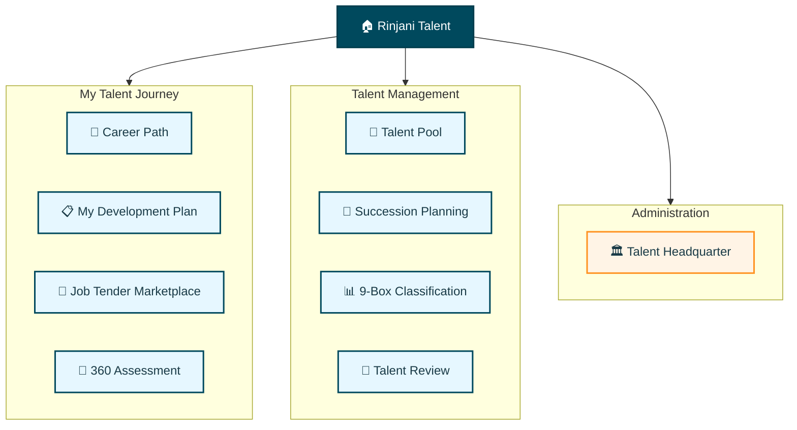

# Rinjani Talent - Application Shell

## Navigation & Layout Specification

---

## Layout

- **Pattern:** Sidebar Navigation (collapsible on mobile)
- **Content Width:** max-w-7xl mx-auto
- **Responsive:** Collapsible nav on mobile, bottom nav for key actions

---

## Application Sitemap



---

## Navigation Structure

### Main Navigation (Sidebar)

| Label | Route | Icon | Access |  |
| --- | --- | --- | --- | --- |
| **Career Path** | /career-path | Target | All Employees |  |
| **My Development Plan** | /my-development | ClipboardList | All Employees |  |
| **Job Tender Marketplace** | /job-tender | Briefcase | All Employees |  |
| **360 Assessment** | /360-assessment | ClipboardCheck | All Employees |  |
| --- | --- | --- | --- |  |
| **Talent Pool** | /talent-pool | Users | HR, Manager |  |
| **Succession Planning** | /succession | GitBranch | HR, Manager |  |
| **9-Box Classification** | /nine-box | Grid3X3 | HR, Manager |  |
| **Talent Review** | /talent-review | FileCheck | HR, Manager |  |
| --- | --- | --- | --- |  |
| **Talent Headquarter** | /talent-hq | Building | Admin |  |

### Header Bar (Top)

| Element | Position | Icon | Description |
| --- | --- | --- | --- |
| **Logo** | Left | - | Rinjani logo + product name |
| **Search** | Center | Search | Global search bar |
| **Platform Switcher** | Right | LayoutGrid | Switch between Rinjani products |
| **Notifications** | Right | Bell | System notifications with badge count |
| **User Avatar** | Right | - | User profile dropdown |

### User Menu Dropdown

- Profile → /profile
- Settings → /settings
- User Menu (Top Right)
    
    ---
    
- **Help**
    - Guidebook → /help/guidebook
    - Service Desk → /help/service-desk
    - ITSM → /help/itsm
- Notifications → /notifications (Bell icon)
    
    ---
    
- Logout → /logout

---

## Page Structure

### My Talent Journey

```jsx
🎯 CAREER PATH (/career-path)
├── Career Overview
│   ├── Current Position
│   ├── Career Roadmap
│   └── Skill Gap Analysis
├── Career Options
│   ├── Lateral Moves
│   ├── Vertical Progression
│   └── Role Comparison
└── Learning Recommendations

📋 MY DEVELOPMENT PLAN (/my-development)
├── IDP Dashboard
│   ├── Active Plans
│   ├── Progress Summary
│   └── Upcoming Actions
├── Plan Detail (/my-development/:id)
│   ├── Learning Goals
│   ├── Action Items
│   └── Progress Tracking
└── Learning History

💼 JOB TENDER MARKETPLACE (/job-tender)
├── Explore Jobs
│   ├── Search & Filters
│   ├── Position Cards
│   └── Pagination
├── Job Detail (/job-tender/:id)
│   ├── Position Info
│   ├── Requirements
│   ├── Eligibility Check
│   └── Apply CTA
├── My Applications
│   ├── Application List
│   ├── Status Timeline
│   └── Withdraw Action
└── Saved Jobs
📝 360 ASSESSMENT (/360-assessment)
├── My Assessment (Assessee POV)
│   ├── Assessment List
│   ├── Assessment Detail (Scores)
│   └── Report (Competency Breakdown)
├── Assigned Assessment (Assessor POV)
│   ├── Assessment List
│   ├── Fill Questionnaire (Likert Scale)
│   └── Progress Tracking
└── Assessment History
```

### Talent Management Modules (HR/Manager)

```jsx
👥 TALENT POOL (/talent-pool)
├── Pool Dashboard
│   ├── Pool Statistics
│   ├── Talent Distribution
│   └── Quick Filters
├── Talent List
│   ├── Search & Filter
│   ├── Talent Cards
│   └── Bulk Actions
└── Talent Detail (/talent-pool/:id)
    ├── Profile Summary
    ├── Assessment History
    └── Development Progress

🔄 SUCCESSION PLANNING (/succession)
├── Succession Dashboard
│   ├── Critical Positions
│   ├── Pipeline Health
│   └── Risk Summary
├── Position Detail (/succession/:positionId)
│   ├── Current Incumbent
│   ├── Successor Candidates
│   └── Readiness Levels
└── Reports & Analytics

📊 9-BOX CLASSIFICATION (/nine-box)
├── 9-Box Grid View
│   ├── Interactive Grid
│   ├── Employee Placement
│   └── Drag & Drop
├── Classification Detail
│   ├── Box Statistics
│   ├── Employee List
│   └── Movement History
└── Calibration Session

📝 TALENT REVIEW (/talent-review)
├── Review Dashboard
│   ├── Pending Reviews
│   ├── Review Calendar
│   └── Summary
├── Review Detail (/talent-review/:id)
│   ├── Assessment Form
│   ├── Rating
│   └── Feedback
└── Review History
```

### Administration

```jsx
🏛️ TALENT HEADQUARTER (/talent-hq)
├── [Tab] Talent Config
│   ├── EQS Configuration
│   ├── Talent Pool Configuration
│   ├── Succession Configuration
│   └── Talent Committee Setup
├── [Tab] IDP Config
│   ├── Cycle Management
│   ├── Library Management (LMS Mapping)
│   ├── Automated Reminders
│   ├── Bulk Assign IDP
│   └── Custom Reason Tag Management
├── [Tab] 360 Assessment
│   ├── Assessment Cycles (Active / Dashboard / Archived)
│   ├── Instrument & Template Management
│   ├── Assessor Management (Auto/Manual, Override)
│   ├── Completion Monitoring
│   └── Assessment Analytics
├── [Tab] Reports & Analytics
│   ├── Talent Reports
│   ├── Succession Reports
│   ├── IDP Completion & Gap Analytics
│   ├── 360 Assessment Reports
│   └── Custom Reports
└── [Tab] Audit Log
    └── All configuration & override changes
```

---

## Component Specifications

### AppShell

Main layout wrapper containing sidebar, header, and content area.

**Props:**

| Prop | Type | Default | Description |
| --- | --- | --- | --- |
| `children` | ReactNode | required | Main content |
| `sidebarCollapsed` | boolean | false | Sidebar collapsed state |
| `onSidebarToggle` | () => void | - | Toggle callback |
| `showBreadcrumbs` | boolean | true | Show breadcrumbs |
| `breadcrumbs` | Breadcrumb[] | [] | Breadcrumb items |
| `pageTitle` | string | - | Current page title |
| `pageActions` | ReactNode | - | Header action buttons |

**Layout Structure:**

```jsx
┌─────────────────────────────────────────────────────┐
│ Header (sticky, white bg, h-16)                     │
│ ┌─────────┬──────────────────────────────────────┐ │
│ │ Logo    │ Search          UserMenu │ │
│ └─────────┴──────────────────────────────────────┘ │
├──────────┬──────────────────────────────────────────┤
│ Sidebar  │ Main Content                             │
│ (fixed)  │ (scrollable, bg-slate-50)                │
│ w-64     │                                          │
│ bg-      │ ┌─────────────────────────────────────┐  │
│ primary  │ │ Breadcrumbs                         │  │
│ #00495d  │ │ PageTitle + Actions                 │  │
│          │ │ ─────────────────────────────────── │  │
│          │ │ Content (max-w-7xl mx-auto px-6)    │  │
│          │ └─────────────────────────────────────┘  │
└──────────┴──────────────────────────────────────────┘
```

### MainNav

Vertical sidebar navigation with collapsible groups.

**Props:**

| Prop | Type | Default | Description |
| --- | --- | --- | --- |
| `items` | NavItem[] | required | Navigation items |
| `collapsed` | boolean | false | Collapsed state |
| `activeRoute` | string | - | Current route |

**NavItem Type:**

```tsx
type NavItem = {
  label: string;
  route: string;
  icon: LucideIcon;
  badge?: number;
  children?: NavItem[];
  access?: string[];
}
```

**States:**

- Default: `bg-transparent text-white/80`
- Hover: `bg-white/10 text-white`
- Active: `bg-white/20 text-white font-medium`

### PageHeader

Page title with breadcrumbs and action buttons.

**Props:**

| Prop | Type | Default | Description |
| --- | --- | --- | --- |
| `title` | string | required | Page title |
| `subtitle` | string | - | Optional subtitle |
| `breadcrumbs` | Breadcrumb[] | [] | Navigation path |
| `actions` | ReactNode | - | Action buttons |
| `backUrl` | string | - | Back navigation URL |

### UserMenu

Top-right user dropdown with profile and actions.

**Props:**

| Prop | Type | Default | Description |
| --- | --- | --- | --- |
| `user` | User | required | Current user |
| `notificationCount` | number | 0 | Unread notifications |
| `onLogout` | () => void | required | Logout handler |

---

## DataTable Specification

Data grid component using TanStack Table for sorting, filtering, and pagination.

**Props:**

| Prop | Type | Default | Description |
| --- | --- | --- | --- |
| `data` | T[] | required | Table data |
| `columns` | ColumnDef<T>[] | required | Column definitions |
| `pagination` | boolean | true | Enable pagination |
| `pageSize` | number | 10 | Items per page |
| `sorting` | boolean | true | Enable sorting |
| `filtering` | boolean | true | Enable filtering |
| `selection` | boolean | false | Enable row selection |
| `onRowClick` | (row: T) => void | - | Row click handler |
| `emptyState` | ReactNode | - | Custom empty state |
| `loading` | boolean | false | Loading state |

**Column Features:**

- Sortable columns with sort indicators
- Filter inputs (text, select, date range)
- Custom cell renderers
- Column visibility toggle
- Resizable columns

**Pagination:**

- Page size selector (10, 25, 50, 100)
- Page navigation with first/last
- Total count display
- "Showing X-Y of Z" label

**Example Usage:**

```jsx
// Talent Profiling - Candidate List
<DataTable
  data={candidates}
  columns={[
    { accessorKey: 'rank', header: '#', width: 50 },
    { accessorKey: 'name', header: 'Nama' },
    { accessorKey: 'position', header: 'Jabatan Saat Ini' },
    { accessorKey: 'company', header: 'Perusahaan' },
    { accessorKey: 'readiness', header: 'Readiness', cell: ReadinessBadge },
    { accessorKey: 'eqsScore', header: 'EQS Score', align: 'right' },
  ]}
  onRowClick={(row) => navigate(`/talent-profiling/${row.id}`)}
/>
```

---

## Form Components Specification

### Input

Text input with label, helper text, and validation states.

**Props:**

| Prop | Type | Default | Description |
| --- | --- | --- | --- |
| `label` | string | - | Input label |
| `placeholder` | string | - | Placeholder text |
| `value` | string | - | Controlled value |
| `onChange` | (value: string) => void | - | Change handler |
| `error` | string | - | Error message |
| `helperText` | string | - | Helper text |
| `required` | boolean | false | Required field |
| `disabled` | boolean | false | Disabled state |
| `type` | 'text' \ | 'email' \ | 'password' \ |
| `leftIcon` | LucideIcon | - | Left icon |
| `rightIcon` | LucideIcon | - | Right icon |

**States:**

- Default: `border-slate-200`
- Focus: `border-primary ring-2 ring-primary/20`
- Error: `border-danger ring-2 ring-danger/20`
- Disabled: `bg-slate-100 cursor-not-allowed`

### Select

Dropdown select with search and multi-select support.

**Props:**

| Prop | Type | Default | Description |
| --- | --- | --- | --- |
| `options` | Option[] | required | Select options |
| `value` | string \ | string[] | - |
| `onChange` | (value) => void | - | Change handler |
| `multiple` | boolean | false | Multi-select mode |
| `searchable` | boolean | false | Enable search |
| `placeholder` | string | 'Pilih...' | Placeholder |
| `error` | string | - | Error message |

### Textarea

Multi-line text input with character count.

**Props:**

| Prop | Type | Default | Description |
| --- | --- | --- | --- |
| `rows` | number | 4 | Visible rows |
| `maxLength` | number | - | Max characters |
| `showCount` | boolean | false | Show character count |

### DatePicker

Date selection with range support.

**Props:**

| Prop | Type | Default | Description |
| --- | --- | --- | --- |
| `value` | Date \ | DateRange | - |
| `onChange` | (date) => void | - | Change handler |
| `mode` | 'single' \ | 'range' | 'single' |
| `minDate` | Date | - | Minimum date |
| `maxDate` | Date | - | Maximum date |

### Checkbox

Checkbox input with label.

**Props:**

| Prop | Type | Default | Description |
| --- | --- | --- | --- |
| `checked` | boolean | false | Checked state |
| `onChange` | (checked: boolean) => void | - | Change handler |
| `label` | string | - | Checkbox label |
| `indeterminate` | boolean | false | Indeterminate state |

### RadioGroup

Radio button group.

**Props:**

| Prop | Type | Default | Description |
| --- | --- | --- | --- |
| `options` | Option[] | required | Radio options |
| `value` | string | - | Selected value |
| `onChange` | (value: string) => void | - | Change handler |
| `orientation` | 'horizontal' \ | 'vertical' | 'vertical' |

---

## Modal/Dialog Specification

Overlay dialog for focused interactions.

**Props:**

| Prop | Type | Default | Description |
| --- | --- | --- | --- |
| `open` | boolean | false | Open state |
| `onClose` | () => void | required | Close handler |
| `title` | string | - | Dialog title |
| `description` | string | - | Dialog description |
| `size` | 'sm' \ | 'md' \ | 'lg' \ |
| `closeOnOverlayClick` | boolean | true | Close on backdrop click |
| `showCloseButton` | boolean | true | Show X button |
| `children` | ReactNode | required | Dialog content |
| `footer` | ReactNode | - | Footer actions |

**Sizes:**

- `sm`: max-w-sm (384px)
- `md`: max-w-md (448px)
- `lg`: max-w-lg (512px)
- `xl`: max-w-xl (576px)
- `full`: max-w-4xl (896px)

**Variants:**

1. **Confirmation Dialog** - Simple yes/no confirmation
2. **Form Dialog** - Dialog with form inputs
3. **Detail Dialog** - Read-only information display
4. **Alert Dialog** - Non-dismissible critical alerts

**Example Usage:**

```jsx
<Dialog open={isOpen} onClose={() => setIsOpen(false)} title="Konfirmasi Penarikan">
  <p>Apakah Anda yakin ingin menarik lamaran ini?</p>
  <DialogFooter>
    <Button variant="ghost" onClick={() => setIsOpen(false)}>Batal</Button>
    <Button variant="danger" onClick={handleWithdraw}>Ya, Tarik Lamaran</Button>
  </DialogFooter>
</Dialog>
```

---

## EmptyState Specification

Placeholder for empty data states.

**Props:**

| Prop | Type | Default | Description |
| --- | --- | --- | --- |
| `icon` | LucideIcon | - | Illustration icon |
| `title` | string | required | Empty state title |
| `description` | string | - | Helpful description |
| `action` | ReactNode | - | CTA button |

**Variants:**

1. **No Data** - Initial empty state
2. **No Results** - Search/filter returned nothing
3. **Error** - Failed to load data
4. **Restricted** - No access permission

**Example Usage:**

```jsx
<EmptyState
  icon={Users}
  title="Belum ada kandidat"
  description="Kandidat akan muncul setelah data talent tersinkronisasi."
  action={<Button onClick={syncData}>Sinkronisasi Data</Button>}
/>
```

**Common Empty States:**

| Module | Context | Title |
| --- | --- | --- |
| Career Path | No roadmap | "Career path belum tersedia" |
| My Development Plan | No plans | "Belum ada rencana pengembangan" |
| Job Tender Marketplace | No jobs | "Tidak ada lowongan tersedia" |
| Talent Pool | No talents | "Belum ada talent terdaftar" |
| Succession Planning | No successors | "Belum ada successor terdaftar" |
| 9-Box Classification | No data | "Belum ada data penilaian" |
| Talent Review | No reviews | "Tidak ada review yang tertunda" |

---

## StatusBadge

Color-coded status indicator.

**Props:**

| Prop | Type | Default | Description |
| --- | --- | --- | --- |
| `status` | string | required | Status value |
| `variant` | 'default' \ | 'outline' | 'default' |
| `size` | 'sm' \ | 'md' | 'md' |

**Status Colors (Generic):**

| Status | Color | Hex |
| --- | --- | --- |
| Draft | Slate | #94A3B8 |
| Pending | Orange (Accent) | #ff9220 |
| Active / Open | Emerald | #10B981 |
| Closed / Completed | Slate | #64748B |
| Cancelled / Rejected | Red (Danger) | #ee3e31 |
| In Progress | Primary | #00495d |

---

## Microcopy Guidelines

### Brand Voice: Empowering & Hospitality-driven

Following the "Hangat namun Megah" principle, all UI copy should be:

- **Empowering** — Use active voice, encourage action
- **Clear** — Avoid jargon, be direct
- **Warm** — Friendly but professional
- **Respectful** — Use proper Indonesian (Anda, not kamu)

### Button Labels

| Action | Good | Avoid |
| --- | --- | --- |
| Primary action | "Simpan", "Lanjutkan" | "Submit", "OK" |
| Cancel action | "Batal" | "Cancel" |
| Confirm action | "Ya, Lanjutkan" | "OK" |
| Back navigation | "Kembali" | "Back" |
| View details | "Lihat Detail" | "View" |
| Export data | "Unduh Data" | "Export" |
| Filter | "Filter" | "Apply Filters" |
| Recalculate | "Hitung Ulang" | "Recalculate" |

### Form Labels & Placeholders

- Use sentence case for labels
- Provide helpful placeholders: "Contoh: Manager HR"
- Include helper text for complex fields

### Success Messages

- "Data berhasil disimpan"
- "Perubahan berhasil diterapkan"
- "Kalkulasi berhasil diperbarui"

### Error Messages

- "Mohon lengkapi semua field yang wajib diisi"
- "Terjadi kesalahan. Silakan coba lagi."
- "Sesi Anda telah berakhir. Silakan login kembali."

### Empty State Copy

- Focus on what users CAN do, not what's missing
- Provide clear next steps
- Use encouraging language

**Example:**

> ❌ "Tidak ada data"
> 

> ✅ "Belum ada kandidat tersedia. Data akan muncul setelah periode penilaian selesai."
> 

### Confirmation Dialogs

Structure:

1. Clear question in title
2. Consequence explanation
3. Clear action buttons (destructive on right)

**Example:**

> **Finalisasi Penilaian?**
> 

> Penilaian yang sudah difinalisasi tidak dapat diubah lagi.
> 

> [Batal] [Ya, Finalisasi]
> 

---

## Responsive Breakpoints

```css
/* Mobile */
@media (max-width: 639px) {
  /* Bottom nav for main actions */
  /* Collapsible sidebar */
  /* Single column layout */
  /* Full-width cards */
}

/* Tablet */
@media (min-width: 640px) and (max-width: 1023px) {
  /* Collapsible sidebar */
  /* 2 column grid for cards */
  /* Reduced padding */
}

/* Desktop */
@media (min-width: 1024px) {
  /* Fixed sidebar (w-64) */
  /* 3-4 column grid for cards */
  /* Side panels for details */
  /* max-w-7xl content width */
}
```

---